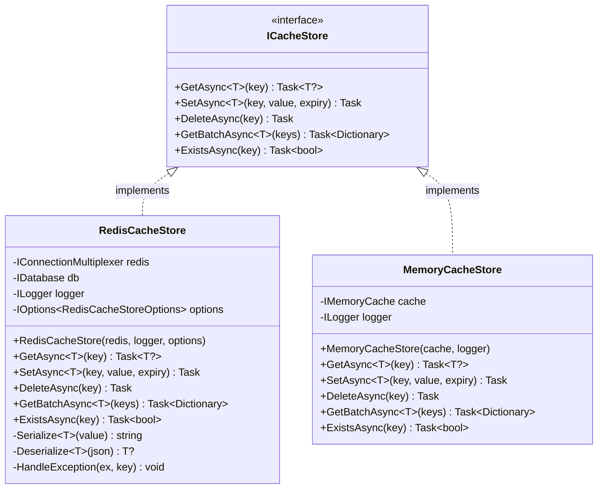

# Redis 缓存层实现深度分析

> **文档版本**: v1.0
> **创建日期**: 2026-03-13
> **任务**: Task 1 - 实现 RedisCacheStore : ICacheStore
> **工作量**: 1.5天
> **优先级**: P0 - 阻塞性

---

## 📋 目录

1. [需求分析](#需求分析)
2. [接口定义](#接口定义)
3. [技术方案选型](#技术方案选型)
4. [架构设计](#架构设计)
5. [详细实现](#详细实现)
6. [异常处理策略](#异常处理策略)
7. [性能优化](#性能优化)
8. [测试策略](#测试策略)
9. [部署配置](#部署配置)
10. [监控和运维](#监控和运维)

---

## 需求分析

### 业务需求

CKY.MAF 框架采用**三层存储架构**：

| 层级 | 存储类型 | 用途 | 性能要求 | 容量限制 |
|------|---------|------|---------|---------|
| **L1** | 内存（IMemoryCache） | 会话数据、频繁访问 | < 1ms | < 200MB |
| **L2** | **Redis** | 分布式缓存、跨会话共享 | < 10ms | 无限制 |
| **L3** | SQLite/PostgreSQL | 持久化存储、事务数据 | < 100ms | 无限制 |

**Redis 缓存的关键作用**：
1. **分布式会话**: 多实例部署时共享会话状态
2. **任务队列**: 存储待执行任务的中间状态
3. **Pub/Sub**: Agent 间消息传递（可选）
4. **性能优化**: 减少数据库访问压力

### 功能需求

**核心功能**（必须实现）：
- ✅ 基本CRUD操作：Get/Set/Delete
- ✅ 批量获取：GetBatch（减少网络往返）
- � 过期时间：支持 TTL（Time To Live）
- ✅ 存在性检查：Exists
- ✅ 异常处理：连接失败、超时处理

**扩展功能**（可选）：
- ⭕ 分布式锁（RedLock）
- ⭕ 发布订阅（Pub/Sub）
- ⭕ 事务支持（MULTI/EXEC）
- ⭕ 管道技术（Pipeline）

### 非功能需求

| 指标 | 目标值 | 测量方法 |
|------|--------|---------|
| **响应时间** | P95 < 10ms | Histogram |
| **吞吐量** | > 10,000 ops/s | Counter |
| **可用性** | > 99.9% | Uptime |
| **连接池** | 最大 100 连接 | Configuration |
| **序列化** | JSON（兼容性优先） | JsonSerializer |

---

## 接口定义

### ICacheStore 接口

```csharp
// src/Core/Abstractions/ICacheStore.cs:7
namespace CKY.MultiAgentFramework.Core.Abstractions
{
    /// <summary>
    /// 缓存存储抽象接口
    /// 支持多种实现：Redis、MemoryCache、NCache等
    /// </summary>
    public interface ICacheStore
    {
        /// <summary>
        /// 获取缓存值
        /// </summary>
        /// <typeparam name="T">缓存值类型（必须是引用类型）</typeparam>
        /// <param name="key">缓存键</param>
        /// <param name="ct">取消令牌</param>
        /// <returns>缓存值，不存在时返回 null</returns>
        Task<T?> GetAsync<T>(
            string key,
            CancellationToken ct = default) where T : class;

        /// <summary>
        /// 设置缓存值
        /// </summary>
        /// <typeparam name="T">缓存值类型</typeparam>
        /// <param name="key">缓存键</param>
        /// <param name="value">缓存值</param>
        /// <param name="expiry">过期时间（null 表示永不过期）</param>
        /// <param name="ct">取消令牌</param>
        Task SetAsync<T>(
            string key,
            T value,
            TimeSpan? expiry = null,
            CancellationToken ct = default) where T : class;

        /// <summary>
        /// 删除缓存值
        /// </summary>
        /// <param name="key">缓存键</param>
        /// <param name="ct">取消令牌</param>
        Task DeleteAsync(
            string key,
            CancellationToken ct = default);

        /// <summary>
        /// 批量获取缓存值
        /// </summary>
        /// <typeparam name="T">缓存值类型</typeparam>
        /// <param name="keys">缓存键集合</param>
        /// <param name="ct">取消令牌</param>
        /// <returns>键值对字典（不存在的键值为 null）</returns>
        Task<Dictionary<string, T?>> GetBatchAsync<T>(
            IEnumerable<string> keys,
            CancellationToken ct = default) where T : class;

        /// <summary>
        /// 检查键是否存在
        /// </summary>
        /// <param name="key">缓存键</param>
        /// <param name="ct">取消令牌</param>
        /// <returns>存在返回 true，否则返回 false</returns>
        Task<bool> ExistsAsync(
            string key,
            CancellationToken ct = default);
    }
}
```

### 设计考量

**约束条件**：
1. **泛型约束**: `where T : class` - 仅支持引用类型
2. **异步优先**: 所有方法都是异步的，避免阻塞
3. **取消令牌**: 支持 `CancellationToken`，允许请求取消
4. **空值处理**: 返回 `T?`（可空引用类型）

**设计决策**：
- ✅ 使用 `System.Text.Json` 而非 `Newtonsoft.Json`（性能更好）
- ✅ 使用 `StackExchange.Redis`（官方推荐，性能最佳）
- ✅ 不支持二进制序列化（跨平台兼容性）

---

## 技术方案选型

### Redis 客户端库对比

| 库名 | 版本 | Stars | 优点 | 缺点 | 推荐度 |
|------|------|-------|------|------|--------|
| **StackExchange.Redis** | 2.11.8 | 31k | 官方推荐、高性能、异步支持 | API 复杂 | ⭐⭐⭐⭐⭐ |
| **StackExchange.Redis.Extensions** | 9.0.0 | 1.4k | 封装了序列化 | 额外抽象层 | ⭐⭐⭐ |
| **CSRedisCore** | 3.9.0 | 1.2k | API 简单 | 社区较小 | ⭐⭐⭐ |
| **FreeRedis** | 1.3.0 | 1.1k | 高性能 | 文档较少 | ⭐⭐ |

**选择结果**: **StackExchange.Redis 2.11.8**

**理由**：
1. 微软官方推荐
2. 高性能（支持多路复用）
3. 完善的异步支持
4. 活跃的社区支持
5. 生产环境验证充分

### 序列化方案对比

| 方案 | 优点 | 缺点 | 推荐度 |
|------|------|------|--------|
| **System.Text.Json** | 高性能、跨平台、内置 | 不支持循环引用 | ⭐⭐⭐⭐⭐ |
| **Newtonsoft.Json** | 功能丰富、兼容性好 | 性能较差、额外依赖 | ⭐⭐⭐ |
| **MessagePack** | 二进制、高性能 | 可读性差 | ⭐⭐⭐ |
| **Protobuf** | 高性能、跨语言 | 需要定义 .proto | ⭐⭐ |

**选择结果**: **System.Text.Json**

**理由**：
1. .NET 内置，无需额外依赖
2. 性能优秀（比 Newtonsoft.Json 快 2倍）
3. 跨平台兼容性好
4. 支持异步流（未来扩展）

---

## 架构设计

### 项目结构

```
src/Infrastructure/Caching/
├── CKY.MAF.Infrastructure.Caching.csproj
├── Redis/
│   ├── RedisCacheStore.cs          # 主实现
│   ├── RedisCacheStoreOptions.cs   # 配置选项
│   └── RedisCacheStoreExtensions.cs # 扩展方法
├── Memory/
│   └── MemoryCacheStore.cs         # 测试用实现
└── Exceptions/
    └── CacheException.cs           # 自定义异常
```

### 类图



### 依赖注入配置

```csharp
// Program.cs 或 Startup.cs
public static class CacheServiceExtensions
{
    public static IServiceCollection AddCacheStore(
        this IServiceCollection services,
        IConfiguration configuration)
    {
        // 注册 IConnectionMultiplexer（单例）
        services.AddSingleton<IConnectionMultiplexer>(sp =>
        {
            var logger = sp.GetRequiredService<ILogger<Program>>();
            var connectionString = configuration.GetConnectionString("Redis");

            logger.LogInformation("Connecting to Redis: {ConnectionString}",
                MaskConnectionString(connectionString));

            var options = ConfigurationOptions.Parse(connectionString);
            options.AbortOnConnectFail = false; // 连接失败时不终止应用
            options.ConnectRetry = 3; // 重试3次
            options.ConnectTimeout = 5000; // 5秒超时
            options.SyncTimeout = 5000;

            return ConnectionMultiplexer.Connect(options);
        });

        // 注册配置选项
        services.Configure<RedisCacheStoreOptions>(
            configuration.GetSection("RedisCache"));

        // 注册 ICacheStore（根据环境选择实现）
        if (configuration.GetValue<bool>("UseMemoryCache"))
        {
            // 开发/测试环境：使用内存缓存
            services.AddSingleton<ICacheStore, MemoryCacheStore>();
        }
        else
        {
            // 生产环境：使用 Redis
            services.AddSingleton<ICacheStore, RedisCacheStore>();
        }

        return services;
    }

    private static string MaskConnectionString(string connectionString)
    {
        // 隐藏密码用于日志
        return Regex.Replace(connectionString, "password=([^,;]+)", "password=****");
    }
}
```

---

## 详细实现

### RedisCacheStore 核心实现

```csharp
// src/Infrastructure/Caching/Redis/RedisCacheStore.cs
using StackExchange.Redis;
using System.Text.Json;
using Microsoft.Extensions.Options;

namespace CKY.MultiAgentFramework.Infrastructure.Caching.Redis
{
    /// <summary>
    /// Redis 缓存存储实现
    /// </summary>
    public sealed class RedisCacheStore : ICacheStore
    {
        private readonly IConnectionMultiplexer _redis;
        private readonly IDatabase _db;
        private readonly ILogger<RedisCacheStore> _logger;
        private readonly RedisCacheStoreOptions _options;

        /// <summary>
        /// 构造函数
        /// </summary>
        public RedisCacheStore(
            IConnectionMultiplexer redis,
            ILogger<RedisCacheStore> logger,
            IOptions<RedisCacheStoreOptions> options)
        {
            _redis = redis ?? throw new ArgumentNullException(nameof(redis));
            _logger = logger ?? throw new ArgumentNullException(nameof(logger));
            _options = options?.Value ?? new RedisCacheStoreOptions();

            // 获取数据库实例（默认数据库 0）
            _db = _redis.GetDatabase(_options.DatabaseId);

            _logger.LogInformation("RedisCacheStore initialized (DatabaseId: {DatabaseId})", _options.DatabaseId);
        }

        #region ICacheStore 实现

        /// <summary>
        /// 获取缓存值
        /// </summary>
        public async Task<T?> GetAsync<T>(
            string key,
            CancellationToken ct = default) where T : class
        {
            try
            {
                var stopwatch = ValueStopwatch.StartNew();

                var value = await _db.StringGetAsync(key);

                _logger.LogDebug("GetAsync: {Key} - Found: {Found}, Latency: {Latency}ms",
                    key, value.HasValue, stopwatch.ElapsedMilliseconds);

                if (!value.HasValue)
                    return null;

                var result = Deserialize<T>(value);
                return result;
            }
            catch (Exception ex)
            {
                HandleException(ex, key, "GetAsync");
                return null; // 降级：返回 null 而非抛出异常
            }
        }

        /// <summary>
        /// 设置缓存值
        /// </summary>
        public async Task SetAsync<T>(
            string key,
            T value,
            TimeSpan? expiry = null,
            CancellationToken ct = default) where T : class
        {
            try
            {
                var stopwatch = ValueStopwatch.StartNew();

                var json = Serialize(value);
                await _db.StringSetAsync(key, json, expiry);

                _logger.LogDebug("SetAsync: {Key}, Expiry: {Expiry}s, Latency: {Latency}ms",
                    key, expiry?.TotalSeconds ?? -1, stopwatch.ElapsedMilliseconds);
            }
            catch (Exception ex)
            {
                HandleException(ex, key, "SetAsync");
            }
        }

        /// <summary>
        /// 删除缓存值
        /// </summary>
        public async Task DeleteAsync(
            string key,
            CancellationToken ct = default)
        {
            try
            {
                var stopwatch = ValueStopwatch.StartNew();

                await _db.KeyDeleteAsync(key);

                _logger.LogDebug("DeleteAsync: {Key}, Latency: {Latency}ms",
                    key, stopwatch.ElapsedMilliseconds);
            }
            catch (Exception ex)
            {
                HandleException(ex, key, "DeleteAsync");
            }
        }

        /// <summary>
        /// 批量获取缓存值
        /// </summary>
        public async Task<Dictionary<string, T?>> GetBatchAsync<T>(
            IEnumerable<string> keys,
            CancellationToken ct = default) where T : class
        {
            try
            {
                var stopwatch = ValueStopwatch.StartNew();

                var keyArray = keys.ToArray();
                var redisKeys = keyArray.Select(k => (RedisKey)k).ToArray();

                // 批量获取（单次网络往返）
                var values = await _db.StringGetAsync(redisKeys);

                var result = new Dictionary<string, T?>(keyArray.Length);
                for (int i = 0; i < keyArray.Length; i++)
                {
                    var key = keyArray[i];
                    var value = values[i];

                    result[key] = value.HasValue ? Deserialize<T>(value) : null;
                }

                _logger.LogDebug("GetBatchAsync: {Count} keys, Latency: {Latency}ms",
                    keyArray.Length, stopwatch.ElapsedMilliseconds);

                return result;
            }
            catch (Exception ex)
            {
                HandleException(ex, "GetBatchAsync", "GetBatchAsync");
                return new Dictionary<string, T?>();
            }
        }

        /// <summary>
        /// 检查键是否存在
        /// </summary>
        public async Task<bool> ExistsAsync(
            string key,
            CancellationToken ct = default)
        {
            try
            {
                return await _db.KeyExistsAsync(key);
            }
            catch (Exception ex)
            {
                HandleException(ex, key, "ExistsAsync");
                return false;
            }
        }

        #endregion

        #region 私有辅助方法

        /// <summary>
        /// 序列化对象为 JSON
        /// </summary>
        private string Serialize<T>(T value) where T : class
        {
            try
            {
                return JsonSerializer.Serialize(value, _options.JsonSerializerOptions);
            }
            catch (Exception ex)
            {
                _logger.LogError(ex, "Failed to serialize value of type {Type}", typeof(T).Name);
                throw new CacheException($"Serialization failed for type {typeof(T).Name}", ex);
            }
        }

        /// <summary>
        /// 反序列化 JSON 为对象
        /// </summary>
        private T? Deserialize<T>(RedisValue json) where T : class
        {
            try
            {
                return JsonSerializer.Deserialize<T>(json, _options.JsonSerializerOptions);
            }
            catch (Exception ex)
            {
                _logger.LogError(ex, "Failed to deserialize JSON to type {Type}", typeof(T).Name);
                return null; // 降级：返回 null 而非抛出异常
            }
        }

        /// <summary>
        /// 统一异常处理
        /// </summary>
        private void HandleException(Exception ex, string key, string operation)
        {
            var exceptionType = ex.GetType().Name;

            _logger.LogError(ex, "Redis operation failed: {Operation}, Key: {Key}, Exception: {ExceptionType}",
                operation, key, exceptionType);

            // 根据异常类型采取不同策略
            switch (ex)
            {
                case RedisConnectionException:
                case RedisTimeoutException:
                    // 连接问题：降级处理，记录监控指标
                    RecordFailureMetric(operation, exceptionType);
                    break;

                case RedisException:
                    // Redis 服务器错误：降级处理
                    RecordFailureMetric(operation, exceptionType);
                    break;

                default:
                    // 其他异常：记录并降级
                    RecordFailureMetric(operation, exceptionType);
                    break;
            }
        }

        /// <summary>
        /// 记录失败指标（用于监控）
        /// </summary>
        private void RecordFailureMetric(string operation, string exceptionType)
        {
            // TODO: 集成 Prometheus
            // _failureCounter.WithLabels(operation, exceptionType).Inc();
        }

        #endregion
    }
}
```

### 配置选项类

```csharp
// src/Infrastructure/Caching/Redis/RedisCacheStoreOptions.cs
using System.Text.Json;

namespace CKY.MultiAgentFramework.Infrastructure.Caching.Redis
{
    /// <summary>
    /// Redis 缓存存储配置选项
    /// </summary>
    public class RedisCacheStoreOptions
    {
        /// <summary>
        /// 数据库 ID（0-15）
        /// </summary>
        public int DatabaseId { get; set; } = 0;

        /// <summary>
        /// JSON 序列化选项
        /// </summary>
        public JsonSerializerOptions JsonSerializerOptions { get; set; } = new()
        {
            PropertyNamingPolicy = JsonNamingPolicy.CamelCase,
            WriteIndented = false,
            DefaultIgnoreCondition = JsonIgnoreCondition.WhenWritingNull
        };

        /// <summary>
        /// 是否启用日志（记录所有操作）
        /// </summary>
        public bool EnableVerboseLogging { get; set; } = false;

        /// <summary>
        /// 操作超时时间（毫秒）
        /// </summary>
        public int OperationTimeoutMs { get; set; } = 5000;
    }
}
```

### MemoryCacheStore 实现（用于测试）

```csharp
// src/Infrastructure/Caching/Memory/MemoryCacheStore.cs
using Microsoft.Extensions.Caching.Memory;

namespace CKY.MultiAgentFramework.Infrastructure.Caching.Memory
{
    /// <summary>
    /// 内存缓存存储实现（用于测试/开发）
    /// </summary>
    public sealed class MemoryCacheStore : ICacheStore
    {
        private readonly IMemoryCache _cache;
        private readonly ILogger<MemoryCacheStore> _logger;

        public MemoryCacheStore(
            IMemoryCache cache,
            ILogger<MemoryCacheStore> logger)
        {
            _cache = cache ?? throw new ArgumentNullException(nameof(cache));
            _logger = logger ?? throw new ArgumentNullException(nameof(logger));
        }

        public async Task<T?> GetAsync<T>(
            string key,
            CancellationToken ct = default) where T : class
        {
            return await Task.FromResult(_cache.Get<T?>(key));
        }

        public async Task SetAsync<T>(
            string key,
            T value,
            TimeSpan? expiry = null,
            CancellationToken ct = default) where T : class
        {
            var options = new MemoryCacheEntryOptions();

            if (expiry.HasValue)
            {
                options.SetAbsoluteExpiration(expiry.Value);
            }

            _cache.Set(key, value, options);
            await Task.CompletedTask;
        }

        public async Task DeleteAsync(
            string key,
            CancellationToken ct = default)
        {
            _cache.Remove(key);
            await Task.CompletedTask;
        }

        public async Task<Dictionary<string, T?>> GetBatchAsync<T>(
            IEnumerable<string> keys,
            CancellationToken ct = default) where T : class
        {
            var result = new Dictionary<string, T?>();

            foreach (var key in keys)
            {
                result[key] = _cache.Get<T?>(key);
            }

            return await Task.FromResult(result);
        }

        public async Task<bool> ExistsAsync(
            string key,
            CancellationToken ct = default)
        {
            return await Task.FromResult(_cache.TryGetValue(key, out _));
        }
    }
}
```

---

## 异常处理策略

### 异常类型和处理

| 异常类型 | 原因 | 处理策略 | 是否降级 |
|---------|------|---------|---------|
| **RedisConnectionException** | 连接失败 | 记录日志、重试 | ✅ 返回 null |
| **RedisTimeoutException** | 操作超时 | 记录日志、重试 | ✅ 返回 null |
| **RedisException** | Redis 服务器错误 | 记录日志 | ✅ 返回 null |
| **JsonException** | 序列化失败 | 抛出 CacheException | ❌ 抛出异常 |
| **ObjectDisposedException** | 对象已释放 | 记录日志 | ❌ 抛出异常 |

### 降级策略

**原则**: 缓存失败不应影响主流程

```csharp
// 示例：在任务调度器中使用 Redis 缓存
public class MafTaskScheduler
{
    private readonly ICacheStore _cacheStore;

    public async Task ScheduleAsync(List<DecomposedTask> tasks, CancellationToken ct)
    {
        foreach (var task in tasks)
        {
            try
            {
                // 尝试缓存任务状态
                await _cacheStore.SetAsync($"task:{task.TaskId}", task, TimeSpan.FromHours(1), ct);
            }
            catch (Exception ex)
            {
                // 缓存失败不影响任务调度
                _logger.LogWarning(ex, "Failed to cache task {TaskId}, continuing...", task.TaskId);
            }
        }

        // 继续执行任务调度...
    }
}
```

### 重试策略

```csharp
// 使用 Polly 实现重试
private async Task<T> ExecuteWithRetryAsync<T>(
    Func<Task<T>> operation,
    string operationName,
    CancellationToken ct)
{
    var retryPolicy = Policy
        .Handle<RedisConnectionException>()
        .Or<RedisTimeoutException>()
        .WaitAndRetryAsync(
            retryCount: 3,
            sleepDurationProvider: retryAttempt => TimeSpan.FromMilliseconds(100 * Math.Pow(2, retryAttempt)),
            onRetry: (exception, delay, retryCount, context) =>
            {
                _logger.LogWarning(exception,
                    "Retry {RetryCount} after {Delay}ms for {OperationName}",
                    retryCount, delay.TotalMilliseconds, operationName);
            });

    return await retryPolicy.ExecuteAsync(operation, ct);
}
```

---

## 性能优化

### 优化策略

#### 1. 批量操作优化

```csharp
// ❌ 错误：多次网络往返
foreach (var key in keys)
{
    var value = await _db.StringGetAsync(key); // N次网络往返
}

// ✅ 正确：批量操作（单次网络往返）
var redisKeys = keys.Select(k => (RedisKey)k).ToArray();
var values = await _db.StringGetAsync(redisKeys); // 1次网络往返
```

#### 2. 连接池配置

```csharp
// ConfigurationOptions 优化
var options = ConfigurationOptions.Parse(connectionString);
options.MaxPoolSize = 100; // 最大连接数
options.MinPoolSize = 10;  // 最小连接数
options.IdleTimeout = 300000; // 空闲超时（5分钟）
options.ConnectTimeout = 5000;
options.SyncTimeout = 5000;
options.AbortOnConnectFail = false; // 连接失败时不终止应用
```

#### 3. 管道技术（Pipeline）

```csharp
// 使用管道批量执行（减少网络往返）
var batch = _db.CreateBatch();
var tasks = new List<Task>();

foreach (var item in items)
{
    var task = batch.StringSetAsync(item.Key, Serialize(item.Value));
    tasks.Add(task);
}

batch.Execute(); // 一次性发送所有命令
await Task.WhenAll(tasks); // 等待所有命令完成
```

#### 4. Lua 脚本（原子操作）

```csharp
// 使用 Lua 脚本保证原子性
var script = @"
    local key = KEYS[1]
    local value = ARGV[1]
    local ttl = ARGV[2]

    if redis.call('EXISTS', key) == 0 then
        redis.call('SET', key, value)
        redis.call('EXPIRE', key, ttl)
        return 1
    else
        return 0
    end
";

var result = (long)await _db.ScriptEvaluateAsync(
    script,
    new RedisKey[] { "mykey" },
    new RedisValue[] { "myvalue", "3600" });
```

### 性能基准测试

```csharp
// BenchmarkDotNet 性能测试
[MemoryDiagnoser]
public class CacheStoreBenchmarks
{
    private ICacheStore _cacheStore;

    [GlobalSetup]
    public void Setup()
    {
        // 初始化
    }

    [Benchmark]
    public async Task<object?> GetAsync_1000_keys()
    {
        var tasks = Enumerable.Range(0, 1000)
            .Select(i => _cacheStore.GetAsync<object>($"key:{i}"));

        return await Task.WhenAll(tasks);
    }
}

/* 预期性能指标（本地网络）:
 * GET 操作: P95 < 2ms
 * SET 操作: P95 < 3ms
 * GET_BATCH (100 keys): P95 < 20ms
 */
```

---

## 测试策略

### 单元测试

```csharp
// tests/UnitTests/Caching/RedisCacheStoreTests.cs
public class RedisCacheStoreTests : IDisposable
{
    private readonly Mock<IConnectionMultiplexer> _mockRedis;
    private readonly Mock<IDatabase> _mockDatabase;
    private readonly RedisCacheStore _cacheStore;

    public RedisCacheStoreTests()
    {
        _mockRedis = new Mock<IConnectionMultiplexer>();
        _mockDatabase = new Mock<IDatabase>();

        _mockRedis.Setup(x => x.GetDatabase(It.IsAny<int>(), It.IsAny<object>()))
            .Returns(_mockDatabase.Object);

        _cacheStore = new RedisCacheStore(
            _mockRedis.Object,
            Mock.Of<ILogger<RedisCacheStore>>(),
            Options.Create(new RedisCacheStoreOptions()));
    }

    [Fact]
    public async Task GetAsync_ShouldReturnDeserializedValue()
    {
        // Arrange
        var key = "test-key";
        var expected = new { Name = "Test", Value = 123 };
        var json = JsonSerializer.Serialize(expected);

        _mockDatabase.Setup(x => x.StringGetAsync(key, It.IsAny<CommandFlags>()))
            .ReturnsAsync(json);

        // Act
        var result = await _cacheStore.GetAsync<object>(key);

        // Assert
        Assert.NotNull(result);
        _mockDatabase.Verify(x => x.StringGetAsync(key, It.IsAny<CommandFlags>()), Times.Once);
    }

    [Fact]
    public async Task SetAsync_ShouldSerializeAndStore()
    {
        // Arrange
        var key = "test-key";
        var value = new { Name = "Test", Value = 123 };

        _mockDatabase.Setup(x => x.StringSetAsync(
            It.IsAny<RedisKey>(),
            It.IsAny<RedisValue>(),
            It.IsAny<TimeSpan?>(),
            It.IsAny<When>(),
            It.IsAny<CommandFlags>()))
            .ReturnsAsync(true);

        // Act
        await _cacheStore.SetAsync(key, value);

        // Assert
        _mockDatabase.Verify(x => x.StringSetAsync(
            key,
            It.Is<RedisValue>(v => v.ToString().Contains("Test")),
            null,
            When.Always,
            CommandFlags.None), Times.Once);
    }
}
```

### 集成测试（使用 Testcontainers）

```csharp
// tests/IntegrationTests/Caching/RedisCacheStoreIntegrationTests.cs
public class RedisCacheStoreIntegrationTests : IAsyncLifetime
{
    private readonly RedisContainer _redisContainer;
    private ICacheStore _cacheStore;

    public RedisCacheStoreIntegrationTests()
    {
        _redisContainer = new RedisBuilder()
            .WithHostname("redis-test")
            .Build();
    }

    public async Task InitializeAsync()
    {
        // 启动 Redis 容器
        await _redisContainer.StartAsync();

        // 初始化 RedisCacheStore
        var redis = ConnectionMultiplexer.Connect(_redisContainer.GetConnectionString());
        var logger = new NullLogger<RedisCacheStore>();
        var options = Options.Create(new RedisCacheStoreOptions());

        _cacheStore = new RedisCacheStore(redis, logger, options);
    }

    public async Task DisposeAsync()
    {
        // 停止 Redis 容器
        await _redisContainer.StopAsync();
    }

    [Fact]
    public async Task SetAndGetAsync_ShouldReturnCachedValue()
    {
        // Arrange
        var key = "test-key";
        var value = new TestModel { Name = "Test", Value = 123 };

        // Act
        await _cacheStore.SetAsync(key, value, TimeSpan.FromMinutes(5));
        var result = await _cacheStore.GetAsync<TestModel>(key);

        // Assert
        Assert.NotNull(result);
        Assert.Equal("Test", result.Name);
        Assert.Equal(123, result.Value);
    }

    [Fact]
    public async Task GetBatchAsync_ShouldReturnMultipleValues()
    {
        // Arrange
        var data = new Dictionary<string, TestModel>
        {
            ["key1"] = new() { Name = "Test1", Value = 1 },
            ["key2"] = new() { Name = "Test2", Value = 2 },
            ["key3"] = new() { Name = "Test3", Value = 3 }
        };

        foreach (var item in data)
        {
            await _cacheStore.SetAsync(item.Key, item.Value);
        }

        // Act
        var result = await _cacheStore.GetBatchAsync<TestModel>(data.Keys);

        // Assert
        Assert.Equal(3, result.Count);
        Assert.Equal("Test1", result["key1"]?.Name);
        Assert.Equal("Test2", result["key2"]?.Name);
        Assert.Equal("Test3", result["key3"]?.Name);
    }

    [Fact]
    public async Task DeleteAsync_ShouldRemoveValue()
    {
        // Arrange
        var key = "test-key";
        var value = new TestModel { Name = "Test", Value = 123 };

        await _cacheStore.SetAsync(key, value);

        // Act
        await _cacheStore.DeleteAsync(key);
        var result = await _cacheStore.GetAsync<TestModel>(key);

        // Assert
        Assert.Null(result);
    }

    [Fact]
    public async Task ExistsAsync_ShouldReturnTrue_WhenKeyExists()
    {
        // Arrange
        var key = "test-key";
        await _cacheStore.SetAsync(key, new TestModel());

        // Act
        var exists = await _cacheStore.ExistsAsync(key);

        // Assert
        Assert.True(exists);
    }

    private class TestModel
    {
        public string Name { get; set; } = string.Empty;
        public int Value { get; set; }
    }
}
```

---

## 部署配置

### appsettings.json

```json
{
  "ConnectionStrings": {
    "Redis": "localhost:6379,password=your_password,defaultDatabase=0"
  },
  "RedisCache": {
    "DatabaseId": 0,
    "EnableVerboseLogging": false,
    "OperationTimeoutMs": 5000
  },
  "UseMemoryCache": false
}
```

### appsettings.Development.json

```json
{
  "ConnectionStrings": {
    "Redis": "localhost:6379,defaultDatabase=0"
  },
  "RedisCache": {
    "DatabaseId": 15,
    "EnableVerboseLogging": true
  },
  "UseMemoryCache": true  // 开发环境使用内存缓存
}
```

### Docker Compose（本地开发）

```yaml
version: '3.8'

services:
  redis:
    image: redis:7-alpine
    container_name: cky-maf-redis
    ports:
      - "6379:6379"
    volumes:
      - redis-data:/data
    command: redis-server --appendonly yes --requirepass your_password
    healthcheck:
      test: ["CMD", "redis-cli", "ping"]
      interval: 5s
      timeout: 3s
      retries: 5

volumes:
  redis-data:
```

### Kubernetes（生产环境）

```yaml
apiVersion: v1
kind: ConfigMap
metadata:
  name: redis-config
data:
  redis.conf: |
    bind 0.0.0.0
    port 6379
    requirepass your_redis_password
    maxmemory 2gb
    maxmemory-policy allkeys-lru
    appendonly yes
    save 900 1
    save 300 10
    save 60 10000

---
apiVersion: apps/v1
kind: Deployment
metadata:
  name: redis
spec:
  replicas: 1
  selector:
    matchLabels:
      app: redis
  template:
    metadata:
      labels:
        app: redis
    spec:
      containers:
      - name: redis
        image: redis:7-alpine
        ports:
        - containerPort: 6379
        volumeMounts:
        - name: config
          mountPath: /usr/local/etc/redis/redis.conf
          subPath: redis.conf
        - name: data
          mountPath: /data
        resources:
          requests:
            memory: "1Gi"
            cpu: "500m"
          limits:
            memory: "2Gi"
            cpu: "1000m"
      volumes:
      - name: config
        configMap:
          name: redis-config
      - name: data
        persistentVolumeClaim:
          claimName: redis-pvc
```

---

## 监控和运维

### Prometheus 指标

```csharp
// 集成 Prometheus metrics
public class RedisCacheStoreMetrics
{
    private readonly Counter _requestCounter;
    private readonly Histogram _responseTimeHistogram;
    private readonly Gauge _errorGauge;

    public RedisCacheStoreMetrics()
    {
        _requestCounter = Metrics.CreateCounter(
            "redis_cache_requests_total",
            "Total number of Redis cache requests",
            new CounterConfiguration
            {
                LabelNames = new[] { "operation", "status" }
            });

        _responseTimeHistogram = Metrics.CreateHistogram(
            "redis_cache_response_time_seconds",
            "Redis cache response time in seconds",
            new HistogramConfiguration
            {
                LabelNames = new[] { "operation" },
                Buckets = Histogram.ExponentialBuckets(0.001, 2, 10)
            });

        _errorGauge = Metrics.CreateGauge(
            "redis_cache_errors",
            "Number of Redis cache errors",
            new GaugeConfiguration
            {
                LabelNames = new[] { "operation", "exception_type" }
            });
    }

    public void RecordRequest(string operation, string status)
    {
        _requestCounter.WithLabels(operation, status).Inc();
    }

    public void RecordResponseTime(string operation, double seconds)
    {
        _responseTimeHistogram.WithLabels(operation).Observe(seconds);
    }

    public void RecordError(string operation, string exceptionType)
    {
        _errorGauge.WithLabels(operation, exceptionType).Inc();
    }
}
```

### Grafana 仪表板

```json
{
  "dashboard": {
    "title": "CKY.MAF Redis Cache",
    "panels": [
      {
        "title": "Request Rate",
        "targets": [
          {
            "expr": "rate(redis_cache_requests_total[5m])"
          }
        ]
      },
      {
        "title": "Response Time (P95)",
        "targets": [
          {
            "expr": "histogram_quantile(0.95, rate(redis_cache_response_time_seconds_bucket[5m]))"
          }
        ]
      },
      {
        "title": "Error Rate",
        "targets": [
          {
            "expr": "rate(redis_cache_requests_total{status=\"error\"}[5m]) / rate(redis_cache_requests_total[5m])"
          }
        ]
      }
    ]
  }
}
```

### 健康检查

```csharp
// 健康检查实现
public class RedisCacheHealthCheck : IHealthCheck
{
    private readonly IConnectionMultiplexer _redis;

    public RedisCacheHealthCheck(IConnectionMultiplexer redis)
    {
        _redis = redis ?? throw new ArgumentNullException(nameof(redis));
    }

    public async Task<HealthCheckResult> CheckHealthAsync(
        HealthCheckContext context,
        CancellationToken cancellationToken = default)
    {
        try
        {
            if (!_redis.IsConnected)
            {
                return HealthCheckResult.Unhealthy("Redis is not connected");
            }

            var db = _redis.GetDatabase();
            var pingResult = await db.PingAsync();

            if (pingResult.IsSuccess)
            {
                var info = await _redis.GetDatabase().PingAsync();
                return HealthCheckResult.Healthy($"Redis is responding (Latency: {info.TotalMilliseconds}ms)");
            }
            else
            {
                return HealthCheckResult.Degraded("Redis is slow to respond");
            }
        }
        catch (Exception ex)
        {
            return HealthCheckResult.Unhealthy($"Redis health check failed: {ex.Message}");
        }
    }
}

// 注册健康检查
// builder.Services.AddHealthChecks()
//     .AddCheck<RedisCacheHealthCheck>("redis-cache");
```

---

## 验收标准

### 功能验收

- ✅ 所有接口方法实现完成
- ✅ 序列化/反序列化正常工作
- ✅ 批量操作正确实现
- ✅ 过期时间（TTL）正确应用
- ✅ 异常处理和日志记录完整

### 性能验收

| 指标 | 目标值 | 测试方法 |
|------|--------|---------|
| **GET 响应时间** | P95 < 10ms | BenchmarkDotNet |
| **SET 响应时间** | P95 < 10ms | BenchmarkDotNet |
| **GET_BATCH (100 keys)** | P95 < 100ms | BenchmarkDotNet |
| **吞吐量** | > 10,000 ops/s | 压力测试 |

### 质量验收

- ✅ 单元测试覆盖率 > 90%
- ✅ 集成测试全部通过
- ✅ 代码审查通过
- ✅ 文档完整（注释、README）
- ✅ 无编译警告

### 运维验收

- ✅ Prometheus 指标正常上报
- ✅ 健康检查通过
- ✅ 日志结构化、可查询
- ✅ 配置可外部化（appsettings.json）

---

## 后续优化方向

### 短期（1-2周）
- [ ] 添加分布式锁（RedLock）
- [ ] 支持发布订阅（Pub/Sub）
- [ ] 添加缓存预热功能

### 中期（1-2月）
- [ ] 支持多级缓存（L1 + L2 自动降级）
- [ ] 添加缓存穿透保护
- [ ] 实现缓存雪崩保护（随机TTL）

### 长期（3-6月）
- [ ] Redis Cluster 支持
- [ ] 读写分离支持
- [ ] 缓存监控仪表板

---

**文档维护**: CKY.MAF 架构团队
**最后更新**: 2026-03-13
**状态**: 待实施
