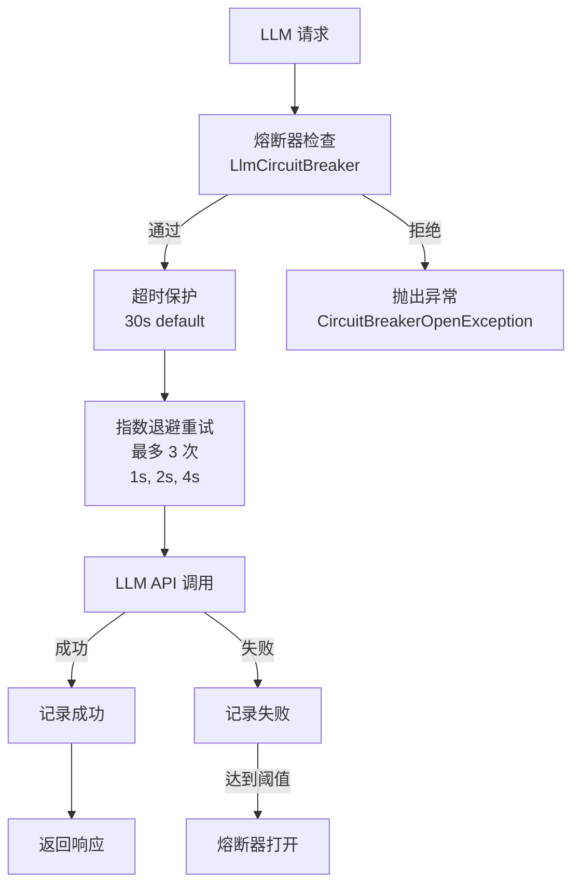
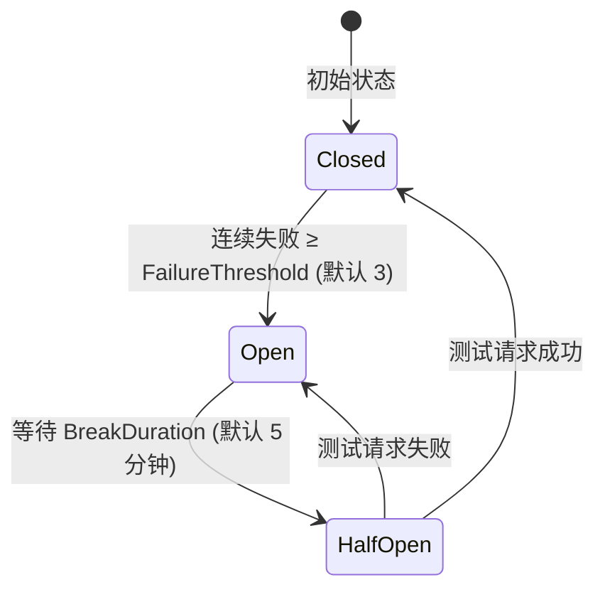
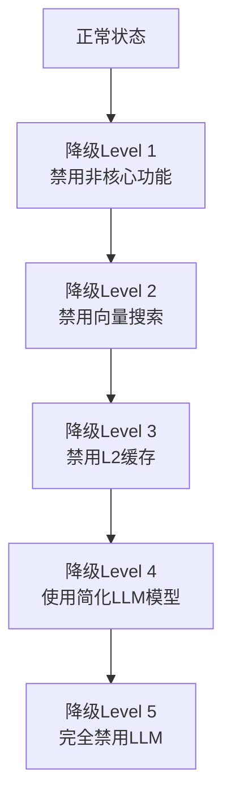

# CKY.MAF框架错误处理指南

> **文档版本**: v1.0
> **创建日期**: 2026-03-13
> **用途**: 定义错误处理策略、重试机制、熔断器和服务降级规范

---

## 📋 目录

1. [错误分类体系](#一错误分类体系)
2. [重试策略](#二重试策略)
3. [熔断器模式](#三熔断器模式)
4. [服务降级策略](#四服务降级策略)
5. [各组件错误处理规范](#五各组件错误处理规范)
6. [日志与监控](#六日志与监控)
7. [错误处理测试策略](#七错误处理测试策略)

---

## 一、错误分类体系

### 1.1 错误类型定义

```csharp
namespace CKY.MAF.Core.Exceptions
{
    /// <summary>
    /// CKY.MAF基础异常
    /// </summary>
    public class MafException : Exception
    {
        public MafErrorCode ErrorCode { get; init; }
        public string Component { get; init; }
        public bool IsRetryable { get; init; }

        public MafException(MafErrorCode errorCode, string message, bool isRetryable = false)
            : base(message)
        {
            ErrorCode = errorCode;
            IsRetryable = isRetryable;
        }
    }

    /// <summary>
    /// LLM服务异常
    /// </summary>
    public class LlmServiceException : MafException
    {
        public int? StatusCode { get; init; }
        public bool IsRateLimited { get; init; }

        public LlmServiceException(string message, int? statusCode = null, bool isRateLimited = false)
            : base(MafErrorCode.LlmServiceError, message, isRetryable: true)
        {
            StatusCode = statusCode;
            IsRateLimited = isRateLimited;
            Component = "LlmService";
        }
    }

    /// <summary>
    /// 缓存服务异常
    /// </summary>
    public class CacheServiceException : MafException
    {
        public CacheServiceException(string message)
            : base(MafErrorCode.CacheServiceError, message, isRetryable: true)
        {
            Component = "CacheStore";
        }
    }

    /// <summary>
    /// 数据库异常
    /// </summary>
    public class DatabaseException : MafException
    {
        public bool IsTransient { get; init; }

        public DatabaseException(string message, bool isTransient = false)
            : base(MafErrorCode.DatabaseError, message, isRetryable: isTransient)
        {
            IsTransient = isTransient;
            Component = "RelationalDatabase";
        }
    }

    /// <summary>
    /// 向量存储异常
    /// </summary>
    public class VectorStoreException : MafException
    {
        public VectorStoreException(string message)
            : base(MafErrorCode.VectorStoreError, message, isRetryable: true)
        {
            Component = "VectorStore";
        }
    }

    /// <summary>
    /// 任务调度异常
    /// </summary>
    public class TaskSchedulingException : MafException
    {
        public string TaskId { get; init; }

        public TaskSchedulingException(string taskId, string message)
            : base(MafErrorCode.TaskSchedulingError, message, isRetryable: false)
        {
            TaskId = taskId;
            Component = "TaskScheduler";
        }
    }
}
```

### 1.2 错误码定义

```csharp
namespace CKY.MAF.Core.Exceptions
{
    public enum MafErrorCode
    {
        // 通用错误 (1000-1099)
        Unknown = 1000,
        InvalidArgument = 1001,
        OperationCancelled = 1002,
        Timeout = 1003,

        // LLM服务错误 (2000-2099)
        LlmServiceError = 2000,
        LlmRateLimited = 2001,
        LlmContextTooLong = 2002,
        LlmAuthFailure = 2003,
        LlmModelUnavailable = 2004,

        // 缓存服务错误 (3000-3099)
        CacheServiceError = 3000,
        CacheConnectionFailed = 3001,
        CacheSerializationError = 3002,

        // 数据库错误 (4000-4099)
        DatabaseError = 4000,
        DatabaseConnectionFailed = 4001,
        DatabaseQueryFailed = 4002,
        DatabaseTransactionFailed = 4003,

        // 向量存储错误 (5000-5099)
        VectorStoreError = 5000,
        VectorStoreConnectionFailed = 5001,
        VectorSearchFailed = 5002,

        // 任务调度错误 (6000-6099)
        TaskSchedulingError = 6000,
        TaskDependencyCycleDetected = 6001,
        TaskExecutionTimeout = 6002,
        TaskMaxRetriesExceeded = 6003,
    }
}
```

---

## 二、重试策略

### 2.1 重试策略定义

```csharp
namespace CKY.MAF.Core.Resilience
{
    /// <summary>
    /// 退避策略
    /// </summary>
    public enum BackoffStrategy
    {
        /// <summary>固定间隔</summary>
        Fixed,
        /// <summary>线性递增</summary>
        Linear,
        /// <summary>指数退避</summary>
        Exponential,
        /// <summary>指数退避+随机抖动（推荐）</summary>
        ExponentialWithJitter
    }

    /// <summary>
    /// 重试策略配置
    /// </summary>
    public class RetryPolicy
    {
        /// <summary>最大重试次数</summary>
        public int MaxRetries { get; init; } = 3;

        /// <summary>退避策略</summary>
        public BackoffStrategy BackoffStrategy { get; init; } = BackoffStrategy.ExponentialWithJitter;

        /// <summary>初始退避时间（毫秒）</summary>
        public int InitialBackoffMs { get; init; } = 1000;

        /// <summary>最大退避时间（毫秒）</summary>
        public int MaxBackoffMs { get; init; } = 30000;

        /// <summary>退避倍数（指数退避使用）</summary>
        public double BackoffMultiplier { get; init; } = 2.0;

        /// <summary>只重试可重试的异常</summary>
        public bool OnlyRetryableExceptions { get; init; } = true;
    }
}
```

### 2.2 重试执行器实现

```csharp
namespace CKY.MAF.Core.Resilience
{
    /// <summary>
    /// 重试执行器
    /// </summary>
    public class RetryExecutor
    {
        private readonly ILogger<RetryExecutor> _logger;
        private static readonly Random _jitterRandom = new();

        public RetryExecutor(ILogger<RetryExecutor> logger)
        {
            _logger = logger;
        }

        public async Task<T> ExecuteAsync<T>(
            Func<CancellationToken, Task<T>> operation,
            RetryPolicy policy,
            string operationName,
            CancellationToken ct = default)
        {
            var attempt = 0;
            Exception lastException = null;

            while (attempt <= policy.MaxRetries)
            {
                try
                {
                    if (attempt > 0)
                    {
                        var delay = CalculateDelay(attempt, policy);
                        _logger.LogWarning(
                            "操作 {OperationName} 第 {Attempt} 次重试，等待 {DelayMs}ms",
                            operationName, attempt, delay.TotalMilliseconds);
                        await Task.Delay(delay, ct);
                    }

                    return await operation(ct);
                }
                catch (OperationCanceledException) when (ct.IsCancellationRequested)
                {
                    throw;
                }
                catch (MafException ex) when (policy.OnlyRetryableExceptions && !ex.IsRetryable)
                {
                    _logger.LogError(ex, "操作 {OperationName} 失败（不可重试）", operationName);
                    throw;
                }
                catch (Exception ex)
                {
                    lastException = ex;
                    attempt++;

                    _logger.LogWarning(
                        ex,
                        "操作 {OperationName} 第 {Attempt} 次失败：{Message}",
                        operationName, attempt, ex.Message);

                    if (attempt > policy.MaxRetries)
                        break;
                }
            }

            _logger.LogError(lastException, "操作 {OperationName} 达到最大重试次数 {MaxRetries}", operationName, policy.MaxRetries);
            throw new MafException(
                MafErrorCode.TaskMaxRetriesExceeded,
                $"操作 '{operationName}' 已重试 {policy.MaxRetries} 次，仍然失败",
                isRetryable: false)
            {
                Data = { ["LastException"] = lastException?.Message }
            };
        }

        private TimeSpan CalculateDelay(int attempt, RetryPolicy policy)
        {
            var baseMs = policy.InitialBackoffMs * Math.Pow(policy.BackoffMultiplier, attempt - 1);
            baseMs = Math.Min(baseMs, policy.MaxBackoffMs);

            return policy.BackoffStrategy switch
            {
                BackoffStrategy.Fixed => TimeSpan.FromMilliseconds(policy.InitialBackoffMs),
                BackoffStrategy.Linear => TimeSpan.FromMilliseconds(policy.InitialBackoffMs * attempt),
                BackoffStrategy.Exponential => TimeSpan.FromMilliseconds(baseMs),
                BackoffStrategy.ExponentialWithJitter => TimeSpan.FromMilliseconds(
                    baseMs * (0.5 + _jitterRandom.NextDouble() * 0.5)),
                _ => TimeSpan.FromMilliseconds(baseMs)
            };
        }
    }
}
```

### 2.3 各服务推荐重试配置

| 服务 | MaxRetries | BackoffStrategy | InitialBackoffMs | 说明 |
|------|-----------|-----------------|-----------------|------|
| **LLM API（普通错误）** | 3 | ExponentialWithJitter | 1000 | 网络抖动、服务暂时不可用 |
| **LLM API（限流）** | 5 | ExponentialWithJitter | 3000 | 429 Too Many Requests |
| **Redis缓存** | 3 | ExponentialWithJitter | 200 | 网络短暂中断 |
| **PostgreSQL（瞬态）** | 3 | ExponentialWithJitter | 500 | 连接池耗尽、死锁 |
| **Qdrant向量数据库** | 3 | ExponentialWithJitter | 300 | 服务暂时不可用 |

```csharp
// 各服务预定义策略
public static class RetryPolicies
{
    public static readonly RetryPolicy LlmDefault = new()
    {
        MaxRetries = 3,
        BackoffStrategy = BackoffStrategy.ExponentialWithJitter,
        InitialBackoffMs = 1000,
        MaxBackoffMs = 15000
    };

    public static readonly RetryPolicy LlmRateLimited = new()
    {
        MaxRetries = 5,
        BackoffStrategy = BackoffStrategy.ExponentialWithJitter,
        InitialBackoffMs = 3000,
        MaxBackoffMs = 60000
    };

    public static readonly RetryPolicy RedisDefault = new()
    {
        MaxRetries = 3,
        BackoffStrategy = BackoffStrategy.ExponentialWithJitter,
        InitialBackoffMs = 200,
        MaxBackoffMs = 5000
    };

    public static readonly RetryPolicy PostgreSqlTransient = new()
    {
        MaxRetries = 3,
        BackoffStrategy = BackoffStrategy.ExponentialWithJitter,
        InitialBackoffMs = 500,
        MaxBackoffMs = 10000
    };

    public static readonly RetryPolicy VectorStoreDefault = new()
    {
        MaxRetries = 3,
        BackoffStrategy = BackoffStrategy.ExponentialWithJitter,
        InitialBackoffMs = 300,
        MaxBackoffMs = 5000
    };
}
```

---

## 三、LLM 弹性管道与熔断器模式

> **重要更新（2026-03-13）**：CKY.MAF 已实现完整的 LLM 弹性管道，包含熔断器、重试机制和超时保护。所有实现位于 `Core/Resilience/` 命名空间。

### 3.1 LLM 弹性管道架构



**核心组件**：
1. **LlmCircuitBreaker** - 每个独立的 AgentId 使用独立的熔断器实例
2. **LlmResiliencePipeline** - 整合熔断器、超时、重试的完整管道
3. **LlmCircuitBreakerOptions** - 配置选项

### 3.2 熔断器状态机



**状态说明**：
- **Closed（关闭）**: 正常运行，允许所有请求，跟踪失败次数
- **Open（断开）**: 停止发送请求，快速失败返回 `LlmCircuitBreakerOpenException`
- **HalfOpen（半开）**: 等待恢复时间后，允许测试请求验证服务是否恢复

### 3.3 LLM 熔断器配置

```csharp
namespace CKY.MultiAgentFramework.Core.Models.Resilience
{
    /// <summary>
    /// LLM 熔断器配置选项
    /// </summary>
    public class LlmCircuitBreakerOptions
    {
        /// <summary>失败阈值：连续失败多少次后熔断（默认 3 次）</summary>
        public int FailureThreshold { get; set; } = 3;

        /// <summary>熔断持续时间（默认 5 分钟）</summary>
        public TimeSpan BreakDuration { get; set; } = TimeSpan.FromMinutes(5);

        /// <summary>半开状态的测试请求超时（默认 30 秒）</summary>
        public TimeSpan HalfOpenTimeout { get; set; } = TimeSpan.FromSeconds(30);
    }
}
```

### 3.4 各 LLM 服务熔断器参数

| LLM 服务 | 失败阈值 | 熔断持续时间 | 半开超时 | 说明 |
|---------|---------|------------|---------|------|
| **智谱AI (GLM-4)** | 3 次 | 5 分钟 | 30 秒 | 主力模型，快速恢复 |
| **通义千问 (Qwen)** | 3 次 | 5 分钟 | 30 秒 | 备选模型，独立熔断 |
| **文心一言** | 3 次 | 5 分钟 | 30 秒 | 备选模型，独立熔断 |

**关键设计**：每个 LLM AgentId 使用独立的熔断器实例，互不影响。

### 3.5 LLM 熔断器实现

```csharp
namespace CKY.MultiAgentFramework.Core.Resilience
{
    /// <summary>
    /// LLM 熔断器状态
    /// </summary>
    public enum LlmCircuitState
    {
        Closed,     // 正常状态
        Open,       // 熔断状态
        HalfOpen    // 半开状态（尝试恢复）
    }

    /// <summary>
    /// LLM 熔断器（完整实现）
    /// </summary>
    public class LlmCircuitBreaker
    {
        private readonly ILogger _logger;
        private readonly LlmCircuitBreakerOptions _options;
        private readonly object _lock = new();

        private LlmCircuitState _state = LlmCircuitState.Closed;
        private int _failureCount;
        private int _successCount;
        private DateTime? _lastStateChangeTime;
        private DateTime? _lastFailureTime;

        /// <summary>
        /// 执行操作（带熔断保护）
        /// </summary>
        public async Task<T> ExecuteAsync<T>(
            string agentId,
            Func<CancellationToken, Task<T>> operation,
            CancellationToken ct = default)
        {
            // 检查是否允许执行
            if (!CanExecute(agentId))
            {
                throw new LlmCircuitBreakerOpenException(
                    $"Circuit breaker is OPEN for {agentId}");
            }

            try
            {
                var result = await operation(ct);
                RecordSuccess(agentId);
                return result;
            }
            catch (Exception ex)
            {
                RecordFailure(agentId, ex);
                throw;
            }
        }

        /// <summary>
        /// 手动重置熔断器
        /// </summary>
        public void Reset(string agentId)
        {
            lock (_lock)
            {
                _state = LlmCircuitState.Closed;
                _failureCount = 0;
                _successCount = 0;
                _lastStateChangeTime = DateTime.UtcNow;
            }
        }
    }

    /// <summary>
    /// LLM 熔断器开启异常
    /// </summary>
    public class LlmCircuitBreakerOpenException : Exception
    {
        public LlmCircuitBreakerOpenException(string message) : base(message) { }
    }
}
```

### 3.6 LLM 弹性管道集成

```csharp
namespace CKY.MultiAgentFramework.Core.Resilience
{
    /// <summary>
    /// LLM 弹性管道（完整实现）
    /// 整合：熔断器 → 超时保护 → 指数退避重试
    /// </summary>
    public class LlmResiliencePipeline : ILlmResiliencePipeline
    {
        private readonly ConcurrentDictionary<string, LlmCircuitBreaker> _circuitBreakers;

        public async Task<T> ExecuteAsync<T>(
            string agentId,
            Func<CancellationToken, Task<T>> operation,
            TimeSpan? timeout = null,
            CancellationToken ct = default)
        {
            var circuitBreaker = GetCircuitBreaker(agentId);

            // 步骤 1: 熔断器检查（第一道防线）
            return await circuitBreaker.ExecuteAsync(
                agentId,
                async (innerCt) => await ExecuteWithRetryAsync(
                    agentId, operation, timeout ?? TimeSpan.FromSeconds(30), innerCt),
                ct);
        }

        private async Task<T> ExecuteWithRetryAsync<T>(...)
        {
            // 步骤 2: 超时保护（第二道防线）
            using var cts = CancellationTokenSource.CreateLinkedTokenSource(ct);
            cts.CancelAfter(timeout);

            // 步骤 3: 指数退避重试（第三道防线）
            // 最多 3 次，延迟：1s, 2s, 4s
            ...
        }
    }
}
```

### 3.7 使用示例

```csharp
// 1. 创建弹性管道
var options = new LlmCircuitBreakerOptions
{
    FailureThreshold = 5,
    BreakDuration = TimeSpan.FromMinutes(10),
    HalfOpenTimeout = TimeSpan.FromSeconds(30)
};
var pipeline = new LlmResiliencePipeline(logger, options);

// 2. 使用弹性管道执行 LLM 调用
try
{
    var response = await pipeline.ExecuteAsync(
        agentId: "zhipuai",
        async (ct) => await agent.ExecuteAsync(...),
        timeout: TimeSpan.FromSeconds(30)
    );
}
catch (LlmCircuitBreakerOpenException ex)
{
    // 熔断器已打开，请求被拒绝
    logger.LogWarning(ex, "Circuit breaker is open");
}
catch (LlmResilienceException ex)
{
    // 所有重试都失败
    logger.LogError(ex, "All retries failed");
}
```

---

## 四、服务降级策略

### 4.1 降级级别定义

CKY.MAF 定义 5 个降级级别，从低影响到高影响逐步降级：



| 级别 | 触发条件 | 禁用功能 | 保留功能 | 影响 |
|------|---------|---------|---------|------|
| **Level 1** | Qdrant不可用 | 个性化推荐、语义相似度 | 所有核心功能 | 轻微，仅影响推荐质量 |
| **Level 2** | Qdrant熔断器断开 | 向量搜索（改用关键词搜索） | 意图识别、任务调度 | 中等，搜索精度降低 |
| **Level 3** | Redis熔断器断开 | L2分布式缓存 | L1内存缓存（24h内数据） | 中等，分布式状态受限 |
| **Level 4** | LLM API限流或高延迟 | GLM-4-Plus | 使用GLM-4-Air简化模型 | 中等，响应质量下降 |
| **Level 5** | LLM API熔断器断开 | 所有LLM调用 | 规则引擎处理请求 | 较大，仅能处理预定义场景 |

### 4.2 降级管理器

```csharp
namespace CKY.MAF.Core.Resilience
{
    /// <summary>
    /// 降级级别
    /// </summary>
    public enum DegradationLevel
    {
        Normal = 0,
        Level1 = 1,  // 禁用非核心功能（推荐）
        Level2 = 2,  // 禁用向量搜索，改用关键词搜索
        Level3 = 3,  // 禁用L2缓存，只用L1
        Level4 = 4,  // 使用简化LLM模型（GLM-4-Air）
        Level5 = 5   // 完全禁用LLM，使用规则引擎
    }

    /// <summary>
    /// 降级管理器
    /// </summary>
    public interface IDegradationManager
    {
        DegradationLevel CurrentLevel { get; }
        bool IsFeatureEnabled(string featureName);
        void SetLevel(DegradationLevel level);
        void AutoDetect(IEnumerable<CircuitBreaker> breakers);
    }

    public class MafDegradationManager : IDegradationManager
    {
        private volatile DegradationLevel _currentLevel = DegradationLevel.Normal;
        private readonly ILogger<MafDegradationManager> _logger;

        public DegradationLevel CurrentLevel => _currentLevel;

        public MafDegradationManager(ILogger<MafDegradationManager> logger)
        {
            _logger = logger;
        }

        public bool IsFeatureEnabled(string featureName)
        {
            return (featureName, _currentLevel) switch
            {
                ("recommendations", >= DegradationLevel.Level1) => false,
                ("vector_search", >= DegradationLevel.Level2) => false,
                ("l2_cache", >= DegradationLevel.Level3) => false,
                ("llm_premium", >= DegradationLevel.Level4) => false,
                ("llm", >= DegradationLevel.Level5) => false,
                _ => true
            };
        }

        public void SetLevel(DegradationLevel level)
        {
            var previous = _currentLevel;
            _currentLevel = level;

            if (level != previous)
            {
                _logger.LogWarning(
                    "服务降级级别变更：{Previous} → {Current}",
                    previous, level);
            }
        }

        public void AutoDetect(IEnumerable<CircuitBreaker> breakers)
        {
            var openBreakers = breakers
                .Where(b => b.State == CircuitBreakerState.Open)
                .Select(b => b.GetType().Name)
                .ToHashSet();

            var newLevel = DegradationLevel.Normal;

            if (openBreakers.Contains("LlmCircuitBreaker"))
                newLevel = DegradationLevel.Level5;
            else if (openBreakers.Contains("RedisCircuitBreaker"))
                newLevel = DegradationLevel.Level3;
            else if (openBreakers.Contains("QdrantCircuitBreaker"))
                newLevel = DegradationLevel.Level2;

            SetLevel(newLevel);
        }
    }
}
```

### 4.3 降级使用示例

```csharp
// 意图识别服务中的降级处理
public class MafIntentRecognizer : IIntentRecognizer
{
    private readonly IDegradationManager _degradationManager;
    private readonly IChatClient _llmClient;          // 高质量LLM
    private readonly IChatClient _llmClientSimple;    // 简化LLM
    private readonly IRuleEngine _ruleEngine;          // 规则引擎

    public async Task<IntentResult> RecognizeAsync(string input, CancellationToken ct = default)
    {
        if (!_degradationManager.IsFeatureEnabled("llm"))
        {
            // Level 5：完全使用规则引擎
            return await _ruleEngine.MatchIntentAsync(input, ct);
        }

        if (!_degradationManager.IsFeatureEnabled("llm_premium"))
        {
            // Level 4：使用简化模型
            return await RecognizeWithLlmAsync(_llmClientSimple, input, ct);
        }

        // 正常：使用高质量模型
        return await RecognizeWithLlmAsync(_llmClient, input, ct);
    }
}

// 会话存储中的降级处理
public class MafTieredSessionStorage : ISessionStorage
{
    private readonly IDegradationManager _degradationManager;
    private readonly ICacheStore _l1Cache;   // 内存缓存（始终可用）
    private readonly ICacheStore _l2Cache;   // Redis缓存（可能不可用）

    public async Task<T> GetAsync<T>(string key, CancellationToken ct = default)
    {
        // L1缓存始终可用
        var l1Result = await _l1Cache.GetAsync<T>(key, ct);
        if (l1Result != null) return l1Result;

        if (!_degradationManager.IsFeatureEnabled("l2_cache"))
        {
            // Level 3+：跳过L2缓存，直接返回L1未命中
            return default;
        }

        // 尝试L2缓存
        return await _l2Cache.GetAsync<T>(key, ct);
    }
}
```

---

## 五、各组件错误处理规范

### 5.1 LLM API调用

```csharp
namespace CKY.MAF.Services.LLM
{
    public class ResilientLlmClient
    {
        private readonly IChatClient _innerClient;
        private readonly RetryExecutor _retryExecutor;
        private readonly CircuitBreaker _circuitBreaker;
        private readonly IDegradationManager _degradationManager;

        public async Task<ChatCompletion> CompleteAsync(
            ChatMessage[] messages,
            CancellationToken ct = default)
        {
            return await _circuitBreaker.ExecuteAsync(async () =>
            {
                var policy = GetRetryPolicy();
                return await _retryExecutor.ExecuteAsync(
                    async (token) => await _innerClient.CompleteAsync(messages, cancellationToken: token),
                    policy,
                    "LlmComplete",
                    ct);
            });
        }

        private RetryPolicy GetRetryPolicy()
        {
            // 根据降级级别调整重试策略
            return _degradationManager.CurrentLevel >= DegradationLevel.Level4
                ? RetryPolicies.LlmRateLimited
                : RetryPolicies.LlmDefault;
        }
    }
}
```

**LLM API错误分类处理**：

| HTTP状态码 | 错误类型 | 处理策略 |
|-----------|---------|---------|
| 429 | 限流 | 使用LlmRateLimited策略重试，触发Level 4降级 |
| 500/502/503 | 服务端错误 | 使用LlmDefault策略重试 |
| 408/504 | 超时 | 使用LlmDefault策略重试，缩短超时时间 |
| 400 | 请求错误（如上下文过长） | 不重试，截断上下文后重试 |
| 401/403 | 认证/授权失败 | 不重试，立即告警通知 |

### 5.2 Redis缓存错误处理

```csharp
namespace CKY.MAF.Infrastructure.Caching
{
    public class ResilientRedisCacheStore : ICacheStore
    {
        private readonly ICacheStore _innerStore;
        private readonly ICacheStore _l1FallbackStore;  // 内存缓存兜底
        private readonly CircuitBreaker _circuitBreaker;
        private readonly RetryExecutor _retryExecutor;
        private readonly ILogger<ResilientRedisCacheStore> _logger;

        public async Task<T> GetAsync<T>(string key, CancellationToken ct = default)
        {
            try
            {
                return await _circuitBreaker.ExecuteAsync(async () =>
                    await _retryExecutor.ExecuteAsync(
                        async (token) => await _innerStore.GetAsync<T>(key, token),
                        RetryPolicies.RedisDefault,
                        $"Redis.Get:{key}",
                        ct));
            }
            catch (CircuitBreakerOpenException)
            {
                // Redis熔断器断开，回退到L1内存缓存
                _logger.LogWarning("Redis不可用，回退到L1内存缓存：{Key}", key);
                return await _l1FallbackStore.GetAsync<T>(key, ct);
            }
        }

        public async Task SetAsync<T>(string key, T value, TimeSpan? ttl = null, CancellationToken ct = default)
        {
            // 始终写入L1缓存
            await _l1FallbackStore.SetAsync(key, value, ttl, ct);

            try
            {
                // 尝试写入Redis（允许失败）
                await _circuitBreaker.ExecuteAsync(async () =>
                    await _retryExecutor.ExecuteAsync(
                        async (token) => await _innerStore.SetAsync(key, value, ttl, token),
                        RetryPolicies.RedisDefault,
                        $"Redis.Set:{key}",
                        ct));
            }
            catch (CircuitBreakerOpenException)
            {
                _logger.LogWarning("Redis不可用，仅写入L1内存缓存：{Key}", key);
            }
        }
    }
}
```

### 5.3 数据库错误处理

```csharp
namespace CKY.MAF.Infrastructure.Relational
{
    public class ResilientPostgreSqlDatabase : IRelationalDatabase
    {
        private readonly IRelationalDatabase _innerDb;
        private readonly CircuitBreaker _circuitBreaker;
        private readonly RetryExecutor _retryExecutor;

        // 判断是否为瞬态错误（可重试）
        private static bool IsTransientError(Exception ex)
        {
            if (ex is Npgsql.NpgsqlException npgsqlEx)
            {
                return npgsqlEx.SqlState switch
                {
                    "08000" => true,  // 连接失败
                    "08006" => true,  // 连接失败（服务端）
                    "40001" => true,  // 序列化失败（死锁）
                    "57P01" => true,  // 管理员关闭连接
                    _ => false
                };
            }
            return false;
        }

        public async Task<IEnumerable<T>> QueryAsync<T>(
            string sql,
            object param = null,
            CancellationToken ct = default)
        {
            var policy = new RetryPolicy
            {
                MaxRetries = 3,
                BackoffStrategy = BackoffStrategy.ExponentialWithJitter,
                InitialBackoffMs = 500,
                OnlyRetryableExceptions = true
            };

            return await _circuitBreaker.ExecuteAsync(async () =>
                await _retryExecutor.ExecuteAsync(
                    async (token) =>
                    {
                        try
                        {
                            return await _innerDb.QueryAsync<T>(sql, param, token);
                        }
                        catch (Exception ex) when (IsTransientError(ex))
                        {
                            throw new DatabaseException(ex.Message, isTransient: true);
                        }
                    },
                    policy,
                    $"PostgreSQL.Query",
                    ct));
        }
    }
}
```

---

## 六、日志与监控

### 6.1 结构化日志规范

所有错误日志必须包含以下字段，便于聚合分析：

```csharp
// 推荐：使用结构化日志
_logger.LogError(ex,
    "操作失败 Component={Component} Operation={Operation} ErrorCode={ErrorCode} IsRetryable={IsRetryable}",
    component, operation, errorCode, isRetryable);

// 禁止：使用字符串插值（破坏结构化日志）
// _logger.LogError($"操作 {operation} 失败: {ex.Message}");  // ❌
```

**日志级别规范**：

| 级别 | 使用场景 | 示例 |
|------|---------|------|
| `LogTrace` | 调试信息，高频操作 | 缓存命中/未命中 |
| `LogDebug` | 开发调试信息 | 任务状态转换 |
| `LogInformation` | 正常业务事件 | 任务完成、会话创建 |
| `LogWarning` | 非致命问题，需关注 | 重试、降级、熔断器半开 |
| `LogError` | 错误需要处理 | 熔断器断开、重试耗尽 |
| `LogCritical` | 系统不可用 | 数据库连接全部失败、内存耗尽 |

### 6.2 Prometheus指标

```csharp
namespace CKY.MAF.Infrastructure.Observability
{
    /// <summary>
    /// 弹性相关的Prometheus指标
    /// </summary>
    public class ResilienceMetrics
    {
        // 重试次数计数器
        private readonly Counter _retryTotal;

        // 熔断器状态（0=Closed, 1=Open, 2=HalfOpen）
        private readonly Gauge _circuitBreakerState;

        // 服务降级级别
        private readonly Gauge _degradationLevel;

        // 操作耗时直方图
        private readonly Histogram _operationDuration;

        public ResilienceMetrics(IMetricFactory metrics)
        {
            _retryTotal = metrics.CreateCounter(
                "maf_retry_total",
                "重试总次数",
                labelNames: new[] { "component", "operation" });

            _circuitBreakerState = metrics.CreateGauge(
                "maf_circuit_breaker_state",
                "熔断器状态 (0=Closed, 1=Open, 2=HalfOpen)",
                labelNames: new[] { "service" });

            _degradationLevel = metrics.CreateGauge(
                "maf_degradation_level",
                "当前服务降级级别 (0-5)");

            _operationDuration = metrics.CreateHistogram(
                "maf_operation_duration_seconds",
                "操作耗时（秒）",
                labelNames: new[] { "component", "operation", "status" });
        }

        public void RecordRetry(string component, string operation)
            => _retryTotal.Labels(component, operation).Inc();

        public void UpdateCircuitBreakerState(string service, CircuitBreakerState state)
            => _circuitBreakerState.Labels(service).Set((double)state);

        public void UpdateDegradationLevel(DegradationLevel level)
            => _degradationLevel.Set((double)level);
    }
}
```

### 6.3 告警规则

```yaml
# Prometheus告警规则
groups:
  - name: maf_resilience_alerts
    rules:
      # 熔断器断开告警
      - alert: MafCircuitBreakerOpen
        expr: maf_circuit_breaker_state == 1
        for: 30s
        labels:
          severity: warning
        annotations:
          summary: "CKY.MAF熔断器已断开: {{ $labels.service }}"
          description: "{{ $labels.service }} 熔断器处于断开状态超过30秒，请检查服务状态"

      # 服务降级告警
      - alert: MafHighDegradationLevel
        expr: maf_degradation_level >= 3
        for: 1m
        labels:
          severity: critical
        annotations:
          summary: "CKY.MAF服务降级级别过高: {{ $value }}"
          description: "当前降级级别为 {{ $value }}，服务质量严重受损"

      # 重试率过高告警
      - alert: MafHighRetryRate
        expr: rate(maf_retry_total[5m]) > 10
        for: 2m
        labels:
          severity: warning
        annotations:
          summary: "CKY.MAF重试率过高"
          description: "每分钟重试次数超过10次，可能存在服务稳定性问题"
```

---

## 七、错误处理测试策略

### 7.1 单元测试：重试策略

```csharp
namespace CKY.MAF.Tests.Unit.Resilience
{
    public class RetryExecutorTests
    {
        private readonly Mock<ILogger<RetryExecutor>> _mockLogger = new();

        [Fact]
        public async Task ExecuteAsync_ShouldRetryOnTransientFailure()
        {
            // Arrange
            var callCount = 0;
            var executor = new RetryExecutor(_mockLogger.Object);
            var policy = new RetryPolicy { MaxRetries = 3, InitialBackoffMs = 1 };

            // Act
            var result = await executor.ExecuteAsync(
                async (ct) =>
                {
                    callCount++;
                    if (callCount < 3) throw new CacheServiceException("瞬态错误");
                    return "success";
                },
                policy,
                "TestOperation");

            // Assert
            result.Should().Be("success");
            callCount.Should().Be(3);
        }

        [Fact]
        public async Task ExecuteAsync_ShouldThrowAfterMaxRetries()
        {
            // Arrange
            var executor = new RetryExecutor(_mockLogger.Object);
            var policy = new RetryPolicy { MaxRetries = 2, InitialBackoffMs = 1 };

            // Act & Assert
            await Assert.ThrowsAsync<MafException>(async () =>
                await executor.ExecuteAsync(
                    async (ct) => throw new CacheServiceException("持续失败"),
                    policy,
                    "TestOperation"));
        }

        [Fact]
        public async Task ExecuteAsync_ShouldNotRetryNonRetryableException()
        {
            // Arrange
            var callCount = 0;
            var executor = new RetryExecutor(_mockLogger.Object);
            var policy = new RetryPolicy { MaxRetries = 3, InitialBackoffMs = 1 };

            // Act & Assert
            await Assert.ThrowsAsync<TaskSchedulingException>(async () =>
                await executor.ExecuteAsync(
                    async (ct) =>
                    {
                        callCount++;
                        throw new TaskSchedulingException("task-1", "不可重试的错误");
                        return "never";
                    },
                    policy,
                    "TestOperation"));

            callCount.Should().Be(1);  // 不应该重试
        }
    }
}
```

### 7.2 单元测试：熔断器

```csharp
namespace CKY.MAF.Tests.Unit.Resilience
{
    public class CircuitBreakerTests
    {
        [Fact]
        public async Task CircuitBreaker_ShouldOpenAfterThreshold()
        {
            // Arrange
            var options = new CircuitBreakerOptions
            {
                FailureThreshold = 3,
                SamplingDurationSeconds = 60,
                BreakDurationSeconds = 120
            };
            var breaker = new CircuitBreaker("TestService", options, Mock.Of<ILogger<CircuitBreaker>>());

            // Act: 触发3次失败
            for (int i = 0; i < 3; i++)
            {
                try { await breaker.ExecuteAsync<string>(async () => throw new Exception("失败")); }
                catch { /* 忽略 */ }
            }

            // Assert: 熔断器应已断开
            breaker.State.Should().Be(CircuitBreakerState.Open);

            // 后续请求应快速失败
            await Assert.ThrowsAsync<CircuitBreakerOpenException>(
                async () => await breaker.ExecuteAsync<string>(async () => "应该被拦截"));
        }

        [Fact]
        public async Task CircuitBreaker_ShouldTransitionToClosedAfterSuccessInHalfOpen()
        {
            // Arrange
            var options = new CircuitBreakerOptions
            {
                FailureThreshold = 1,
                SamplingDurationSeconds = 60,
                BreakDurationSeconds = 1  // 1秒后进入半开
            };
            var breaker = new CircuitBreaker("TestService", options, Mock.Of<ILogger<CircuitBreaker>>());

            // 触发断开
            try { await breaker.ExecuteAsync<string>(async () => throw new Exception("失败")); } catch { }
            breaker.State.Should().Be(CircuitBreakerState.Open);

            // 等待进入半开状态
            await Task.Delay(1100);

            // 半开状态下成功请求
            var result = await breaker.ExecuteAsync<string>(async () => "恢复成功");

            // Assert: 应回到关闭状态
            result.Should().Be("恢复成功");
            breaker.State.Should().Be(CircuitBreakerState.Closed);
        }
    }
}
```

### 7.3 单元测试：服务降级

```csharp
namespace CKY.MAF.Tests.Unit.Resilience
{
    public class DegradationManagerTests
    {
        [Theory]
        [InlineData(DegradationLevel.Normal, "recommendations", true)]
        [InlineData(DegradationLevel.Level1, "recommendations", false)]
        [InlineData(DegradationLevel.Level2, "vector_search", false)]
        [InlineData(DegradationLevel.Level2, "l2_cache", true)]   // Level2不禁用l2_cache
        [InlineData(DegradationLevel.Level3, "l2_cache", false)]
        [InlineData(DegradationLevel.Level4, "llm_premium", false)]
        [InlineData(DegradationLevel.Level4, "llm", true)]        // Level4不禁用llm
        [InlineData(DegradationLevel.Level5, "llm", false)]
        public void IsFeatureEnabled_ShouldReturnCorrectResult(
            DegradationLevel level, string feature, bool expectedEnabled)
        {
            // Arrange
            var manager = new MafDegradationManager(Mock.Of<ILogger<MafDegradationManager>>());
            manager.SetLevel(level);

            // Act & Assert
            manager.IsFeatureEnabled(feature).Should().Be(expectedEnabled);
        }
    }
}
```

### 7.4 集成测试：Redis故障场景

```csharp
namespace CKY.MAF.Tests.Integration.Resilience
{
    public class RedisFaultToleranceTests : IAsyncLifetime
    {
        private RedisContainer _redisContainer;
        private IServiceProvider _serviceProvider;

        public async Task InitializeAsync()
        {
            _redisContainer = new RedisBuilder().Build();
            await _redisContainer.StartAsync();

            var services = new ServiceCollection();
            services.AddSingleton<ICacheStore, RedisCacheStore>(sp =>
                new RedisCacheStore(_redisContainer.GetConnectionString()));
            services.AddSingleton<ICacheStore, MemoryCacheStore>();  // L1 fallback
            services.AddSingleton<CircuitBreaker>(sp =>
                new CircuitBreaker("Redis", CircuitBreakerConfigs.Redis, sp.GetRequiredService<ILogger<CircuitBreaker>>()));
            services.AddSingleton<ICacheStore, ResilientRedisCacheStore>();

            _serviceProvider = services.BuildServiceProvider();
        }

        [Fact]
        public async Task ResilientRedis_ShouldFallbackToMemoryWhenRedisDown()
        {
            // Arrange
            var cacheStore = _serviceProvider.GetRequiredService<ICacheStore>();
            await cacheStore.SetAsync("key1", "value1");

            // 停止Redis模拟故障
            await _redisContainer.StopAsync();

            // Act: 此时应回退到内存缓存
            var result = await cacheStore.GetAsync<string>("key1");

            // Assert
            result.Should().Be("value1");  // 仍能从L1内存缓存读取
        }

        public async Task DisposeAsync()
        {
            await _redisContainer.DisposeAsync();
        }
    }
}
```

---

## 🔗 相关文档

- [核心架构](./00-CORE-ARCHITECTURE.md) - 整体架构、设计原则和5层DIP架构
- [实现指南](./01-IMPLEMENTATION-GUIDE.md) - 存储抽象接口定义和实现模式
- [性能基准测试](./13-performance-benchmarks.md) - 性能指标和优化策略
- [测试指南](./10-testing-guide.md) - 测试策略和工具链
- [部署指南](./08-deployment-guide.md) - Prometheus告警配置

---

**文档版本**: v1.0
**最后更新**: 2026-03-13
**维护团队**: CKY.MAF架构团队
