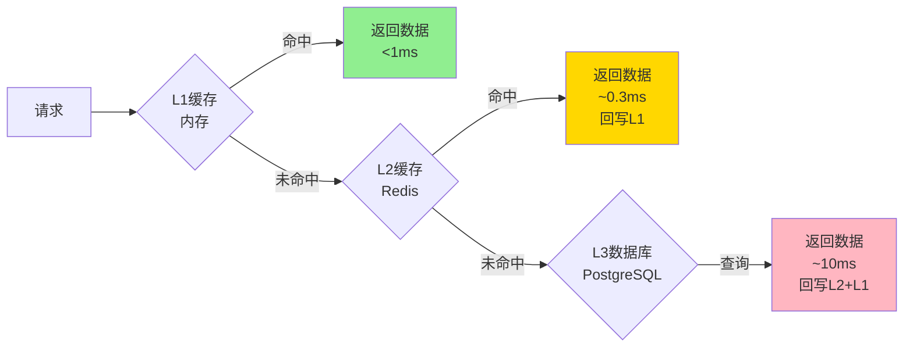

# CKY.MAF框架部署指南

> **文档版本**: v1.2
> **创建日期**: 2026-03-12
> **用途**: 生产环境部署与运维指南

---

## 📋 目录

1. [环境要求](#一环境要求)
2. [本地开发环境](#二本地开发环境)
3. [Docker部署](#三docker部署)
4. [Kubernetes部署](#四kubernetes部署)
5. [配置管理](#五配置管理)
6. [监控与日志](#六监控与日志)
7. [性能优化](#七性能优化)
8. [安全加固](#八安全加固)

---

## 一、环境要求

### 1.1 开发环境

```yaml
操作系统:
  - Windows 11+ (推荐)
  - Ubuntu 22.04+
  - macOS 13+

运行时:
  - .NET 10.0 SDK
  - Docker Desktop 4.25+
  - Docker Compose 2.20+

开发工具:
  - Visual Studio 2022 17.8+
  - VS Code + C# Dev Kit
  - Git 2.40+

数据库:
  - PostgreSQL 16+
  - Redis 7+
  - Qdrant 1.12+ (可选)
```

### 1.2 生产环境

```yaml
最低配置:
  CPU: 4核
  内存: 8GB
  磁盘: 50GB SSD

推荐配置:
  CPU: 8核
  内存: 16GB
  磁盘: 100GB SSD

依赖服务:
  - PostgreSQL 16 (持久化存储)
  - Redis 7 (缓存、会话)
  - RabbitMQ 3.12+ (消息队列，可选)
  - Qdrant 1.12+ (向量数据库，可选)
```

---

## 二、本地开发环境

### 2.1 快速开始

```bash
# 1. 克隆仓库
git clone https://github.com/your-org/maf-framework.git
cd maf-framework

# 2. 启动基础服务（Docker Compose）
docker-compose -f docker-compose.dev.yml up -d

# 3. 安装.NET依赖
dotnet restore

# 4. 配置开发环境
cp appsettings.Development.json.example appsettings.Development.json

# 5. 运行数据库迁移
dotnet ef database update

# 6. 启动应用
dotnet run --project src/MafApplication

# 7. 访问应用
# 浏览器打开: https://localhost:5001
```

### 2.2 开发环境配置

```json
// appsettings.Development.json
{
  "Logging": {
    "LogLevel": {
      "Default": "Information",
      "Microsoft": "Warning",
      "Microsoft.EntityFrameworkCore": "Information"
    }
  },
  "AllowedHosts": "*",
  "Kestrel": {
    "Endpoints": {
      "Http": {
        "Url": "http://localhost:5000"
      },
      "Https": {
        "Url": "https://localhost:5001"
      }
    }
  },
  "CKY.MAF": {
    "Environment": "Development",
    "EnableDetailedErrors": true,
    "EnableSensitiveDataLogging": true
  },
  "ConnectionStrings": {
    "DefaultConnection": "Host=localhost;Database=maf_dev;Username=maf;Password=maf_dev"
  },
  "Redis": {
    "ConnectionString": "localhost:6379"
  },
  "LLM": {
    "Provider": "ZhipuAI",
    "ApiKey": "your-api-key",
    "Model": "glm-4",
    "Endpoint": "https://open.bigmodel.cn/api/paas/v4/chat/completions"
  }
}
```

---

## 三、Docker部署

### 3.1 Dockerfile

```dockerfile
# 多阶段构建
FROM mcr.microsoft.com/dotnet/sdk:10.0 AS build
WORKDIR /src

# 复制项目文件
COPY ["src/MafApplication/MafApplication.csproj", "MafApplication/"]
COPY ["src/MafCore/MafCore.csproj", "MafCore/"]
COPY ["src/MafServices/MafServices.csproj", "MafServices/"]

# 还原依赖
RUN dotnet restore "MafApplication/MafApplication.csproj"

# 复制所有源代码
COPY . .

# 构建项目
WORKDIR "/src/MafApplication"
RUN dotnet build "MafApplication.csproj" -c Release -o /app/build

# 发布项目
FROM build AS publish
RUN dotnet publish "MafApplication.csproj" -c Release -o /app/publish /p:UseAppHost=false

# 运行时镜像
FROM mcr.microsoft.com/dotnet/aspnet:10.0 AS final
WORKDIR /app
EXPOSE 80
EXPOSE 443

# 复制发布文件
COPY --from=publish /app/publish .

# 健康检查
HEALTHCHECK --interval=30s --timeout=3s \
  CMD curl -f http://localhost/health || exit 1

ENTRYPOINT ["dotnet", "MafApplication.dll"]
```

### 3.2 Docker Compose配置

```yaml
# docker-compose.yml
version: '3.8'

services:
  # CKY.MAF应用
  maf-app:
    build:
      context: .
      dockerfile: Dockerfile
    container_name: maf-application
    ports:
      - "5000:80"
      - "5001:443"
    environment:
      - ASPNETCORE_ENVIRONMENT=Production
      - ASPNETCORE_URLS=https://+:443;http://+:80
      - ASPNETCORE_Kestrel__Certificates__Default__Path=/https/aspnetcoreapp.pfx
      - ASPNETCORE_Kestrel__Certificates__Default__Password=your_password
      - ConnectionStrings__DefaultConnection=Host=postgres;Database=maf;Username=maf;Password=maf_password;Port=5432
      - Redis__ConnectionString=redis:6379
      - LLM__Provider=ZhipuAI
      - LLM__ApiKey=${LLM_API_KEY}
    depends_on:
      - postgres
      - redis
    volumes:
      - ./https:/https:ro
      - maf-data:/app/data
    restart: unless-stopped
    networks:
      - maf-network

  # PostgreSQL数据库
  postgres:
    image: postgres:16-alpine
    container_name: maf-postgres
    environment:
      POSTGRES_DB: maf
      POSTGRES_USER: maf
      POSTGRES_PASSWORD: maf_password
    ports:
      - "5432:5432"
    volumes:
      - postgres-data:/var/lib/postgresql/data
      - ./init-db.sql:/docker-entrypoint-initdb.d/init-db.sql:ro
    restart: unless-stopped
    networks:
      - maf-network
    healthcheck:
      test: ["CMD-SHELL", "pg_isready -U maf"]
      interval: 10s
      timeout: 5s
      retries: 5

  # Redis缓存
  redis:
    image: redis:7-alpine
    container_name: maf-redis
    ports:
      - "6379:6379"
    volumes:
      - redis-data:/data
    command: redis-server --appendonly yes --requirepass redis_password
    restart: unless-stopped
    networks:
      - maf-network
    healthcheck:
      test: ["CMD", "redis-cli", "ping"]
      interval: 10s
      timeout: 3s
      retries: 5

  # Qdrant向量数据库（可选）
  qdrant:
    image: qdrant/qdrant:v1.12.0
    container_name: maf-qdrant
    ports:
      - "6333:6333"
    volumes:
      - qdrant-data:/qdrant/storage
    restart: unless-stopped
    networks:
      - maf-network

  # 监控服务
  prometheus:
    image: prom/prometheus:latest
    container_name: maf-prometheus
    ports:
      - "9090:9090"
    volumes:
      - ./prometheus.yml:/etc/prometheus/prometheus.yml:ro
      - prometheus-data:/prometheus
    command:
      - '--config.file=/etc/prometheus/prometheus.yml'
      - '--storage.tsdb.path=/prometheus'
    restart: unless-stopped
    networks:
      - maf-network

  grafana:
    image: grafana/grafana:latest
    container_name: maf-grafana
    ports:
      - "3000:3000"
    environment:
      - GF_SECURITY_ADMIN_PASSWORD=admin
    volumes:
      - grafana-data:/var/lib/grafana
      - ./grafana/provisioning:/etc/grafana/provisioning:ro
    restart: unless-stopped
    networks:
      - maf-network

volumes:
  postgres-data:
  redis-data:
  qdrant-data:
  maf-data:
  prometheus-data:
  grafana-data:

networks:
  maf-network:
    driver: bridge
```

### 3.3 启动命令

```bash
# 构建并启动所有服务
docker-compose up -d

# 查看日志
docker-compose logs -f maf-app

# 停止所有服务
docker-compose down

# 停止并删除所有数据
docker-compose down -v
```

---

## 四、Kubernetes部署

### 4.1 命名空间配置

```yaml
# namespace.yaml
apiVersion: v1
kind: Namespace
metadata:
  name: maf-system
  labels:
    name: maf-system
```

### 4.2 配置管理

```yaml
# configmap.yaml
apiVersion: v1
kind: ConfigMap
metadata:
  name: maf-config
  namespace: maf-system
data:
  ASPNETCORE_ENVIRONMENT: "Production"
  ASPNETCORE_URLS: "https://+:443;http://+:80"
  Redis__ConnectionString: "redis-service:6379"
  LLM__Provider: "ZhipuAI"
  LLM__Model: "glm-4"
```

```yaml
# secret.yaml
apiVersion: v1
kind: Secret
metadata:
  name: maf-secrets
  namespace: maf-system
type: Opaque
stringData:
  db-password: "your-secure-password"
  redis-password: "your-redis-password"
  llm-api-key: "your-llm-api-key"
  jwt-secret: "your-jwt-secret-key"
```

### 4.3 部署配置

```yaml
# deployment.yaml
apiVersion: apps/v1
kind: Deployment
metadata:
  name: maf-application
  namespace: maf-system
spec:
  replicas: 3
  selector:
    matchLabels:
      app: maf
  template:
    metadata:
      labels:
        app: maf
        version: v1.0.0
    spec:
      containers:
      - name: maf-app
        image: maf-application:v1.0.0
        ports:
        - containerPort: 80
          name: http
        - containerPort: 443
          name: https
        env:
        - name: ASPNETCORE_ENVIRONMENT
          valueFrom:
            configMapKeyRef:
              name: maf-config
              key: ASPNETCORE_ENVIRONMENT
        - name: ConnectionStrings__DefaultConnection
          valueFrom:
            secretKeyRef:
              name: maf-secrets
              key: db-password
        - name: Redis__ConnectionString
          valueFrom:
            configMapKeyRef:
              name: maf-config
              key: Redis__ConnectionString
        - name: LLM__ApiKey
          valueFrom:
            secretKeyRef:
              name: maf-secrets
              key: llm-api-key
        resources:
          requests:
            memory: "256Mi"
            cpu: "250m"
          limits:
            memory: "512Mi"
            cpu: "500m"
        livenessProbe:
          httpGet:
            path: /health
            port: 80
          initialDelaySeconds: 30
          periodSeconds: 10
          timeoutSeconds: 5
          failureThreshold: 3
        readinessProbe:
          httpGet:
            path: /health/ready
            port: 80
          initialDelaySeconds: 5
          periodSeconds: 5
          timeoutSeconds: 3
          failureThreshold: 3
---
apiVersion: v1
kind: Service
metadata:
  name: maf-service
  namespace: maf-system
spec:
  selector:
    app: maf
  ports:
  - name: http
    port: 80
    targetPort: 80
  - name: https
    port: 443
    targetPort: 443
  type: LoadBalancer
  sessionAffinity: ClientIP
```

### 4.4 HPA自动扩缩容

```yaml
# hpa.yaml
apiVersion: autoscaling/v2
kind: HorizontalPodAutoscaler
metadata:
  name: maf-hpa
  namespace: maf-system
spec:
  scaleTargetRef:
    apiVersion: apps/v1
    kind: Deployment
    name: maf-application
  minReplicas: 3
  maxReplicas: 10
  metrics:
  - type: Resource
    resource:
      name: cpu
      target:
        type: Utilization
        averageUtilization: 70
  - type: Resource
    resource:
      name: memory
      target:
        type: Utilization
        averageUtilization: 80
  behavior:
    scaleDown:
      stabilizationWindowSeconds: 300
      policies:
      - type: Percent
        value: 50
        periodSeconds: 60
    scaleUp:
      stabilizationWindowSeconds: 60
      policies:
      - type: Percent
        value: 100
        periodSeconds: 30
      - type: Pods
        value: 2
        periodSeconds: 60
```

---

## 五、配置管理

### 5.1 配置文件结构

```yaml
# 配置优先级（从高到低）
# 1. 环境变量
# 2. 命令行参数
# 3. 用户机密（Secrets）
# 4. 配置文件（appsettings.{Environment}.json）
# 5. 代码中的默认值

MAF配置层次:
├── appsettings.json                    # 基础配置
├── appsettings.Production.json         # 生产环境
├── appsettings.Development.json        # 开发环境
└── config/
    ├── logging.json                    # 日志配置
    ├── cache.json                      # 缓存配置
    └── llm.json                        # LLM配置
```

### 5.2 生产环境配置

```json
// appsettings.Production.json
{
  "Logging": {
    "LogLevel": {
      "Default": "Warning",
      "Microsoft": "Warning",
      "Microsoft.Hosting.Lifetime": "Information"
    }
  },
  "AllowedHosts": "*.yourdomain.com",
  "CKY.MAF": {
    "Environment": "Production",
    "EnableDetailedErrors": false,
    "EnableSensitiveDataLogging": false,
    "Agents": {
      "MaxConcurrentTasksPerAgent": 5,
      "AgentTimeout": "00:05:00",
      "HealthCheckInterval": "00:00:30"
    },
    "LLM": {
      "Provider": "ZhipuAI",
      "Models": {
        "MainAgent": "glm-4-plus",
        "SubAgent": "glm-4"
      },
      "Fallback": {
        "EnableFallback": true,
        "FallbackProvider": "Qwen",
        "MaxRetries": 3
      },
      "RateLimit": {
        "RequestsPerMinute": 100,
        "TokensPerMinute": 100000
      }
    },
    "Storage": {
      "Session": {
        "L1Enabled": true,
        "L2ConnectionString": "redis-service:6379,password=redis_password",
        "L2TTL": "01:00:00",
        "L3ConnectionString": "Host=postgres-service;Database=maf;Username=maf;Password=***",
        "L3ArchiveDays": 30
      },
      "Vector": {
        "Provider": "Qdrant",
        "ConnectionString": "http://qdrant-service:6333",
        "Dimension": 768,
        "IndexType": "HNSW"
      }
    },
    "Monitoring": {
      "EnablePrometheus": true,
      "EnableOpenTelemetry": true,
      "MetricsPort": 9090,
      "TracingEndpoint": "http://jaeger-collector:14268/api/traces"
    }
  }
}
```

---

## 六、监控与日志

### 6.1 Prometheus指标配置

```yaml
# prometheus.yml
global:
  scrape_interval: 15s
  evaluation_interval: 15s

scrape_configs:
  - job_name: 'maf-application'
    static_configs:
      - targets: ['maf-app:80']
    metrics_path: '/metrics'
    scrape_interval: 30s

  - job_name: 'postgres'
    static_configs:
      - targets: ['postgres:5432']

  - job_name: 'redis'
    static_configs:
      - targets: ['redis:6379']
```

### 6.2 关键指标

```csharp
// 自定义指标
public class MafMetrics
{
    private readonly Counter _requestCounter;
    private readonly Histogram _responseTimeHistogram;
    private readonly Gauge _activeAgentsGauge;
    private readonly Counter _llmTokenCounter;

    public MafMetrics(IMetricFactory metrics)
    {
        _requestCounter = metrics.CreateCounter(
            "maf_requests_total",
            "Total requests processed",
            new[] { "agent_type", "intent" });

        _responseTimeHistogram = metrics.CreateHistogram(
            "maf_request_duration_seconds",
            "Request duration in seconds",
            new[] { "agent_type" });

        _activeAgentsGauge = metrics.CreateGauge(
            "maf_active_agents",
            "Number of active agents");

        _llmTokenCounter = metrics.CreateCounter(
            "maf_llm_tokens_total",
            "Total LLM tokens consumed",
            new[] { "model", "provider" });
    }

    public void RecordRequest(string agentType, string intent, double duration)
    {
        _requestCounter.WithLabels(agentType, intent).Inc();
        _responseTimeHistogram.WithLabels(agentType).Observe(duration);
    }

    public void SetActiveAgents(int count)
    {
        _activeAgentsGauge.Set(count);
    }

    public void RecordLLMTokens(string model, string provider, int tokens)
    {
        _llmTokenCounter.WithLabels(model, provider).Inc(tokens);
    }
}
```

### 6.3 日志配置

```csharp
// Program.cs
Log.Logger = new LoggerConfiguration()
    .ReadFrom.Configuration(configuration)
    .Enrich.FromLogContext()
    .Enrich.WithProperty("Application", "CKY.MAF")
    .Enrich.WithProperty("Environment", context.HostingEnvironment)
    .WriteTo.Console()
    .WriteTo.File(
        "logs/maf-.log",
        rollingInterval: RollingInterval.Day,
        outputTemplate: "{Timestamp:yyyy-MM-dd HH:mm:ss.fff} [{Level:u3}] {SourceContext}{Message}{NewLine}{Exception}")
    )
    .WriteTo.Elasticsearch(options =>
    {
        options.NodeUris = new[] { "http://elasticsearch:9200" };
        options.IndexFormat = "maf-logs-{0:yyyy.MM.dd}";
        options.Template = new { }
    })
    .CreateLogger();
```

---

## 七、性能优化

### 7.1 缓存策略



### 7.2 连接池配置

```json
{
  "ConnectionStrings": {
    "DefaultConnection": "Host=postgres;Database=maf;Username=maf;Password=***;Maximum Pool Size=100;Minimum Pool Size=10;Connection Lifetime=300;"
  }
}
```

### 7.3 性能基准

| 指标 | 目标值 | 监控方式 |
|------|--------|----------|
| **响应时间** | P95 < 500ms | Histogram |
| **吞吐量** | > 100 req/s | Counter |
| **错误率** | < 1% | Counter |
| **CPU使用率** | < 70% | Gauge |
| **内存使用率** | < 80% | Gauge |
| **LLM延迟** | P95 < 3s | Histogram |

---

## 八、安全加固

### 8.1 认证授权

```csharp
// JWT认证
services.AddAuthentication(JwtBearerDefaults.AuthenticationScheme)
    .AddJwtBearer(options =>
    {
        options.TokenValidationParameters = new TokenValidationParameters
        {
            ValidateIssuer = true,
            ValidateAudience = true,
            ValidateLifetime = true,
            ValidateIssuerSigningKey = true,
            ValidIssuer = "CKY.MAF",
            ValidAudience = "CKY.MAF.Client",
            IssuerSigningKey = new SymmetricSecurityKey(
                Encoding.UTF8.GetBytes(configuration["JWT:Secret"]))
        };
    });

// .NET权限管理
services.AddAbpIdentity<CKY.MAFUser, CKY.MAFRole>()
    .AddAbpIdentityServer();
```

### 8.2 API安全

```csharp
// 速率限制
services.AddRateLimiter(options =>
{
    options.GlobalLimiter = PartitionedRateLimiter.CreateChained(
        PartitionedRateLimiter.SlidingWindow(
            permittedNumberOfCalls: 100,
            window: TimeSpan.FromMinutes(1),
            SegmentsPerWindow: 10),
        PartitionedRateLimiter.SlidingWindow(
            permittedNumberOfCalls: 20,
            window: TimeSpan.FromSeconds(10),
            SegmentsPerWindow: 2)
    );
});

// CORS配置
services.AddCors(options =>
{
    options.AddPolicy("Production", policy =>
    {
        policy.WithOrigins("https://maf.yourdomain.com")
              .WithMethods("GET", "POST", "PUT", "DELETE")
              .WithHeaders("Content-Type", "Authorization")
              .AllowCredentials();
    });
});
```

### 8.3 数据保护

```csharp
// API密钥加密
public class ApiKeyProtector
{
    private readonly IDataProtector _protector;

    public ApiKeyProtector(IDataProtectionProvider provider)
    {
        _protector = provider.CreateProtector("CKY.MAF.ApiKeys.v1");
    }

    public string Protect(string plainApiKey)
    {
        return _protector.Protect(plainApiKey);
    }

    public string Unprotect(string protectedApiKey)
    {
        try
        {
            return _protector.Unprotect(protectedApiKey);
        }
        catch (CryptographicException ex)
        {
            throw new SecurityException("Invalid API key", ex);
        }
    }
}
```

---

## 🔧 快速部署命令

### Docker Compose

```bash
# 一键启动
docker-compose up -d

# 查看状态
docker-compose ps

# 查看日志
docker-compose logs -f

# 停止
docker-compose down
```

### Kubernetes

```bash
# 创建命名空间
kubectl create namespace maf-system

# 部署配置
kubectl apply -f k8s/namespace.yaml
kubectl apply -f k8s/configmap.yaml
kubectl apply -f k8s/secret.yaml
kubectl apply -f k8s/deployment.yaml
kubectl apply -f k8s/service.yaml
kubectl apply -f k8s/hpa.yaml

# 检查部署状态
kubectl get pods -n maf-system
kubectl get services -n maf-system

# 查看日志
kubectl logs -f deployment/maf-application -n maf-system
```

---

## 🔗 相关文档

- [核心架构](./00-CORE-ARCHITECTURE.md)
- [实现指南](./01-IMPLEMENTATION-GUIDE.md)
- [架构图表集](./02-architecture-diagrams.md)

---

**文档版本**: v1.2
**最后更新**: 2026-03-13
