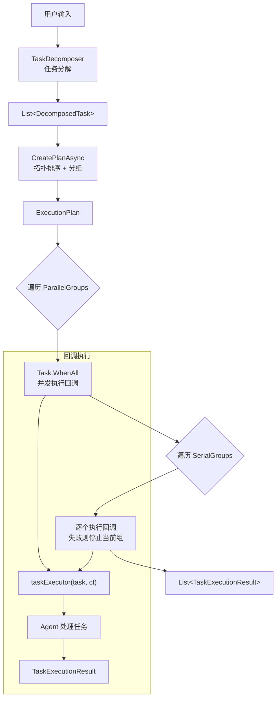

# 如何使用任务编排器（Task Orchestrator）

## 概述

`ITaskOrchestrator` 是 CKY.MAF 框架的核心编排组件，负责将分解后的子任务按依赖关系自动分组（串行 / 并行），生成执行计划并协调执行。框架提供两个实现：

| 实现 | 用途 |
|------|------|
| `MafTaskOrchestrator` | 基础编排器 — 拓扑排序、分组、回调执行 |
| `PersistentTaskOrchestrator` | 持久化装饰器 — 包装基础编排器，添加数据库持久化 |

## 架构位置

```
L4 Services
  └─ Orchestration/
       ├─ MafTaskOrchestrator.cs         # 基础实现
       └─ PersistentTaskOrchestrator.cs  # 持久化装饰器
L1 Core
  └─ Abstractions/
       └─ ITaskOrchestrator.cs           # 接口
  └─ Models/Task/
       ├─ ExecutionPlan.cs               # 执行计划
       ├─ TaskGroup.cs                   # 任务组
       ├─ DecomposedTask.cs              # 分解后的子任务
       ├─ TaskDependency.cs              # 依赖关系
       └─ TaskExecutionResult.cs         # 执行结果
```

## 执行流程



## 持久化流程

```mermaid
sequenceDiagram
    participant Client
    participant Persistent as PersistentTaskOrchestrator
    participant Inner as MafTaskOrchestrator
    participant DB as Database

    Client->>Persistent: CreatePlanAsync(tasks)
    Persistent->>Inner: CreatePlanAsync(tasks)
    Inner-->>Persistent: ExecutionPlan
    Persistent->>DB: SaveExecutionPlanEntity (JSON)
    Persistent-->>Client: ExecutionPlan

    Client->>Persistent: ExecutePlanAsync(plan, callback)
    Persistent->>DB: UpdateStatus → Running
    Persistent->>Inner: ExecutePlanAsync(plan, callback)
    Inner-->>Persistent: List&lt;TaskExecutionResult&gt;
    Persistent->>DB: SaveExecutionResultEntities
    Persistent->>DB: UpdateStatus → Completed/Failed
    Persistent-->>Client: List&lt;TaskExecutionResult&gt;
```

## 快速开始

### 1. 注册服务

**基础版（无持久化）**：

```csharp
services.AddPersistentTaskServices();
// 注册：ITaskOrchestrator → MafTaskOrchestrator
```

**持久化版**：

```csharp
services.AddPersistentTaskServicesWithPersistence();
// 注册：ITaskOrchestrator → PersistentTaskOrchestrator(MafTaskOrchestrator)
// 需要配合 IExecutionPlanRepository 和 ITaskExecutionResultRepository
```

两个方法定义在 `PersistentTaskServiceExtensions` 中（位于 `Services/PersistentTaskService.cs`）。

### 2. 创建子任务

```csharp
var tasks = new List<DecomposedTask>
{
    new()
    {
        TaskName = "打开客厅灯",
        Intent = "LightControl",
        RequiredCapability = "lighting",
        Priority = TaskPriority.High,
        PriorityScore = 80
    },
    new()
    {
        TaskName = "调节温度到26度",
        Intent = "ClimateControl",
        RequiredCapability = "climate",
        Priority = TaskPriority.Normal,
        PriorityScore = 50
    }
};
```

### 3. 创建执行计划

```csharp
var orchestrator = serviceProvider.GetRequiredService<ITaskOrchestrator>();
var plan = await orchestrator.CreatePlanAsync(tasks);
// plan.ParallelGroups → 无依赖的任务被分到并行组
// plan.SerialGroups   → 有依赖的单任务被分到串行组
```

### 4. 执行计划

```csharp
var results = await orchestrator.ExecutePlanAsync(plan, async (task, ct) =>
{
    // 你的 Agent 执行逻辑
    var agentResult = await myAgent.HandleAsync(task, ct);
    return new TaskExecutionResult
    {
        TaskId = task.TaskId,
        Success = true,
        Message = agentResult.Response,
        StartedAt = DateTime.UtcNow,
        CompletedAt = DateTime.UtcNow
    };
});
```

## 核心概念

### 接口定义

```csharp
public interface ITaskOrchestrator
{
    // 根据任务依赖关系生成执行计划
    Task<ExecutionPlan> CreatePlanAsync(
        List<DecomposedTask> tasks, CancellationToken ct = default);

    // 使用默认执行器执行计划
    Task<List<TaskExecutionResult>> ExecutePlanAsync(
        ExecutionPlan plan, CancellationToken ct = default);

    // 使用自定义回调执行计划（推荐）
    Task<List<TaskExecutionResult>> ExecutePlanAsync(
        ExecutionPlan plan,
        Func<DecomposedTask, CancellationToken, Task<TaskExecutionResult>> taskExecutor,
        CancellationToken ct = default);

    // 取消正在执行的计划
    Task CancelAsync(string planId, CancellationToken ct = default);
}
```

### 执行计划（ExecutionPlan）

`CreatePlanAsync` 内部使用拓扑排序算法按依赖关系对任务分组：

- **无依赖的多个任务** → `ParallelGroups`（`Task.WhenAll` 并发执行）
- **有依赖的单个任务** → `SerialGroups`（逐个执行）

```csharp
public class ExecutionPlan
{
    public string PlanId { get; set; }              // 唯一标识
    public List<TaskGroup> SerialGroups { get; set; }    // 串行任务组
    public List<TaskGroup> ParallelGroups { get; set; }  // 并行任务组
    public bool AllowPartialExecution { get; set; }      // 是否允许部分执行
}
```

### 任务组（TaskGroup）

```csharp
public class TaskGroup
{
    public string GroupId { get; set; }
    public GroupExecutionMode Mode { get; set; }  // Serial | Parallel
    public List<DecomposedTask> Tasks { get; set; }
    public GroupStatus Status { get; set; }       // Pending → Running → Completed/Failed
}
```

### 依赖关系（TaskDependency）

```csharp
public class TaskDependency
{
    public string DependsOnTaskId { get; set; }
    public DependencyType Type { get; set; }
    public bool IsSatisfied { get; set; }
    public string? Condition { get; set; }  // 可选条件表达式
}
```

**依赖类型**：

| 类型 | 含义 |
|------|------|
| `MustComplete` | 前置任务必须完成（无论成功失败） |
| `MustSucceed` | 前置任务必须成功 |
| `MustStart` | 前置任务必须已开始 |
| `DataDependency` | 需要前置任务的输出数据 |
| `SoftDependency` | 软依赖（可选，优先级继承） |

## 回调模式（Callback Pattern）

编排器通过 `Func<DecomposedTask, CancellationToken, Task<TaskExecutionResult>>` 回调将每个子任务分发给具体的 Agent 执行。

### 方式 A：调用时传入回调（推荐）

```csharp
var results = await orchestrator.ExecutePlanAsync(plan, async (task, ct) =>
{
    // 根据 task.RequiredCapability 路由到不同 Agent
    var agent = agentRegistry.GetAgent(task.RequiredCapability);
    var response = await agent.ProcessAsync(task, ct);

    return new TaskExecutionResult
    {
        TaskId = task.TaskId,
        Success = response.IsSuccess,
        Message = response.Message,
        Data = response.Data,
        StartedAt = DateTime.UtcNow,
        CompletedAt = DateTime.UtcNow
    };
});
```

### 方式 B：注入默认执行器

适用于 LeaderAgent 在初始化时设置全局的 Agent 分发逻辑：

```csharp
// 初始化时注入
if (orchestrator is MafTaskOrchestrator mafOrchestrator)
{
    mafOrchestrator.SetDefaultTaskExecutor(async (task, ct) =>
    {
        var agent = FindBestAgent(task);
        return await agent.ExecuteAsync(task, ct);
    });
}

// 后续调用无需传入回调
var results = await orchestrator.ExecutePlanAsync(plan);
```

### 回调执行优先级

1. **调用方提供的 `taskExecutor` 回调** — 最高优先级
2. **`SetDefaultTaskExecutor` 注入的默认执行器** — 次之
3. **无执行器** — 返回占位成功结果（仅测试用）

### 异常处理

回调抛出异常时不会中断整个执行计划，仅将对应任务标记为失败：

```csharp
// 回调抛出异常 → 自动捕获 → 任务标记 Failed
var results = await orchestrator.ExecutePlanAsync(plan, async (task, ct) =>
{
    throw new InvalidOperationException("Agent 不可用");
    // 不会影响其他任务，此任务 Result.Success = false
});
```

## 依赖关系与分组策略

### 无依赖 — 并行执行

```csharp
var taskA = new DecomposedTask { TaskName = "打开灯" };
var taskB = new DecomposedTask { TaskName = "调节温度" };
var taskC = new DecomposedTask { TaskName = "播放音乐" };

var plan = await orchestrator.CreatePlanAsync(new List<DecomposedTask> { taskA, taskB, taskC });
// plan.ParallelGroups[0].Tasks = [taskA, taskB, taskC]
// 三个任务通过 Task.WhenAll 并发执行
```

### 有依赖 — 串行分组

```csharp
var step1 = new DecomposedTask { TaskName = "生成代码" };
var step2 = new DecomposedTask
{
    TaskName = "运行测试",
    Dependencies = new List<TaskDependency>
    {
        new() { DependsOnTaskId = step1.TaskId, Type = DependencyType.MustSucceed }
    }
};
var step3 = new DecomposedTask
{
    TaskName = "部署",
    Dependencies = new List<TaskDependency>
    {
        new() { DependsOnTaskId = step2.TaskId, Type = DependencyType.MustSucceed }
    }
};

var plan = await orchestrator.CreatePlanAsync(new List<DecomposedTask> { step1, step2, step3 });
// 分为 3 个组，按依赖顺序串行执行
// 第 2 步失败时第 3 步不会执行
```

### 混合场景 — 并行 + 串行

```csharp
var fetchData = new DecomposedTask { TaskName = "获取数据" };
var fetchConfig = new DecomposedTask { TaskName = "获取配置" };  // 无依赖 → 与 fetchData 并行
var processData = new DecomposedTask
{
    TaskName = "处理数据",
    Dependencies = new List<TaskDependency>
    {
        new() { DependsOnTaskId = fetchData.TaskId, Type = DependencyType.DataDependency },
        new() { DependsOnTaskId = fetchConfig.TaskId, Type = DependencyType.MustSucceed }
    }
};

// 第 1 组: fetchData + fetchConfig（并行）
// 第 2 组: processData（串行，依赖第 1 组完成）
```

## 串行组中的失败停止

在串行组中，如果某个任务失败，后续同组任务将被跳过：

```csharp
// step1 成功 → step2 失败 → step3 不执行
var results = await orchestrator.ExecutePlanAsync(plan, async (task, ct) =>
{
    if (task.TaskName == "步骤2")
        return new TaskExecutionResult
        {
            TaskId = task.TaskId, Success = false, Message = "失败",
            StartedAt = DateTime.UtcNow, CompletedAt = DateTime.UtcNow
        };

    return new TaskExecutionResult
    {
        TaskId = task.TaskId, Success = true, Message = "成功",
        StartedAt = DateTime.UtcNow, CompletedAt = DateTime.UtcNow
    };
});
// results 只包含 step1 和 step2 的结果
```

## 取消执行

```csharp
// 异步取消正在运行的计划
await orchestrator.CancelAsync(plan.PlanId);
```

编排器内部通过 `CancellationTokenSource.CreateLinkedTokenSource` 管理取消令牌，`CancelAsync` 会触发所有关联任务的取消。

## 持久化编排器

`PersistentTaskOrchestrator` 是装饰器模式，包装 `MafTaskOrchestrator` 并添加数据库持久化能力。

### 额外功能

```csharp
var persistentOrchestrator = (PersistentTaskOrchestrator)orchestrator;

// 从数据库恢复执行计划
var restoredPlan = await persistentOrchestrator.RestorePlanAsync(planId);

// 查询计划状态
var status = await persistentOrchestrator.GetPlanStatusAsync(planId);

// 查询执行结果
var results = await persistentOrchestrator.GetExecutionResultsAsync(planId);
```

### 状态流转

```
Created → Running → Completed          (全部成功)
                  → PartiallyCompleted  (部分失败)
                  → Failed              (异常)
                  → Cancelled           (取消)
```

### 持久化时序

1. `CreatePlanAsync` → 序列化计划 JSON → 写入 `ExecutionPlanEntity`
2. `ExecutePlanAsync` → 更新状态为 `Running` → 执行 → 保存 `TaskExecutionResultEntity` → 更新最终状态
3. `CancelAsync` → 委托取消 → 更新状态为 `Cancelled`

## 与 TaskScheduler 的协作

`ITaskScheduler` 负责优先级计算和并发控制，`ITaskOrchestrator` 负责依赖分组和执行：

```csharp
// 完整流程：分解 → 调度 → 编排 → 执行
var decomposition = await decomposer.DecomposeAsync(userInput, intent);
var scheduleResult = await scheduler.ScheduleAsync(decomposition.SubTasks);
var executionPlan = await orchestrator.CreatePlanAsync(decomposition.SubTasks);
var results = await orchestrator.ExecutePlanAsync(executionPlan, agentExecutor);
```

`PersistentTaskService` 封装了以上完整流程：

```csharp
var taskService = serviceProvider.GetRequiredService<PersistentTaskService>();
var response = await taskService.SubmitAndExecuteAsync(request, decomposition);
// 内部自动调用 Scheduler + Orchestrator + 持久化
```

## 与 TaskDecomposer 的协作

`MafTaskDecomposer` 将用户输入分解为 `List<DecomposedTask>`，作为编排器的输入：

```csharp
var decomposer = serviceProvider.GetRequiredService<ITaskDecomposer>();
var decomposition = await decomposer.DecomposeAsync(userInput, intent);

// decomposition.SubTasks → 传入编排器
var plan = await orchestrator.CreatePlanAsync(decomposition.SubTasks);
```

## 完整使用示例

### 场景：智能家居多任务执行

```csharp
public class SmartHomeService
{
    private readonly ITaskOrchestrator _orchestrator;
    private readonly IMafAiAgentRegistry _agentRegistry;

    public SmartHomeService(
        ITaskOrchestrator orchestrator,
        IMafAiAgentRegistry agentRegistry)
    {
        _orchestrator = orchestrator;
        _agentRegistry = agentRegistry;
    }

    public async Task<List<TaskExecutionResult>> ExecuteSmartHomeCommandsAsync(
        string userInput, CancellationToken ct)
    {
        // 1. 构建子任务
        var tasks = new List<DecomposedTask>
        {
            new()
            {
                TaskName = "打开客厅灯",
                RequiredCapability = "lighting",
                Priority = TaskPriority.High,
                PriorityScore = 80
            },
            new()
            {
                TaskName = "调节温度到24度",
                RequiredCapability = "climate",
                Priority = TaskPriority.Normal,
                PriorityScore = 50
            },
            new()
            {
                TaskName = "播放轻音乐",
                RequiredCapability = "entertainment",
                Priority = TaskPriority.Low,
                PriorityScore = 30
            }
        };

        // 2. 创建执行计划（三个无依赖任务 → 并行组）
        var plan = await _orchestrator.CreatePlanAsync(tasks, ct);

        // 3. 使用回调执行
        return await _orchestrator.ExecutePlanAsync(plan, async (task, token) =>
        {
            var agent = _agentRegistry.GetAgentByCapability(task.RequiredCapability);
            if (agent == null)
            {
                return new TaskExecutionResult
                {
                    TaskId = task.TaskId,
                    Success = false,
                    Error = $"找不到支持 {task.RequiredCapability} 的 Agent",
                    StartedAt = DateTime.UtcNow,
                    CompletedAt = DateTime.UtcNow
                };
            }

            var result = await agent.ProcessAsync(task.Parameters, token);
            return new TaskExecutionResult
            {
                TaskId = task.TaskId,
                Success = result.IsSuccess,
                Message = result.Message,
                Data = result.Data,
                StartedAt = DateTime.UtcNow,
                CompletedAt = DateTime.UtcNow
            };
        }, ct);
    }
}
```

## 可观测性

`MafTaskOrchestrator` 内置 OpenTelemetry 追踪和 Prometheus 指标：

- **Trace Span**: `task.create_plan`, `task.execute_plan`
- **Tags**: `task.count`, `plan.id`, `plan.parallel_groups`, `plan.serial_groups`, `plan.success_count`, `plan.failure_count`
- **Metrics**: `task_created_total`, `task_completed_total`, `task_failed_total`, `task_duration`

## 注意事项

- **回调必须设置 `StartedAt` 和 `CompletedAt`**：`TaskExecutionResult` 需要这两个时间戳来计算 `Duration`。
- **`_activePlans` 非线程安全**：`MafTaskOrchestrator` 内部的 `Dictionary<string, CancellationTokenSource>` 不是并发安全的，不应在高并发场景下同时执行多个 `ExecutePlanAsync` + `CancelAsync`。
- **串行组失败即停止**：串行组中某个任务失败后，后续同组任务不会执行，但不影响其他组。
- **并行组不短路**：并行组中即使某个任务失败，其他任务仍会继续执行至完成。
- **持久化装饰器按需使用**：仅在需要数据库落地时使用 `AddPersistentTaskServicesWithPersistence()`，基础版开销更小。

## 相关文件

| 文件 | 说明 |
|------|------|
| `src/Core/Abstractions/ITaskOrchestrator.cs` | 接口定义 |
| `src/Services/Orchestration/MafTaskOrchestrator.cs` | 基础实现 |
| `src/Services/Orchestration/PersistentTaskOrchestrator.cs` | 持久化装饰器 |
| `src/Services/PersistentTaskService.cs` | 整合服务 + DI 扩展 |
| `src/Core/Models/Task/ExecutionPlan.cs` | 执行计划模型 |
| `src/Core/Models/Task/TaskGroup.cs` | 任务组模型 |
| `src/Core/Models/Task/DecomposedTask.cs` | 子任务模型 |
| `src/Core/Models/Task/TaskDependency.cs` | 依赖关系模型 |
| `src/Core/Models/Task/TaskExecutionResult.cs` | 执行结果模型 |
| `tests/UnitTests/Orchestration/MafTaskOrchestratorTests.cs` | 基础单元测试 |
| `tests/UnitTests/Services/Orchestration/MafTaskOrchestratorExtendedTests.cs` | 扩展单元测试 |
| `tests/IntegrationTests/Orchestration/TaskOrchestratorCallbackTests.cs` | 回调集成测试 |
