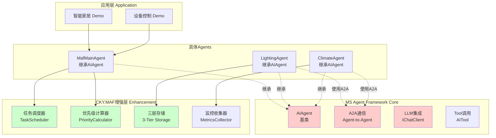
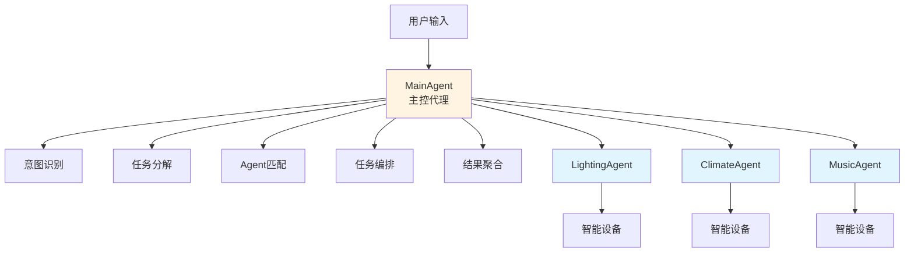
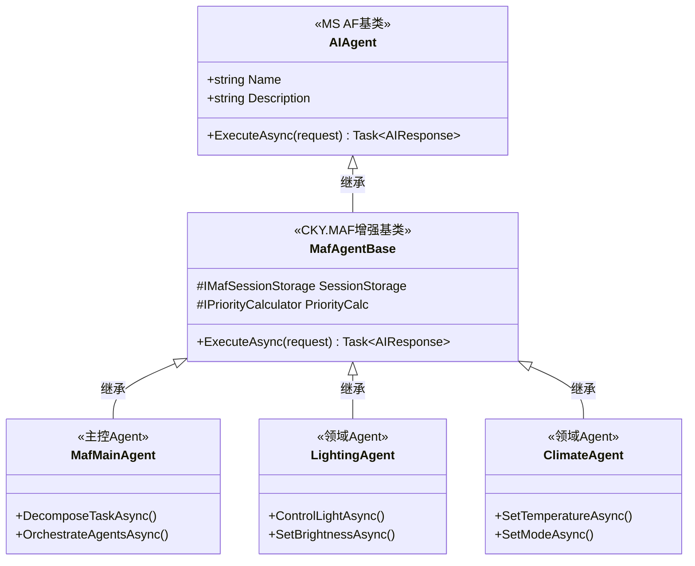
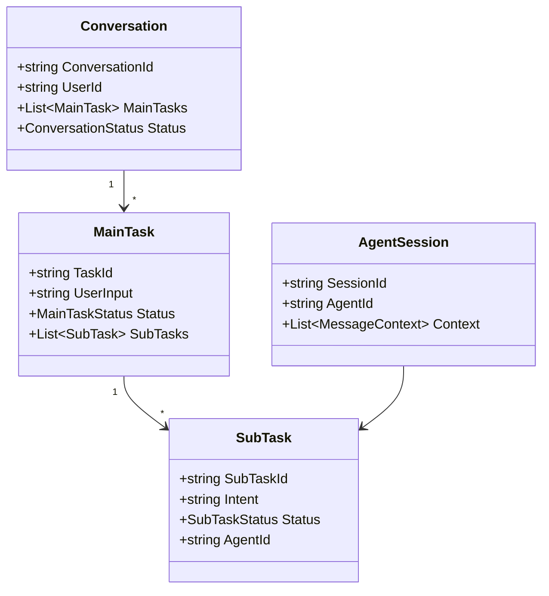

# CKY.MAF框架架构设计概览

> **文档版本**: v1.2
> **创建日期**: 2026-03-12
> **最后更新**: 2026-03-13
> **设计原则**: 基于Microsoft Agent Framework的企业级增强
> **核心依赖**: Microsoft Agent Framework (Preview)
> **目标**: 构建生产级多Agent应用系统

---

## 📋 文档说明

本文档是CKY.MAF框架的**架构设计概览**，提供核心架构、设计原则和技术选型的快速了解。

**CKY.MAF = 基于Microsoft Agent Framework的企业级增强层**

> ⚠️ **重要**: CKY.MAF **不是独立框架**，而是**Microsoft Agent Framework的企业级扩展**。所有Agent基于MS AF的`AIAgent`基类构建。

**详细专题文档**：
- 📐 [接口设计规范](./06-interface-design-spec.md) - 所有接口定义
- 💻 [实现指南](./09-implementation-guide.md) - 代码实现细节
- 📊 [任务调度系统](./03-task-scheduling-design.md) - 优先级、依赖、调度
- 🎨 [UI设计规范](./07-ui-design-spec.md) - 前端架构设计
- 🚀 [部署指南](./08-deployment-guide.md) - 部署与运维
- 📈 [架构图表集](./02-architecture-diagrams.md) - 可视化图表

---

## 一、核心设计原则

### 1.1 SOLID原则

CKY.MAF框架严格遵循SOLID原则：

| 原则 | 说明 | CKY.MAF中的应用 |
|------|------|----------------|
| **单一职责 (SRP)** | 每个类只负责一件事 | `IMafAgent`只负责执行任务<br>`ITaskDecomposer`只负责任务分解 |
| **开闭原则 (OCP)** | 对扩展开放，对修改关闭 | 新增Agent无需修改框架<br>新功能通过接口扩展 |
| **里氏替换 (LSP)** | 子类可替换父类 | `MafAgentBase`可被任何Agent替换 |
| **接口隔离 (ISP)** | 接口精简，按需实现 | `IMafMainAgent`扩展`IMafAgent`<br>`IMafAgentLifecycle`独立生命周期 |
| **依赖倒置 (DIP)** | 依赖抽象而非具体 | 实现层依赖抽象接口<br>高层不依赖低层 |

### 1.2 分层架构

```
┌─────────────────────────────────────────┐
│  应用层              │  智能家居、设备控制、客服  │
├─────────────────────────────────────────┤
│  CKY.MAF增强层      │  调度、存储、监控、优先级  │
├─────────────────────────────────────────┤
│  MS Agent Framework  │  AIAgent、A2A、LLM集成   │
├─────────────────────────────────────────┤
│  基础设施层         │  LLM、数据库、消息队列    │
└─────────────────────────────────────────┘
```

**依赖方向**: 应用层 → CKY.MAF增强层 → MS Agent Framework → 基础设施层

**关键点**：
- ✅ **MS Agent Framework是核心基础**，提供Agent基类和通信能力
- ✅ **CKY.MAF是增强层**，提供MS AF缺失的企业级特性
- ✅ **兼容性保证**，所有CKY.MAF Agent都是MS AF的AIAgent

---

## 二、核心架构

### 2.1 基于Microsoft Agent Framework的架构



**关键关系**：
- ✅ 所有Agent**继承**自MS AF的`AIAgent`
- ✅ Agent间通信使用MS AF的**A2A机制**
- ✅ CKY.MAF**增强**MS AF的能力（调度、存储、监控）
- ✅ LLM调用使用MS AF的`IChatClient`接口

---

### 2.2 Main-Agent + Sub-Agent 模式



**职责划分**：
- **MainAgent**: 意图识别、任务分解、Agent编排、结果聚合
- **SubAgent**: 执行特定领域的具体任务

**MS Agent Framework提供**：
- `AIAgent`基类：所有Agent的父类
- A2A通信：Agent间消息传递机制
- LLM集成：通过`IChatClient`调用大模型
- Tool机制：Agent能力扩展

**CKY.MAF增强**：
- 任务调度：优先级、依赖管理、执行策略
- 状态管理：AgentSession持久化、三层缓存
- 企业特性：监控、日志、追踪

---

### 2.3 Agent类层次结构



---

### 2.4 三层存储架构

| 层级 | 存储 | TTL | 延迟 | 用途 |
|------|------|-----|------|------|
| **L1** | 内存缓存 | 会话期间 | <1ms | 热数据、高频访问 |
| **L2** | Redis | 72小时 | ~0.3ms | 会话数据、共享缓存 |
| **L3** | PostgreSQL | 永久(30天归档) | ~10ms | 审计日志、历史数据 |

### 2.5 技术栈

#### 后端技术栈
```yaml
核心框架:
  必须: Microsoft Agent Framework (Preview)
       ↓ CKY.MAF基于此构建
  运行时: .NET 10
  依赖注入: 原生Microsoft.Extensions.DependencyInjection

Agent框架:
  基类: AIAgent (MS AF提供)
  通信: Agent-to-Agent (MS AF A2A)
  LLM: Microsoft.Extensions.AI (MS AF集成)

CKY.MAF增强:
  调度: 智能任务调度系统
  存储: 三层缓存架构 (L1/L2/L3)
  优先级: 多维优先级评分 (0-100)
  依赖管理: 5种依赖类型
  监控: Prometheus + 分布式追踪

LLM提供商:
  首选: 智谱AI (GLM-4 / GLM-4-Plus)
  备选: 通义千问、文心一言、讯飞星火

数据库:
  关系型: PostgreSQL 16
  缓存: Redis 7
  向量: Qdrant

消息队列:
  Agent间通信: MS AF A2A (内置)
  应用级消息: RabbitMQ / Redis Streams

实时通信:
  SignalR (CKY.MAF添加)

测试:
  - xUnit
  - Moq
  - FluentAssertions
```

#### 前端技术栈
```yaml
框架:
  首选: Blazor Server
  备选: Blazor WebAssembly

UI库:
  - MudBlazor (Material Design)

实时通信:
  - SignalR (内置)

图表:
  - Plotly.Blazor
```

---

## 三、核心概念

### 3.1 核心实体



### 3.2 状态机

#### MainTask状态机
```
Submitted → Decomposing → Dispatching → Aggregating → Completed/Failed
```

#### SubTask状态机
```
Pending → Ready → Running → Completed/Failed/Timeout
         ↓                        ↓
      Cancelled          InputRequired → Waiting
```

### 3.3 任务优先级

**多维评分系统** (0-100分)：
- 基础优先级: 0-40分
- 用户交互: 0-30分
- 时间因素: 0-15分
- 资源利用率: 0-10分
- 依赖传播: 0-5分

**优先级等级**：
- **Critical** (50分): 安全关键、用户强制操作
- **High** (35-50分): 用户明确要求
- **Normal** (20-35分): 常规任务
- **Low** (10-20分): 后台任务
- **Background** (0-10分): 日志、统计

---

## 四、Demo场景

### 4.1 智能家居场景

**场景1：晨间例程**
```
用户输入: "我起床了"
↓
任务分解:
  1. 打开客厅灯 (High, 45分)
  2. 设置空调26度 (Normal, 25分)
  3. 播放轻音乐 (Normal, 20分, 依赖任务1)
  4. 打开窗帘 (Low, 10分)
↓
执行计划:
  第一组(并行): 任务1
  第二组(并行): 任务2, 任务3
  第三组(并行): 任务4
```

**场景2：紧急停止**
```
用户输入: "紧急停止"
↓
关键任务 (Critical, 50分):
  - 立即中断所有任务
  - 独占资源
  - 5秒超时
```

### 4.2 场景复杂度对比

| 场景 | Agent数 | 任务数 | 依赖关系 | 执行策略 |
|------|---------|--------|----------|----------|
| 简单控制 | 1 | 1-2 | 无 | 串行 |
| 场景模式 | 4-6 | 4-8 | 简单 | 混合 |
| 长对话 | 多个 | 10+ | 复杂 | 混合 |

---

## 五、关键技术特性

### 5.1 智能任务调度

- ✅ 自动依赖识别（隐式依赖检测）
- ✅ 循环依赖检测（DFS算法）
- ✅ 拓扑排序（Kahn算法）
- ✅ 并行组识别（按依赖深度）
- ✅ 资源约束优化（独占资源、任务数限制）

### 5.2 多轮对话支持

- ✅ 对话上下文管理（AgentSession）
- ✅ 指代消解（"它"、"那个"）
- ✅ 意图漂移处理
- ✅ 记忆管理（短期、长期、语义）

### 5.3 生产级特性

- ✅ **错误处理**: 重试、断路器、降级
- ✅ **性能优化**: 三层缓存、连接池、批量操作
- ✅ **监控告警**: Prometheus指标、分布式追踪
- ✅ **安全加固**: 认证授权、速率限制、数据加密
- ✅ **容器化**: Docker、Kubernetes支持

---

## 六、快速开始

### 6.1 环境准备

#### 6.1.1 必需软件

**开发环境**:
- .NET 10 SDK
- Visual Studio 2022 / Rider
- Git

**运行时依赖**:
- Docker Desktop（用于PostgreSQL、Redis、Qdrant）
- Node.js 18+（如需前端开发）

#### 6.1.2 数据库准备

使用Docker快速启动依赖服务：

```bash
# 启动PostgreSQL
docker run -d --name maf-postgres \
  -e POSTGRES_PASSWORD=your_password \
  -e POSTGRES_DB=smarthome_maf \
  -p 5432:5432 \
  postgres:16

# 启动Redis
docker run -d --name maf-redis \
  -p 6379:6379 \
  redis:7

# 启动Qdrant（向量数据库）
docker run -d --name maf-qdrant \
  -p 6333:6333 \
  qdrant/qdrant:latest
```

#### 6.1.3 LLM API配置

注册并获取API密钥：
- **智谱AI**: https://open.bigmodel.cn/
- **通义千问**: https://dashscope.aliyun.com/
- **文心一言**: https://cloud.baidu.com/product/wenxinworkshop

配置环境变量：
```bash
export ZHIPU_API_KEY="your_zhipu_api_key"
export QWEN_API_KEY="your_qwen_api_key"
```

#### 6.1.4 项目初始化

```bash
# 克隆仓库
git clone https://github.com/your-org/smarthome-maf.git
cd smarthome-maf

# 恢复NuGet包
dotnet restore

# 更新数据库
dotnet ef database update

# 运行应用
dotnet run --project src/CKY.Maf.Application
```

### 6.2 创建第一个Agent

```csharp
using CKY.Maf.Agents;

public class HelloWorldAgent : MafAgentBase
{
    public override string AgentId => "demo:hello:world";
    public override string Name => "Hello World Agent";
    public override string Description => "我的第一个MAF Agent";

    protected override async Task<ExecutionResult> ExecuteBusinessLogicAsync(
        MafTaskRequest request,
        CancellationToken ct)
    {
        var message = $"Hello, {request.Input}!";
        return ExecutionResult.Success(message);
    }
}
```

### 6.3 运行Demo场景

```bash
# 启动智能家居Demo
dotnet run --project demos/SmartHomeDemo

# 访问Web UI
# 浏览器打开: http://localhost:5000
```

### 6.4 核心接口使用示例

#### 6.4.1 发送用户请求

```csharp
// 创建请求
var request = new MafTaskRequest
{
    ConversationId = "conv_123",
    UserId = "user_456",
    Input = "打开客厅的灯"
};

// 调用MainAgent
var mainAgent = ServiceProvider.GetRequiredService<IMafMainAgent>();
var result = await mainAgent.ExecuteAsync(request);

// 获取响应
Console.WriteLine(result.Output);
// => "已为您打开客厅的灯"
```

#### 6.4.2 查询任务状态

```csharp
// 查询MainTask状态
var task = await _taskRepository.GetAsync(taskId);
Console.WriteLine($"状态: {task.Status}"); // Completed

// 查询SubTask列表
foreach (var subTask in task.SubTasks)
{
    Console.WriteLine($"  {subTask.AgentId}: {subTask.Status}");
}
```

#### 6.4.3 监听实时通知

```javascript
// 前端Blazor代码
var hubConnection = new HubConnectionBuilder()
    .WithUrl("http://localhost:5000/task-hub")
    .Build();

hubConnection.On<TaskStatusChangedEvent>("TaskStatusChanged", (eventData) =>
{
    Console.WriteLine($"任务 {eventData.TaskId} 状态变更: {eventData.NewStatus}");
});

await hubConnection.StartAsync();
```

### 6.5 核心接口使用示例

```csharp
// ========== 1. 意图识别 ==========
var intent = await _mainAgent.RecognizeIntentAsync("打开客厅的灯");
// intent.Name = "ControlDevice"
// intent.Confidence = 0.95
// intent.Entities = { "Room": "客厅", "Device": "灯", "Action": "打开" }

// ========== 2. 任务分解 ==========
var mainTask = await _mainAgent.DecomposeTaskAsync(new MafTaskRequest
{
    Input = "我起床了",
    Context = new Dictionary<string, object>
    {
        ["Time"] = "07:00",
        ["UserProfile"] = "MorningRoutine"
    }
});
// 自动分解为4个SubTask：
//   - 打开客厅灯 (High, 45分)
//   - 设置空调26度 (Normal, 25分)
//   - 播放轻音乐 (Normal, 20分, 依赖任务1)
//   - 打开窗帘 (Low, 10分)

// ========== 3. 优先级计算 ==========
var priority = await _priorityCalculator.CalculateAsync(subTask);
// priority.TotalScore = 45
// priority.Breakdown = {
//   BasePriority: 20,
//   UserInteraction: 15,
//   TimeFactor: 7,
//   ResourceUsage: 3
// }

// ========== 4. 任务调度 ==========
var executionPlan = await _taskScheduler.ScheduleAsync(mainTask);
// executionPlan.ParallelGroups = [
//   [任务1],           // 第1组：串行
//   [任务2, 任务3],    // 第2组：并行
//   [任务4]            // 第3组：串行
// ]

// ========== 5. Agent执行 ==========
var result = await _lightingAgent.ExecuteAsync(subTask);
// result.Status = Completed
// result.Output = "已成功打开客厅的灯"
// result.ExecutionTime = 245ms

// ========== 6. 结果聚合 ==========
var finalResult = await _mainAgent.AggregateResultsAsync(mainTask);
// finalResult.Summary = "晨间例程已完成"
// finalResult.SubTaskResults = [
//   { AgentId: "lighting", Status: "Completed", Output: "灯已打开" },
//   { AgentId: "climate", Status: "Completed", Output: "空调已设置为26度" },
//   { AgentId: "music", Status: "Completed", Output: "正在播放轻音乐" },
//   { AgentId: "curtain", Status: "Completed", Output: "窗帘已打开" }
// ]
```

---

## 七、文档导航

### 7.1 按角色阅读

| 角色 | 推荐阅读路径 |
|------|-------------|
| **架构师** | 本文档 → 接口设计规范 → 任务调度系统 → 架构图表集 |
| **后端开发** | 本文档 → 接口设计规范 → 实现指南 → 部署指南 |
| **前端开发** | 本文档 → UI设计规范 → 架构图表集 |
| **测试工程师** | 本文档 → 实现指南 → 测试指南 |
| **运维工程师** | 本文档 → 部署指南 → 架构图表集 |

### 7.2 学习路径

**第1周**: 理解核心架构
- 阅读本文档（架构概览）
- 查看架构图表集

**第2周**: 深入接口设计
- 研究接口设计规范
- 理解任务调度系统

**第3周**: 实践编码
- 跟随实现指南
- 运行Demo场景

**第4周**: 部署上线
- 参考部署指南
- 配置监控告警

---

## 八、常见问题

### Q1: CKY.MAF与LangGraph、AutoGen的区别？

| 特性 | CKY.MAF | LangGraph | AutoGen |
|------|-----|-----------|---------|
| **命名空间** | CKY.MAF前缀，无冲突 | 可能冲突 | 可能冲突 |
| **语言** | C#/.NET | Python | Python/多语言 |
| **执行策略** | 弹性（自动选择） | 图状态机 | 对话式 |
| **存储架构** | 三层存储 | 单层 | 单层 |
| **多轮对话** | 完整支持 | 有限 | 有限 |
| **生产就绪** | 是 | 部分是 | 部分是 |

### Q2: 如何扩展新的Agent？

```csharp
// 1. 继承MafAgentBase
public class MyCustomAgent : MafAgentBase
{
    public override string AgentId => "mydomain:custom:agent";
    public override string Name => "我的自定义Agent";
    public override IReadOnlyList<string> Capabilities =>
        new List<string> { "MyDomain:Custom:Action" };

    protected override async Task<ExecutionResult> ExecuteBusinessLogicAsync(
        MafTaskRequest request,
        CancellationToken ct)
    {
        // 实现业务逻辑
        return new ExecutionResult { Success = true };
    }
}

// 2. 注册到DI
services.AddSingleton<IMafAgent, MyCustomAgent>();
```

### Q3: 如何处理长对话？

MAF自动管理长对话上下文：
- **短期记忆**: L1内存缓存（会话期间）
- **长期记忆**: L3数据库持久化
- **语义记忆**: L2向量数据库检索

---

## 九、附录

### 9.1 术语表

| 术语 | 定义 |
|------|------|
| **CKY.MAF** | 基于Microsoft Agent Framework的企业级增强层 |
| **MainAgent** | 主控Agent，负责意图识别、任务分解、Agent编排 |
| **SubAgent** | 子Agent，负责特定领域的具体任务 |
| **Conversation** | 用户与系统的完整对话上下文 |
| **MainTask** | 用户单次请求的完整处理过程 |
| **SubTask** | 委托给SubAgent的独立执行单元 |
| **AgentSession** | SubAgent的LLM上下文，会话期间维护 |

### 9.2 参考资料

- [完整设计文档索引](./README.md)
- [接口设计规范](./specifications/interface-design-spec.md)
- [实现指南](./implementation/implementation-guide.md)
- [架构图表集](./02-architecture-diagrams.md)

---

**文档版本**: v1.2
**最后更新**: 2026-03-13
**维护团队**: CKY.MAF架构团队
