# CKY.MAF 框架架构图表集（Mermaid格式）

> **文档版本**: v1.2
> **创建日期**: 2026-03-12
> **用途**: 补充主架构设计文档的可视化图表

---

## 📋 目录

1. [系统架构图](#1-系统架构图)
2. [接口类图](#2-接口类图)
3. [任务状态机](#3-任务状态机)
4. [Agent状态机](#4-agent状态机)
5. [用户请求处理序列图](#5-用户请求处理序列图)
6. [任务调度流程图](#6-任务调度流程图)
7. [依赖关系图](#7-依赖关系图)
8. [三层存储架构](#8-三层存储架构)
9. [前端架构图](#9-前端架构图)
10. [部署架构图](#10-部署架构图)
11. [实时通信序列图](#11-实时通信序列图)

---

## 1. 系统架构图

### 1.1 分层架构视图

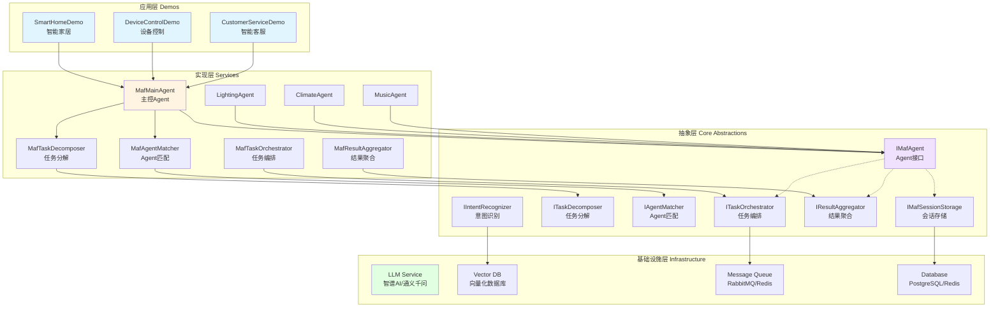
```mermaid
graph TB
    subgraph "应用层 Demos"
        A1[SmartHomeDemo<br/>智能家居]
        A2[DeviceControlDemo<br/>设备控制]
        A3[CustomerServiceDemo<br/>智能客服]
    end

    subgraph "实现层 Services"
        B1[MafMainAgent<br/>主控Agent]
        B2[LightingAgent]
        B3[ClimateAgent]
        B4[MusicAgent]
        B5[MafTaskDecomposer<br/>任务分解]
        B6[MafAgentMatcher<br/>Agent匹配]
        B7[MafTaskOrchestrator<br/>任务编排]
        B8[MafResultAggregator<br/>结果聚合]
    end

    subgraph "抽象层 Core Abstractions"
        C1[IMafAgent<br/>Agent接口]
        C2[IIntentRecognizer<br/>意图识别]
        C3[ITaskDecomposer<br/>任务分解]
        C4[IAgentMatcher<br/>Agent匹配]
        C5[ITaskOrchestrator<br/>任务编排]
        C6[IResultAggregator<br/>结果聚合]
        C7[IMafSessionStorage<br/>会话存储]
    end

    subgraph "基础设施层 Infrastructure"
        D1[LLM Service<br/>智谱AI/通义千问]
        D2[Vector DB<br/>向量化数据库]
        D3[Message Queue<br/>RabbitMQ/Redis]
        D4[Database<br/>PostgreSQL/Redis]
    end

    A1 --> B1
    A2 --> B1
    A3 --> B1
    B1 --> B5
    B1 --> B6
    B1 --> C1
    B2 --> C1
    B3 --> C1
    B4 --> C1
    B5 --> C3
    B6 --> C4
    B7 --> C5
    B8 --> C6
    C1 -.-> C5
    C1 -.-> C6
    C1 -.-> C7
    C2 --> D2
    C5 --> D3
    C7 --> D4

    style A1 fill:#e1f5ff
    style A2 fill:#e1f5ff
    style A3 fill:#e1f5ff
    style B1 fill:#fff4e1
    style C1 fill:#f0e1ff
    style D1 fill:#e1ffe1
```

### 1.2 依赖方向图

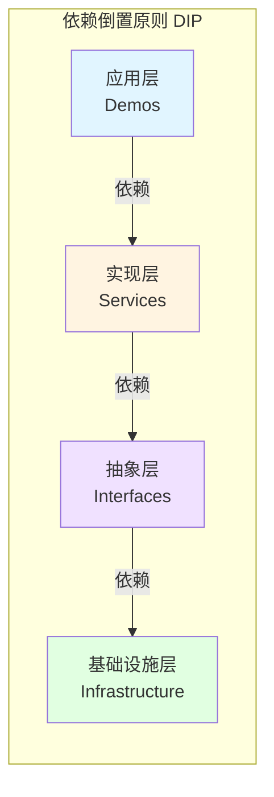
```mermaid
graph LR
    subgraph "依赖倒置原则 DIP"
        A[应用层<br/>Demos] -->|依赖| B[实现层<br/>Services]
        B -->|依赖| C[抽象层<br/>Interfaces]
        C -->|依赖| D[基础设施层<br/>Infrastructure]
    end

    style A fill:#e1f5ff
    style B fill:#fff4e1
    style C fill:#f0e1ff
    style D fill:#e1ffe1
```

---

## 2. 接口类图

### 2.1 Agent接口层次结构

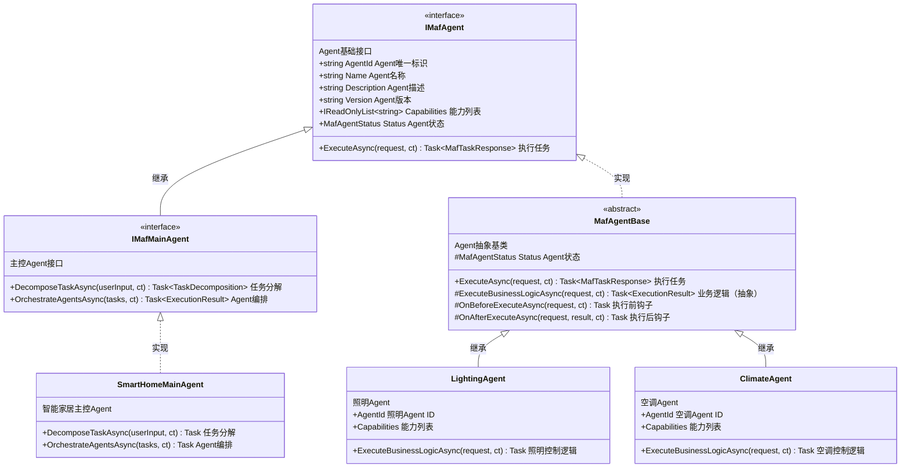
```mermaid
classDiagram
    class IMafAgent {
        <<interface>>
        Agent基础接口
        +string AgentId Agent唯一标识
        +string Name Agent名称
        +string Description Agent描述
        +string Version Agent版本
        +IReadOnlyList~string~ Capabilities 能力列表
        +MafAgentStatus Status Agent状态
        +ExecuteAsync(request, ct) Task~MafTaskResponse~ 执行任务
    }

    class IMafMainAgent {
        <<interface>>
        主控Agent接口
        +DecomposeTaskAsync(userInput, ct) Task~TaskDecomposition~ 任务分解
        +OrchestrateAgentsAsync(tasks, ct) Task~ExecutionResult~ Agent编排
    }

    class MafAgentBase {
        <<abstract>>
        Agent抽象基类
        #MafAgentStatus Status Agent状态
        +ExecuteAsync(request, ct) Task~MafTaskResponse~ 执行任务
        #ExecuteBusinessLogicAsync(request, ct) Task~ExecutionResult~ 业务逻辑（抽象）
        #OnBeforeExecuteAsync(request, ct) Task 执行前钩子
        #OnAfterExecuteAsync(request, result, ct) Task 执行后钩子
    }

    class SmartHomeMainAgent {
        智能家居主控Agent
        +DecomposeTaskAsync(userInput, ct) Task 任务分解
        +OrchestrateAgentsAsync(tasks, ct) Task Agent编排
    }

    class LightingAgent {
        照明Agent
        +AgentId 照明Agent ID
        +Capabilities 能力列表
        +ExecuteBusinessLogicAsync(request, ct) Task 照明控制逻辑
    }

    class ClimateAgent {
        空调Agent
        +AgentId 空调Agent ID
        +Capabilities 能力列表
        +ExecuteBusinessLogicAsync(request, ct) Task 空调控制逻辑
    }

    IMafAgent <|-- IMafMainAgent : 继承
    IMafAgent <|.. MafAgentBase : 实现
    IMafMainAgent <|.. SmartHomeMainAgent : 实现
    MafAgentBase <|-- LightingAgent : 继承
    MafAgentBase <|-- ClimateAgent : 继承
```

### 2.2 任务处理接口关系

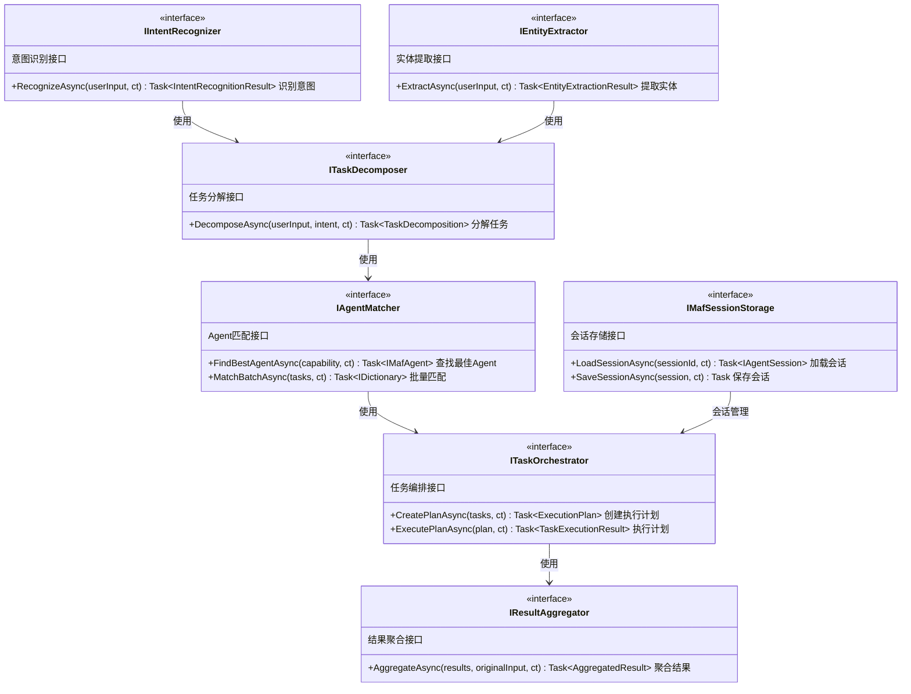
```mermaid
classDiagram
    class IIntentRecognizer {
        <<interface>>
        意图识别接口
        +RecognizeAsync(userInput, ct) Task~IntentRecognitionResult~ 识别意图
    }

    class IEntityExtractor {
        <<interface>>
        实体提取接口
        +ExtractAsync(userInput, ct) Task~EntityExtractionResult~ 提取实体
    }

    class ITaskDecomposer {
        <<interface>>
        任务分解接口
        +DecomposeAsync(userInput, intent, ct) Task~TaskDecomposition~ 分解任务
    }

    class IAgentMatcher {
        <<interface>>
        Agent匹配接口
        +FindBestAgentAsync(capability, ct) Task~IMafAgent~ 查找最佳Agent
        +MatchBatchAsync(tasks, ct) Task~IDictionary~ 批量匹配
    }

    class ITaskOrchestrator {
        <<interface>>
        任务编排接口
        +CreatePlanAsync(tasks, ct) Task~ExecutionPlan~ 创建执行计划
        +ExecutePlanAsync(plan, ct) Task~TaskExecutionResult~ 执行计划
    }

    class IResultAggregator {
        <<interface>>
        结果聚合接口
        +AggregateAsync(results, originalInput, ct) Task~AggregatedResult~ 聚合结果
    }

    class IMafSessionStorage {
        <<interface>>
        会话存储接口
        +LoadSessionAsync(sessionId, ct) Task~IAgentSession~ 加载会话
        +SaveSessionAsync(session, ct) Task 保存会话
    }

    IIntentRecognizer --> ITaskDecomposer : 使用
    IEntityExtractor --> ITaskDecomposer : 使用
    ITaskDecomposer --> IAgentMatcher : 使用
    IAgentMatcher --> ITaskOrchestrator : 使用
    ITaskOrchestrator --> IResultAggregator : 使用
    IMafSessionStorage --> ITaskOrchestrator : 会话管理
```

---

## 3. 任务状态机

### 3.1 MainTask状态机

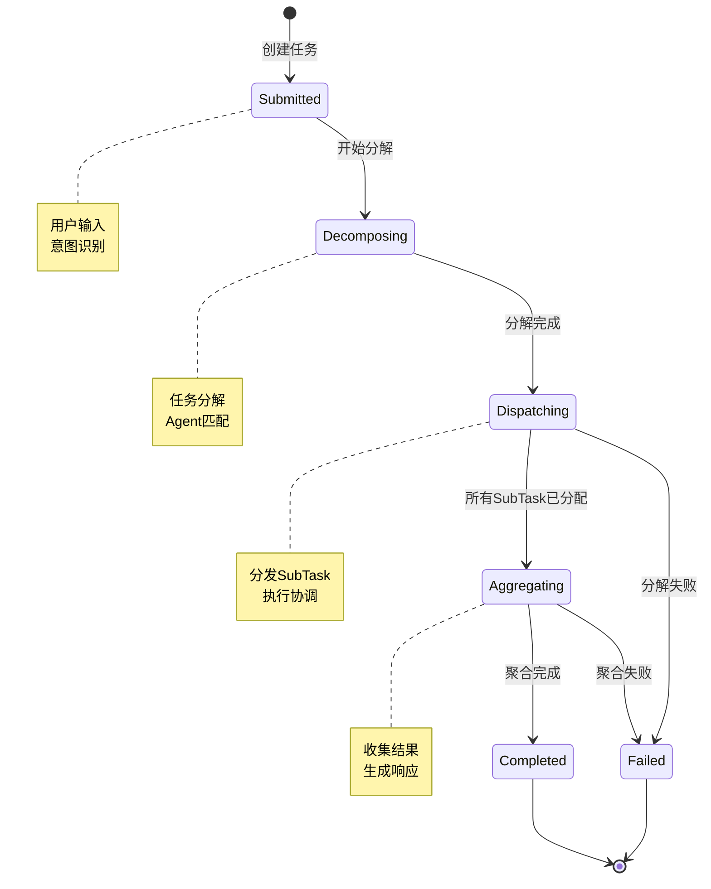
```mermaid
stateDiagram-v2
    [*] --> Submitted: 创建任务

    Submitted --> Decomposing: 开始分解
    Decomposing --> Dispatching: 分解完成

    Dispatching --> Aggregating: 所有SubTask已分配
    Dispatching --> Failed: 分解失败

    Aggregating --> Completed: 聚合完成
    Aggregating --> Failed: 聚合失败

    Failed --> [*]
    Completed --> [*]

    note right of Submitted
        用户输入
        意图识别
    end note

    note right of Decomposing
        任务分解
        Agent匹配
    end note

    note right of Dispatching
        分发SubTask
        执行协调
    end note

    note right of Aggregating
        收集结果
        生成响应
    end note
```

### 3.2 SubTask状态机

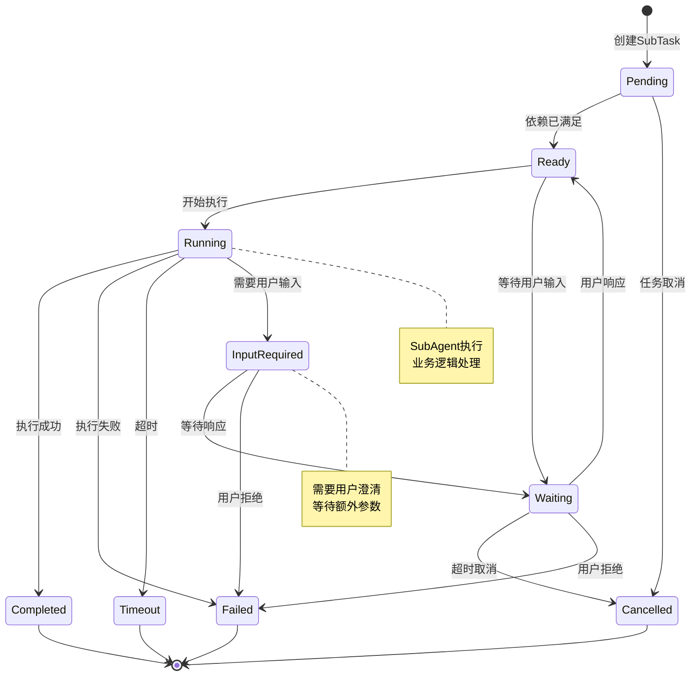
```mermaid
stateDiagram-v2
    [*] --> Pending: 创建SubTask

    Pending --> Ready: 依赖已满足
    Pending --> Cancelled: 任务取消

    Ready --> Running: 开始执行
    Ready --> Waiting: 等待用户输入

    Running --> Completed: 执行成功
    Running --> Failed: 执行失败
    Running --> Timeout: 超时
    Running --> InputRequired: 需要用户输入

    Waiting --> Ready: 用户响应
    Waiting --> Cancelled: 超时取消
    Waiting --> Failed: 用户拒绝

    InputRequired --> Waiting: 等待响应
    InputRequired --> Failed: 用户拒绝

    Completed --> [*]
    Failed --> [*]
    Timeout --> [*]
    Cancelled --> [*]

    note right of Running
        SubAgent执行
        业务逻辑处理
    end note

    note right of InputRequired
        需要用户澄清
        等待额外参数
    end note
```

---

## 4. Agent状态机

### 4.1 MafAgent状态机

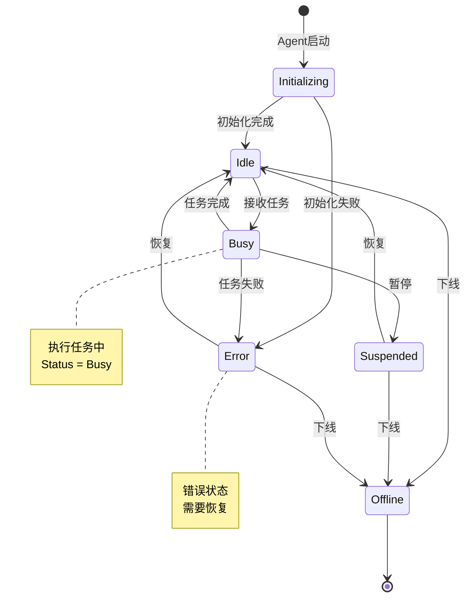
```mermaid
stateDiagram-v2
    [*] --> Initializing: Agent启动

    Initializing --> Idle: 初始化完成
    Initializing --> Error: 初始化失败

    Idle --> Busy: 接收任务
    Idle --> Offline: 下线

    Busy --> Idle: 任务完成
    Busy --> Error: 任务失败
    Busy --> Suspended: 暂停

    Suspended --> Idle: 恢复
    Suspended --> Offline: 下线

    Error --> Idle: 恢复
    Error --> Offline: 下线

    Offline --> [*]

    note right of Busy
        执行任务中
        Status = Busy
    end note

    note right of Error
        错误状态
        需要恢复
    end note
```

---

## 5. 用户请求处理序列图

### 5.1 完整请求处理流程

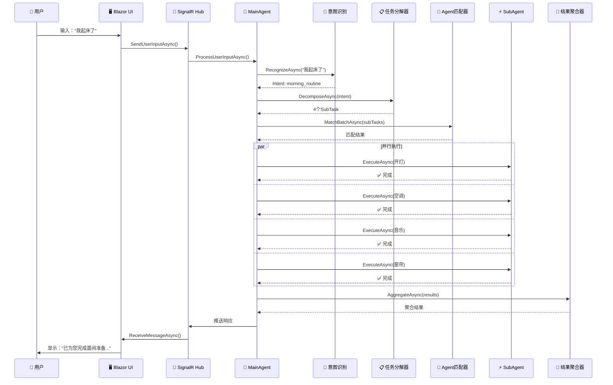
```mermaid
sequenceDiagram
    participant User as 👤 用户
    participant UI as 🖥️ Blazor UI
    participant Hub as 📡 SignalR Hub
    participant MainAgent as 🤖 MainAgent
    participant IntentRec as 🧠 意图识别
    participant TaskDecomposer as 📋 任务分解器
    participant AgentMatcher as 🎯 Agent匹配器
    participant SubAgent as ⚡ SubAgent
    participant Aggregator as 🔄 结果聚合器

    User->>UI: 输入："我起床了"
    UI->>Hub: SendUserInputAsync()
    Hub->>MainAgent: ProcessUserInputAsync()

    MainAgent->>IntentRec: RecognizeAsync("我起床了")
    IntentRec-->>MainAgent: Intent: morning_routine

    MainAgent->>TaskDecomposer: DecomposeAsync(intent)
    TaskDecomposer-->>MainAgent: 4个SubTask

    MainAgent->>AgentMatcher: MatchBatchAsync(subTasks)
    AgentMatcher-->>MainAgent: 匹配结果

    par 并行执行
        MainAgent->>SubAgent: ExecuteAsync(开灯)
        SubAgent-->>MainAgent: ✅ 完成
    and
        MainAgent->>SubAgent: ExecuteAsync(空调)
        SubAgent-->>MainAgent: ✅ 完成
    and
        MainAgent->>SubAgent: ExecuteAsync(音乐)
        SubAgent-->>MainAgent: ✅ 完成
    and
        MainAgent->>SubAgent: ExecuteAsync(窗帘)
        SubAgent-->>MainAgent: ✅ 完成
    end

    MainAgent->>Aggregator: AggregateAsync(results)
    Aggregator-->>MainAgent: 聚合结果

    MainAgent->>Hub: 推送响应
    Hub->>UI: ReceiveMessageAsync()
    UI->>User: 显示："已为您完成晨间准备..."
```

### 5.2 任务执行详细序列

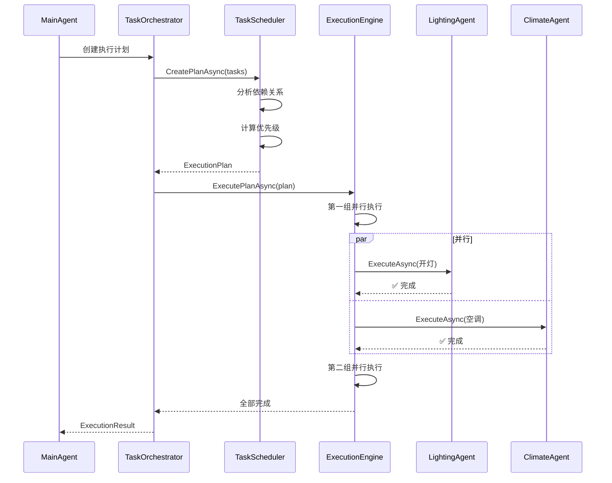
```mermaid
sequenceDiagram
    participant Main as MainAgent
    participant Orchestrator as TaskOrchestrator
    participant Scheduler as TaskScheduler
    participant Executor as ExecutionEngine
    participant SubA1 as LightingAgent
    participant SubA2 as ClimateAgent

    Main->>Orchestrator: 创建执行计划
    Orchestrator->>Scheduler: CreatePlanAsync(tasks)
    Scheduler->>Scheduler: 分析依赖关系
    Scheduler->>Scheduler: 计算优先级
    Scheduler-->>Orchestrator: ExecutionPlan

    Orchestrator->>Executor: ExecutePlanAsync(plan)

    Executor->>Executor: 第一组并行执行
    par 并行
        Executor->>SubA1: ExecuteAsync(开灯)
        SubA1-->>Executor: ✅ 完成
    and
        Executor->>SubA2: ExecuteAsync(空调)
        SubA2-->>Executor: ✅ 完成
    end

    Executor->>Executor: 第二组并行执行
    Executor-->>Orchestrator: 全部完成
    Orchestrator-->>Main: ExecutionResult
```

---

## 6. 任务调度流程图

### 6.1 智能调度流程

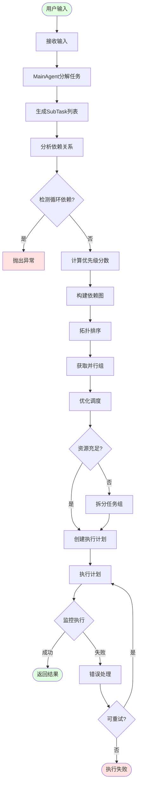
```mermaid
flowchart TD
    Start([用户输入]) --> Input[接收输入]
    Input --> Decompose[MainAgent分解任务]
    Decompose --> Tasks[生成SubTask列表]

    Tasks --> Analyze[分析依赖关系]
    Analyze --> CheckCycle{检测循环依赖?}
    CheckCycle -->|是| Error[抛出异常]
    CheckCycle -->|否| CalcPriority[计算优先级分数]

    CalcPriority --> BuildGraph[构建依赖图]
    BuildGraph --> TopoSort[拓扑排序]
    TopoSort --> GetGroups[获取并行组]

    GetGroups --> Optimize[优化调度]
    Optimize --> CheckResource{资源充足?}
    CheckResource -->|否| SplitGroup[拆分任务组]
    CheckResource -->|是| CreatePlan[创建执行计划]

    SplitGroup --> CreatePlan
    CreatePlan --> Execute[执行计划]

    Execute --> Monitor{监控执行}
    Monitor -->|成功| Success([返回结果])
    Monitor -->|失败| HandleError[错误处理]
    HandleError --> Retry{可重试?}
    Retry -->|是| Execute
    Retry -->|否| Failed([执行失败])

    style Start fill:#e1ffe1
    style Success fill:#e1ffe1
    style Failed fill:#ffe1e1
    style Error fill:#ffe1e1
```

### 6.2 优先级计算流程

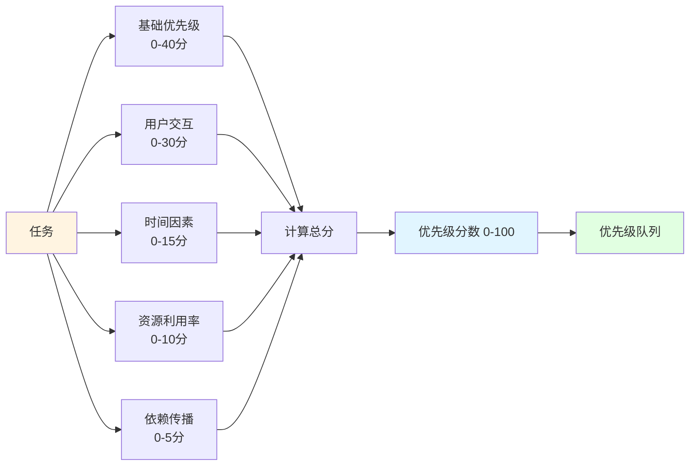
```mermaid
flowchart LR
    Task[任务] --> Base[基础优先级<br/>0-40分]
    Task --> User[用户交互<br/>0-30分]
    Task --> Time[时间因素<br/>0-15分]
    Task --> Resource[资源利用率<br/>0-10分]
    Task --> Dep[依赖传播<br/>0-5分]

    Base --> Sum[计算总分]
    User --> Sum
    Time --> Sum
    Resource --> Sum
    Dep --> Sum

    Sum --> Score[优先级分数 0-100]
    Score --> Queue[优先级队列]

    style Task fill:#fff4e1
    style Score fill:#e1f5ff
    style Queue fill:#e1ffe1
```

---

## 7. 依赖关系图

### 7.1 任务依赖示例

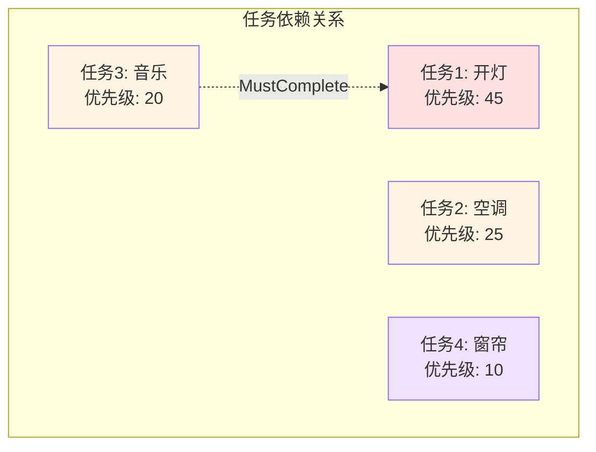
```mermaid
graph TB
    subgraph "任务依赖关系"
        T1[任务1: 开灯<br/>优先级: 45]
        T2[任务2: 空调<br/>优先级: 25]
        T3[任务3: 音乐<br/>优先级: 20]
        T4[任务4: 窗帘<br/>优先级: 10]

        T3 -.->|MustComplete| T1
    end

    style T1 fill:#ffe1e1
    style T2 fill:#fff4e1
    style T3 fill:#fff4e1
    style T4 fill:#f0e1ff
```

### 7.2 并行执行组

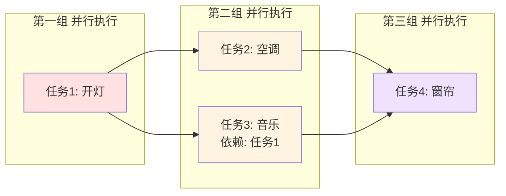
```mermaid
graph LR
    subgraph "第一组 并行执行"
        G1A[任务1: 开灯]
    end

    subgraph "第二组 并行执行"
        G2A[任务2: 空调]
        G2B[任务3: 音乐<br/>依赖: 任务1]
    end

    subgraph "第三组 并行执行"
        G3A[任务4: 窗帘]
    end

    G1A --> G2A
    G1A --> G2B
    G2A --> G3A
    G2B --> G3A

    style G1A fill:#ffe1e1
    style G2A fill:#fff4e1
    style G2B fill:#fff4e1
    style G3A fill:#f0e1ff
```

---

## 8. 三层存储架构

### 8.1 存储层次结构

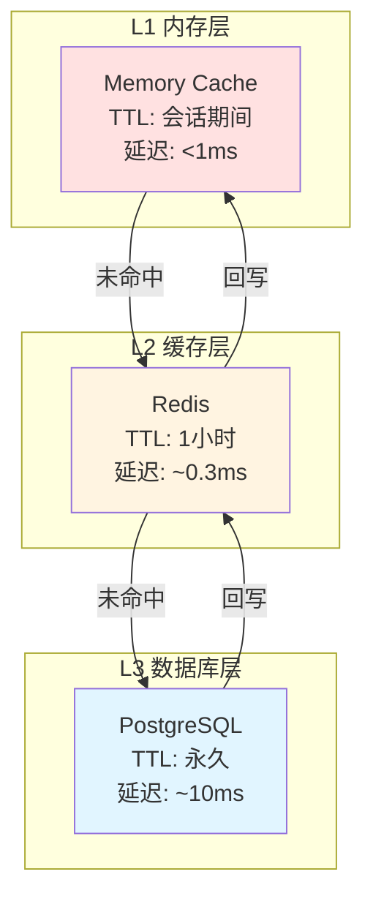
```mermaid
graph TB
    subgraph "L1 内存层"
        L1[Memory Cache<br/>TTL: 会话期间<br/>延迟: <1ms]
    end

    subgraph "L2 缓存层"
        L2[Redis<br/>TTL: 1小时<br/>延迟: ~0.3ms]
    end

    subgraph "L3 数据库层"
        L3[PostgreSQL<br/>TTL: 永久<br/>延迟: ~10ms]
    end

    L1 -->|未命中| L2
    L2 -->|未命中| L3
    L3 -->|回写| L2
    L2 -->|回写| L1

    style L1 fill:#ffe1e1
    style L2 fill:#fff4e1
    style L3 fill:#e1f5ff
```

### 8.2 数据访问流程

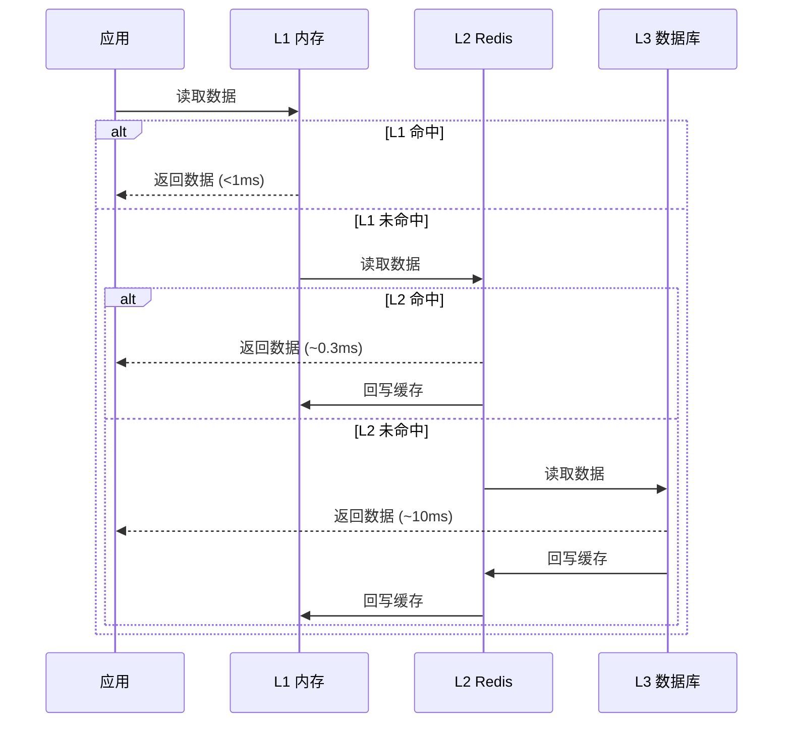
```mermaid
sequenceDiagram
    participant App as 应用
    participant L1 as L1 内存
    participant L2 as L2 Redis
    participant L3 as L3 数据库

    App->>L1: 读取数据
    alt L1 命中
        L1-->>App: 返回数据 (<1ms)
    else L1 未命中
        L1->>L2: 读取数据
        alt L2 命中
            L2-->>App: 返回数据 (~0.3ms)
            L2->>L1: 回写缓存
        else L2 未命中
            L2->>L3: 读取数据
            L3-->>App: 返回数据 (~10ms)
            L3->>L2: 回写缓存
            L2->>L1: 回写缓存
        end
    end
```

---

## 9. 前端架构图

### 9.1 Blazor前端架构

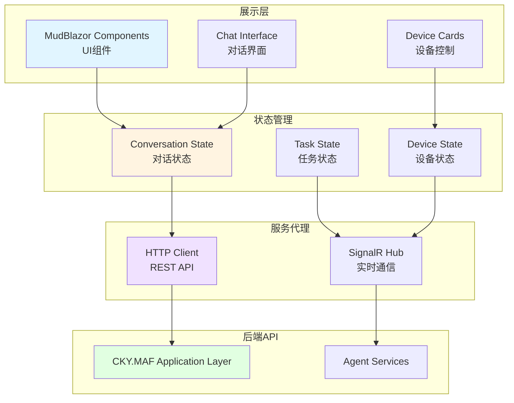
```mermaid
graph TB
    subgraph "展示层"
        UI1[MudBlazor Components<br/>UI组件]
        UI2[Chat Interface<br/>对话界面]
        UI3[Device Cards<br/>设备控制]
    end

    subgraph "状态管理"
        State1[Conversation State<br/>对话状态]
        State2[Task State<br/>任务状态]
        State3[Device State<br/>设备状态]
    end

    subgraph "服务代理"
        Svc1[HTTP Client<br/>REST API]
        Svc2[SignalR Hub<br/>实时通信]
    end

    subgraph "后端API"
        API1[CKY.MAF Application Layer]
        API2[Agent Services]
    end

    UI1 --> State1
    UI2 --> State1
    UI3 --> State3
    State1 --> Svc1
    State2 --> Svc2
    State3 --> Svc2
    Svc1 --> API1
    Svc2 --> API2

    style UI1 fill:#e1f5ff
    style State1 fill:#fff4e1
    style Svc1 fill:#f0e1ff
    style API1 fill:#e1ffe1
```

### 9.2 实时通信架构

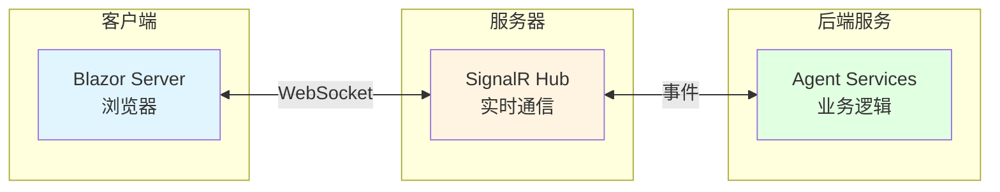
```mermaid
graph LR
    subgraph "客户端"
        Browser[Blazor Server<br/>浏览器]
    end

    subgraph "服务器"
        Hub[SignalR Hub<br/>实时通信]
    end

    subgraph "后端服务"
        Agent[Agent Services<br/>业务逻辑]
    end

    Browser <--WebSocket--> Hub
    Hub <--事件--> Agent

    style Browser fill:#e1f5ff
    style Hub fill:#fff4e1
    style Agent fill:#e1ffe1
```

---

## 10. 部署架构图

### 10.1 Docker Compose部署

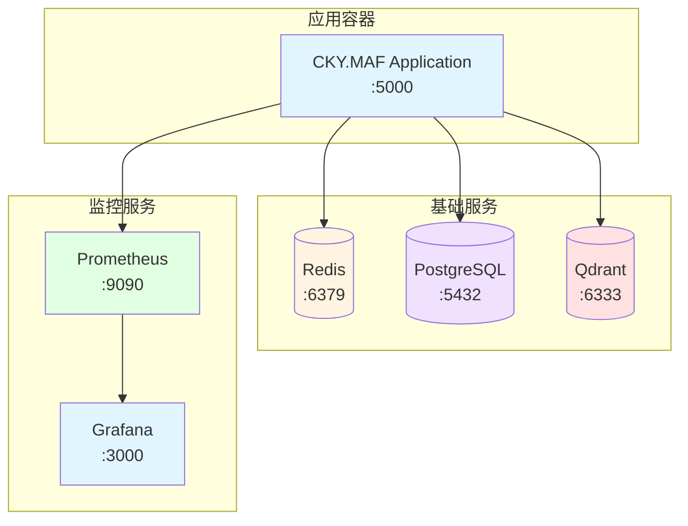
```mermaid
graph TB
    subgraph "应用容器"
        App[CKY.MAF Application<br/>:5000]
    end

    subgraph "基础服务"
        Redis[(Redis<br/>:6379)]
        Postgres[(PostgreSQL<br/>:5432)]
        Qdrant[(Qdrant<br/>:6333)]
    end

    subgraph "监控服务"
        Prometheus[Prometheus<br/>:9090]
        Grafana[Grafana<br/>:3000]
    end

    App --> Redis
    App --> Postgres
    App --> Qdrant
    App --> Prometheus
    Prometheus --> Grafana

    style App fill:#e1f5ff
    style Redis fill:#fff4e1
    style Postgres fill:#f0e1ff
    style Qdrant fill:#ffe1e1
    style Prometheus fill:#e1ffe1
    style Grafana fill:#e1f5ff
```

### 10.2 Kubernetes部署

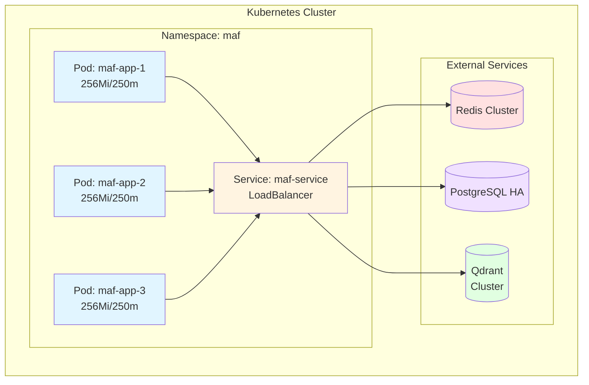
```mermaid
graph TB
    subgraph "Kubernetes Cluster"
        subgraph "Namespace: maf"
            Pod1[Pod: maf-app-1<br/>256Mi/250m]
            Pod2[Pod: maf-app-2<br/>256Mi/250m]
            Pod3[Pod: maf-app-3<br/>256Mi/250m]

            Service[Service: maf-service<br/>LoadBalancer]
        end

        subgraph "External Services"
            Redis[(Redis Cluster)]
            Postgres[(PostgreSQL HA)]
            Qdrant[(Qdrant<br/>Cluster)]
        end
    end

    Pod1 --> Service
    Pod2 --> Service
    Pod3 --> Service
    Service --> Redis
    Service --> Postgres
    Service --> Qdrant

    style Pod1 fill:#e1f5ff
    style Pod2 fill:#e1f5ff
    style Pod3 fill:#e1f5ff
    style Service fill:#fff4e1
    style Redis fill:#ffe1e1
    style Postgres fill:#f0e1ff
    style Qdrant fill:#e1ffe1
```

---

## 11. 实时通信序列图

### 11.1 SignalR实时通信流程

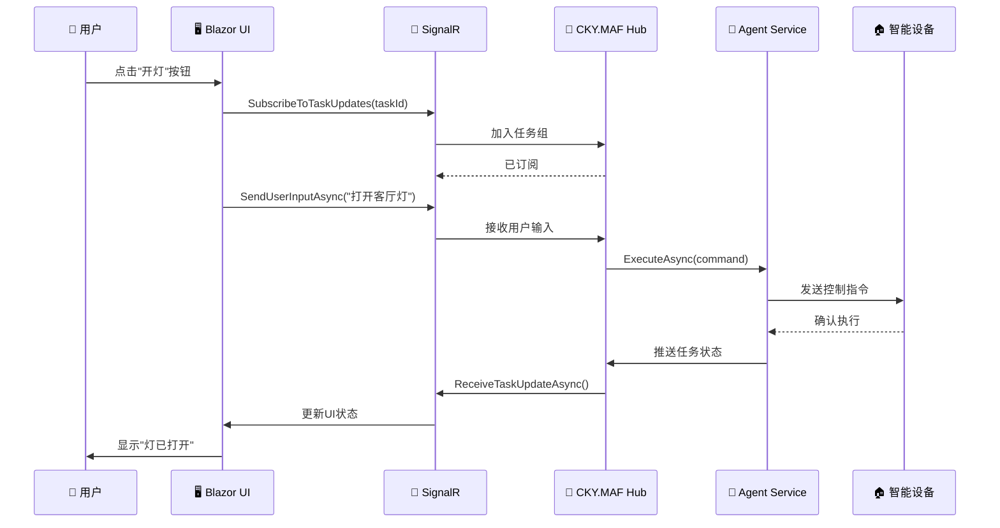
```mermaid
sequenceDiagram
    participant User as 👤 用户
    participant Blazor as 🖥️ Blazor UI
    participant SignalR as 📡 SignalR
    participant Hub as 🎯 CKY.MAF Hub
    participant Agent as 🤖 Agent Service
    participant Device as 🏠 智能设备

    User->>Blazor: 点击"开灯"按钮
    Blazor->>SignalR: SubscribeToTaskUpdates(taskId)
    SignalR->>Hub: 加入任务组
    Hub-->>SignalR: 已订阅

    Blazor->>SignalR: SendUserInputAsync("打开客厅灯")
    SignalR->>Hub: 接收用户输入
    Hub->>Agent: ExecuteAsync(command)
    Agent->>Device: 发送控制指令
    Device-->>Agent: 确认执行

    Agent->>Hub: 推送任务状态
    Hub->>SignalR: ReceiveTaskUpdateAsync()
    SignalR->>Blazor: 更新UI状态

    Blazor->>User: 显示"灯已打开"
```

### 11.2 多Agent协作序列图

```mermaid
sequenceDiagram
    participant User as 用户
    participant Main as MainAgent
    participant Light as LightingAgent
    participant Climate as ClimateAgent
    participant Music as MusicAgent

    User->>Main: "我起床了"
    Main->>Main: 意图识别: morning_routine
    Main->>Main: 任务分解: 4个SubTask

    par 并行执行
        Main->>Light: 打开客厅灯
        Light-->>Main: ✅ 完成
    and
        Main->>Climate: 设置空调26度
        Climate-->>Main: ✅ 完成
    and
        Main->>Music: 播放轻音乐
        Music-->>Main: ✅ 完成
    end

    Main->>Main: 聚合结果
    Main-->>User: "已为您完成晨间准备"
```

---

## 📊 图表使用指南

### 在Markdown中使用

在主文档中引用这些图表：

```markdown
### 1.1 整体架构图

参见：[CKY.MAF框架架构图表集 - 1.系统架构图](./02-architecture-diagrams.md#1-系统架构图)

或直接嵌入：

```mermaid
graph TB
    ...
```
```

### 支持的图表类型

| 图表类型 | Mermaid语法 | 适用场景 |
|---------|------------|----------|
| **流程图** | `graph` / `flowchart` | 系统架构、依赖关系 |
| **类图** | `classDiagram` | 接口关系、类层次结构 |
| **状态图** | `stateDiagram` | 任务状态机、Agent状态机 |
| **序列图** | `sequenceDiagram` | 时序流程、交互流程 |
| **ER图** | `erDiagram` | 数据库关系 |
| **用户旅程** | `journey` | 用户操作流程 |
| **甘特图** | `gantt` | 项目计划 |

### 渲染工具

- **GitHub**: 原生支持 Mermaid
- **VS Code**: 安装 "Markdown Preview Mermaid Support" 插件
- **Typora**: 原生支持
- **Obsidian**: 原生支持
- **在线工具**: https://mermaid.live/

---

**文档版本**: v1.2
**最后更新**: 2026-03-13
