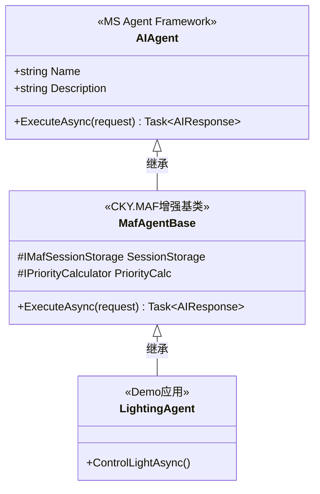
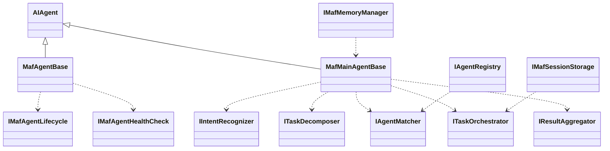

# CKY.MAF接口扩展规范

> **文档版本**: v1.2
> **创建日期**: 2026-03-12
> **最后更新**: 2026-03-13
> **用途**: 定义CKY.MAF基于Microsoft Agent Framework的接口扩展

---

## ⚠️ 重要说明

**CKY.MAF不是独立框架**，而是**Microsoft Agent Framework的企业级增强层**。

**核心依赖**：
- ✅ 所有Agent必须继承自MS AF的`AIAgent`基类
- ✅ 使用MS AF的Agent-to-Agent（A2A）通信机制
- ✅ 使用MS AF的`IChatClient`进行LLM调用
- ✅ CKY.MAF提供MS AF缺失的企业级特性（调度、存储、监控）

---

## 📋 目录

1. [MS Agent Framework集成](#一ms-agent-framework集成)
2. [CKY.MAF增强基类](#二ckymaf增强基类)
3. [任务处理扩展接口](#三任务处理扩展接口)
4. [存储扩展接口](#四存储扩展接口)
5. [数据模型定义](#五数据模型定义)
6. [枚举定义](#六枚举定义)

---

## 一、MS Agent Framework集成

### 1.1 核心继承关系

所有CKY.MAF Agent必须遵循以下继承层次：



**关键原则**：
- ✅ **不定义自己的IMafAgent接口**，直接使用MS AF的`AIAgent`
- ✅ **不定义自己的LLM接口**，使用MS AF的`IChatClient`
- ✅ **不定义自己的Agent通信接口**，使用MS AF的A2A机制
- ✅ **CKY.MAF只提供增强功能**：存储、调度、监控

---

### 1.2 不再定义的接口

以下接口由Microsoft Agent Framework提供，**CKY.MAF不再重复定义**：

| CKY.MAF旧接口 | MS AF对应接口 | 说明 |
|--------------|---------------|------|
| ❌ `IMafAgent` | ✅ `AIAgent` | Agent基类 |
| ❌ `ILLMService` | ✅ `IChatClient` | LLM调用接口 |
| ❌ `IAgentCommunicator` | ✅ A2A内置 | Agent间通信 |
| ❌ `IToolRegistry` | ✅ `AITool` | 工具注册机制 |

---

## 二、CKY.MAF增强基类

### 2.1 MafAgentBase - 增强基类

```csharp
namespace MultiAgentFramework.Core.Agents
{
    /// <summary>
    /// CKY.MAF增强基类，继承自MS Agent Framework的AIAgent
    /// </summary>
    public abstract class MafAgentBase : AIAgent
    {
        /// <summary>
        /// CKY.MAF添加：会话存储
        /// </summary>
        protected IMafSessionStorage SessionStorage { get; }

        /// <summary>
        /// CKY.MAF添加：优先级计算器
        /// </summary>
        protected IPriorityCalculator PriorityCalculator { get; }

        /// <summary>
        /// CKY.MAF添加：监控指标收集器
        /// </summary>
        protected IMetricsCollector MetricsCollector { get; }

        /// <summary>
        /// 增强的Execute方法，添加监控和存储功能
        /// </summary>
        public override async Task<AIResponse> ExecuteAsync(
            AIRequest request,
            CancellationToken cancellationToken = default)
        {
            var startTime = DateTime.UtcNow;

            try
            {
                // 1. 加载会话上下文（CKY.MAF增强）
                var session = await SessionStorage.LoadSessionAsync(
                    request.ConversationId,
                    cancellationToken);

                // 2. 调用业务逻辑
                var result = await ExecuteBusinessLogicAsync(
                    request,
                    session,
                    cancellationToken);

                // 3. 保存会话上下文（CKY.MAF增强）
                await SessionStorage.SaveSessionAsync(
                    session,
                    cancellationToken);

                // 4. 记录指标（CKY.MAF增强）
                await MetricsCollector.RecordExecutionAsync(
                    this.Name,
                    startTime,
                    result.Success,
                    cancellationToken);

                return result;
            }
            catch (Exception ex)
            {
                await MetricsCollector.RecordErrorAsync(
                    this.Name,
                    ex,
                    cancellationToken);
                throw;
            }
        }

        /// <summary>
        /// 子类实现具体的业务逻辑
        /// </summary>
        protected abstract Task<AIResponse> ExecuteBusinessLogicAsync(
            AIRequest request,
            AgentSession session,
            CancellationToken cancellationToken);
    }
}
```

---

### 2.2 具体Agent示例

```csharp
namespace SmartHomeDemo.Agents
{
    /// <summary>
    /// 照明Agent - Demo应用示例
    /// </summary>
    public class LightingAgent : MafAgentBase
    {
        public override string Name => "LightingAgent";
        public override string Description => "智能照明控制Agent";

        protected override async Task<AIResponse> ExecuteBusinessLogicAsync(
            AIRequest request,
            AgentSession session,
            CancellationToken cancellationToken)
        {
            // 1. 使用MS AF的LLM能力
            var prompt = BuildPrompt(request, session);
            var llmResponse = await this.LLM.CompleteAsync(
                prompt,
                cancellationToken: cancellationToken);

            // 2. 使用CKY.MAF的存储
            await SessionStorage.SaveContextAsync(
                request.ConversationId,
                "last_operation",
                llmResponse.Content);

            // 3. 使用MS AF的A2A通信（如需与其他Agent协作）
            if (NeedCollaboration(request))
            {
                await this.SendAgentMessageAsync(
                    "ClimateAgent",
                    "调低温度以配合照明",
                    cancellationToken);
            }

            return new AIResponse
            {
                Content = llmResponse.Content,
                Success = true
            };
        }
    }
}
```

---

## 三、任务处理扩展接口

> **设计说明**：CKY.MAF 不定义 `IMafAgent` 接口，直接使用 MS AF 的 `AIAgent` 基类。
> 所有 CKY.MAF Agent 继承自 `MafAgentBase`（继承 `AIAgent`），获得企业级增强功能。

### 3.1 IMafMainAgent - 主控Agent接口

```csharp
namespace MultiAgentFramework.Core.Abstractions
{
    /// <summary>
    /// 主控Agent接口
    /// Main Agent除了基本Agent能力外，还需具备任务分解和编排能力
    /// 注意：本接口扩展自MS AF的AIAgent，不重复定义基础Agent能力
    /// </summary>
    public interface IMafMainAgent  // 依赖注入时使用，不继承IMafAgent
    {
        /// <summary>
        /// 任务分解能力
        /// </summary>
        Task<TaskDecomposition> DecomposeTaskAsync(
            string userInput,
            CancellationToken ct = default);

        /// <summary>
        /// Agent编排能力
        /// </summary>
        Task<ExecutionResult> OrchestrateAgentsAsync(
            List<DecomposedTask> tasks,
            CancellationToken ct = default);
    }
}
```

### 3.2 Agent生命周期接口

```csharp
namespace MultiAgentFramework.Core.Abstractions
{
    /// <summary>
    /// Agent生命周期管理接口
    /// </summary>
    public interface IMafAgentLifecycle
    {
        /// <summary>
        /// 初始化Agent
        /// </summary>
        Task InitializeAsync(CancellationToken ct = default);

        /// <summary>
        /// 关闭Agent
        /// </summary>
        Task ShutdownAsync(CancellationToken ct = default);

        /// <summary>
        /// 暂停Agent
        /// </summary>
        Task SuspendAsync(CancellationToken ct = default);

        /// <summary>
        /// 恢复Agent
        /// </summary>
        Task ResumeAsync(CancellationToken ct = default);
    }

    /// <summary>
    /// Agent健康检查接口
    /// </summary>
    public interface IMafAgentHealthCheck
    {
        /// <summary>
        /// 检查Agent健康状态
        /// </summary>
        Task<MafHealthStatus> CheckHealthAsync(CancellationToken ct = default);

        /// <summary>
        /// 获取Agent统计信息
        /// </summary>
        Task<AgentStatistics> GetStatisticsAsync(CancellationToken ct = default);
    }

    /// <summary>
    /// 健康状态枚举
    /// </summary>
    public enum MafHealthStatus
    {
        Healthy = 0,
        Degraded = 1,
        Unhealthy = 2,
        Unknown = 3
    }
}
```

---

## 四、NLP组件接口

本章节定义CKY.MAF框架中自然语言处理（NLP）相关的核心接口，包括意图识别、实体提取和指代消解功能。这些组件是MainAgent理解用户输入的基础。

### 4.1 意图识别接口

**用途**：识别用户输入的真实意图，将自然语言转换为系统可理解的结构化意图。

**核心功能**：
- 单句意图识别：分析单条用户输入，返回主要意图和备选意图
- 批量意图识别：处理多条用户输入，提高批量场景效率
- 置信度评分：返回意图识别的置信度，支持阈值过滤

**使用场景**：
- 用户说"打开客厅的灯" → 识别为`ControlDevice`意图
- 用户说"我有点冷" → 识别为`AdjustClimate`意图
- 用户说"播放音乐" → 识别为`PlayMusic`意图

**关键属性**：
- `PrimaryIntent`：主要意图（如：ControlDevice）
- `Confidence`：识别置信度（0.0-1.0）
- `AlternativeIntents`：备选意图列表，用于意图漂移处理

```csharp
namespace MultiAgentFramework.Core.Abstractions
{
    /// <summary>
    /// 意图识别器接口
    /// </summary>
    public interface IIntentRecognizer
    {
        /// <summary>
        /// 识别用户意图
        /// </summary>
        Task<IntentRecognitionResult> RecognizeAsync(
            string userInput,
            CancellationToken ct = default);

        /// <summary>
        /// 批量识别意图
        /// </summary>
        Task<List<IntentRecognitionResult>> RecognizeBatchAsync(
            List<string> userInputs,
            CancellationToken ct = default);
    }

    /// <summary>
    /// 意图识别结果
    /// </summary>
    public class IntentRecognitionResult
    {
        public string PrimaryIntent { get; set; }
        public double Confidence { get; set; }
        public Dictionary<string, double> AlternativeIntents { get; set; }
        public List<string> Tags { get; set; }
        public string OriginalInput { get; set; }
    }
}
```

### 4.2 实体提取接口

**用途**：从用户输入中提取关键实体信息（如房间名、设备名、数值参数等），为任务执行提供结构化参数。

**核心功能**：
- 实体识别：识别输入中的关键实体
- 位置标注：记录实体在原文中的位置
- 实体分类：按类型分类实体（Room、Device、Value等）

**使用场景**：
- 输入："把客厅的温度调到26度"
  - 提取结果：`{Room: "客厅", Value: 26, Unit: "度"}`
- 输入："打开卧室的灯"
  - 提取结果：`{Room: "卧室", Device: "灯"}`

**关键属性**：
- `EntityType`：实体类型（Room、Device、Action、Value等）
- `EntityValue`：实体值
- `StartPosition/EndPosition`：在原文中的位置
- `Confidence`：提取置信度

```csharp
namespace MultiAgentFramework.Core.Abstractions
{
    /// <summary>
    /// 实体提取器接口
    /// </summary>
    public interface IEntityExtractor
    {
        /// <summary>
        /// 提取实体
        /// </summary>
        Task<EntityExtractionResult> ExtractAsync(
            string userInput,
            CancellationToken ct = default);
    }

    /// <summary>
    /// 实体提取结果
    /// </summary>
    public class EntityExtractionResult
    {
        public Dictionary<string, object> Entities { get; set; }
        public List<Entity> ExtractedEntities { get; set; }
    }

    /// <summary>
    /// 实体
    /// </summary>
    public class Entity
    {
        public string EntityType { get; set; }
        public string EntityValue { get; set; }
        public int StartPosition { get; set; }
        public int EndPosition { get; set; }
        public double Confidence { get; set; }
    }
}
```

### 4.3 指代消解接口

**用途**：解决多轮对话中的指代关系，将"它"、"那个"等代词替换为实际实体，实现上下文连贯性。

**核心功能**：
- 代词识别：识别输入中的代词（它、那个、这个）
- 指代解析：根据对话历史解析代词指向的实体
- 实体替换：将代词替换为具体实体值

**使用场景**：
- 第一轮：用户说"打开客厅的灯"
- 第二轮：用户说"把它调暗一点" → 解析为"把客厅的灯调暗一点"
- 第三轮：用户说"关闭它" → 解析为"关闭客厅的灯"

**关键方法**：
- `ResolveAsync`：解析单个输入中的指代关系
- `ResolveBatchAsync`：批量解析多个输入

```csharp
namespace MultiAgentFramework.Core.Abstractions
{
    /// <summary>
    /// 指代消解器接口
    /// </summary>
    public interface ICoreferenceResolver
    {
        /// <summary>
        /// 消解指代词
        /// </summary>
        Task<string> ResolveAsync(
            string userInput,
            string conversationId,
            CancellationToken ct = default);
    }
}
```

---

## 五、任务处理接口

本章节定义MainAgent的核心任务处理接口，包括任务分解、Agent匹配、任务编排和结果聚合。这些接口是实现智能任务编排的关键。

### 5.1 任务分解接口

**用途**：将用户输入的复杂任务分解为多个可独立执行的子任务（SubTask），支持并行执行和依赖管理。

**核心功能**：
- 智能分解：根据意图和实体信息自动分解任务
- 依赖识别：识别子任务间的依赖关系
- 优先级分配：为每个子任务分配初始优先级

**使用场景**：
- 输入："我起床了"
- 分解结果：
  1. 打开客厅灯（High优先级，无依赖）
  2. 设置空调26度（Normal优先级，无依赖）
  3. 播放轻音乐（Normal优先级，依赖任务1）
  4. 打开窗帘（Low优先级，无依赖）

**关键属性**：
- `SubTasks`：子任务列表
- `Dependencies`：任务依赖关系图
- `ExecutionPlan`：建议的执行计划

```csharp
namespace MultiAgentFramework.Core.Abstractions
{
    /// <summary>
    /// 任务分解器接口
    /// </summary>
    public interface ITaskDecomposer
    {
        /// <summary>
        /// 分解任务
        /// </summary>
        Task<TaskDecomposition> DecomposeAsync(
            string userInput,
            IntentRecognitionResult intent,
            CancellationToken ct = default);
    }

    /// <summary>
    /// 任务分解结果
    /// </summary>
    public class TaskDecomposition
    {
        public string DecompositionId { get; set; }
        public string OriginalUserInput { get; set; }
        public IntentRecognitionResult Intent { get; set; }
        public List<DecomposedTask> SubTasks { get; set; }
        public DecompositionMetadata Metadata { get; set; }
    }
}
```

### 5.2 Agent匹配接口

**用途**：根据子任务的能力需求，从注册的Agent池中选择最合适的Agent来执行任务。

**核心功能**：
- 能力匹配：根据Agent的能力列表进行匹配
- 负载均衡：考虑Agent当前状态和负载
- 多候选返回：返回多个候选Agent，支持降级策略

**使用场景**：
- 任务："控制客厅灯光"
- 匹配结果：
  1. `LightingAgent`（最佳匹配，能力完全匹配）
  2. `SmartHomeAgent`（备选，通用Agent）

**关键方法**：
- `MatchAsync`：查找单个任务的最佳Agent
- `MatchBatchAsync`：批量匹配多个任务

```csharp
namespace MultiAgentFramework.Core.Abstractions
{
    /// <summary>
    /// Agent匹配器接口
    /// </summary>
    public interface IAgentMatcher
    {
        /// <summary>
        /// 查找最佳Agent
        /// </summary>
        Task<IMafAgent> FindBestAgentAsync(
            string requiredCapability,
            CancellationToken ct = default);

        /// <summary>
        /// 批量匹配Agent
        /// </summary>
        Task<IDictionary<DecomposedTask, IMafAgent>> MatchBatchAsync(
            List<DecomposedTask> tasks,
            CancellationToken ct = default);

        /// <summary>
        /// 获取所有可用Agent
        /// </summary>
        Task<List<IMafAgent>> GetAvailableAgentsAsync(CancellationToken ct = default);
    }
}
```

### 5.3 任务编排接口

**用途**：根据任务依赖关系、优先级和资源约束，生成最优的执行计划，支持并行执行和资源优化。

**核心功能**：
- 依赖分析：分析任务间的依赖关系
- 并行组识别：识别可并行执行的任务组
- 资源约束：考虑独占资源和并发限制
- 执行顺序优化：生成最优执行顺序

**使用场景**：
- 任务组：
  - 任务1（打开客厅灯）- 无依赖 → 第1组执行
  - 任务2（设置空调）- 无依赖 → 第1组并行
  - 任务3（播放音乐）- 依赖任务1 → 第2组执行
  - 任务4（打开窗帘）- 无依赖 → 第1组并行

**关键概念**：
- `ParallelGroups`：并行任务组列表
- `ExecutionOrder`：任务执行顺序
- `ResourceConstraints`：资源约束条件

```csharp
namespace MultiAgentFramework.Core.Abstractions
{
    /// <summary>
    /// 任务编排器接口
    /// </summary>
    public interface ITaskOrchestrator
    {
        /// <summary>
        /// 创建执行计划
        /// </summary>
        Task<ExecutionPlan> CreatePlanAsync(
            List<DecomposedTask> tasks,
            CancellationToken ct = default);

        /// <summary>
        /// 执行计划
        /// </summary>
        Task<TaskExecutionResult> ExecutePlanAsync(
            ExecutionPlan plan,
            CancellationToken ct = default);

        /// <summary>
        /// 取消执行
        /// </summary>
        Task CancelAsync(string planId, CancellationToken ct = default);
    }
}
```

### 5.4 结果聚合接口

**用途**：将多个子任务的执行结果聚合成统一的用户响应，支持智能总结和格式化输出。

**核心功能**：
- 结果汇总：收集所有子任务的执行结果
- 智能总结：生成简洁的任务总结
- 错误处理：处理部分任务失败的情况
- 响应生成：生成自然语言响应

**使用场景**：
- 输入："我起床了"
- 子任务结果：
  - 任务1：客厅灯已打开 ✓
  - 任务2：空调已设置为26度 ✓
  - 任务3：正在播放轻音乐 ✓
  - 任务4：窗帘已打开 ✓
- 聚合响应："好的！已为您完成晨间例程：客厅灯已打开，空调调至26度，正在播放轻音乐，窗帘也打开了。"

**关键方法**：
- `AggregateAsync`：聚合多个子任务结果
- `GenerateResponseAsync`：生成自然语言响应
- `HandlePartialFailure`：处理部分失败情况

```csharp
namespace MultiAgentFramework.Core.Abstractions
{
    /// <summary>
    /// 结果聚合器接口
    /// </summary>
    public interface IResultAggregator
    {
        /// <summary>
        /// 聚合结果
        /// </summary>
        Task<AggregatedResult> AggregateAsync(
            List<TaskExecutionResult> results,
            string originalUserInput,
            CancellationToken ct = default);

        /// <summary>
        /// 生成用户响应
        /// </summary>
        Task<string> GenerateResponseAsync(
            AggregatedResult aggregatedResult,
            CancellationToken ct = default);
    }

    /// <summary>
    /// 聚合结果
    /// </summary>
    public class AggregatedResult
    {
        public bool Success { get; set; }
        public List<TaskExecutionResult> IndividualResults { get; set; }
        public Dictionary<string, object> AggregatedData { get; set; }
        public string Summary { get; set; }
    }
}
```

---

## 六、存储接口

> **架构设计原则**：本章节采用**依赖倒置原则（DIP）**，框架核心（Core）只定义抽象接口，具体实现（Redis、PostgreSQL、Qdrant）下沉到 Infrastructure 层。

### 6.1 存储抽象接口（DIP设计）

**设计目的**：将具体存储实现从框架核心剥离，支持灵活替换和测试。

#### 6.1.1 缓存存储接口

**用途**：定义分布式缓存的标准接口，支持多种实现（Redis、MemoryCache、NCache等）。

**核心功能**：
- 键值存储：Get/Set/Delete
- 过期管理：支持绝对过期和滑动过期
- 批量操作：批量获取和删除

**实现位置**：`CKY.MAF.Infrastructure.Caching`

```csharp
namespace CKY.MultiAgentFramework.Core.Abstractions
{
    /// <summary>
    /// 缓存存储抽象接口
    /// </summary>
    public interface ICacheStore
    {
        /// <summary>
        /// 获取缓存值
        /// </summary>
        Task<T?> GetAsync<T>(
            string key,
            CancellationToken ct = default) where T : class;

        /// <summary>
        /// 设置缓存值
        /// </summary>
        Task SetAsync<T>(
            string key,
            T value,
            TimeSpan? expiry = null,
            CancellationToken ct = default) where T : class;

        /// <summary>
        /// 删除缓存值
        /// </summary>
        Task DeleteAsync(
            string key,
            CancellationToken ct = default);

        /// <summary>
        /// 批量获取
        /// </summary>
        Task<Dictionary<string, T?>> GetBatchAsync<T>(
            IEnumerable<string> keys,
            CancellationToken ct = default) where T : class;

        /// <summary>
        /// 检查键是否存在
        /// </summary>
        Task<bool> ExistsAsync(
            string key,
            CancellationToken ct = default);
    }
}
```

**具体实现**（Infrastructure层）：
- `RedisCacheStore : ICacheStore` - 使用 StackExchange.Redis
- `MemoryCacheStore : ICacheStore` - 开发测试使用
- `HybridCacheStore : ICacheStore` - 混合缓存（L1内存+L2 Redis）

---

#### 6.1.2 向量存储接口

**用途**：定义向量数据库的标准接口，支持语义检索和RAG（检索增强生成）。

**核心功能**：
- 向量集合管理：创建/删除集合
- 向量插入：插入带元数据的向量
- 相似度检索：基于余弦/欧氏距离的TopK检索
- 删除操作：按ID或元数据过滤删除

**实现位置**：`CKY.MAF.Infrastructure.Vectorization`

```csharp
namespace CKY.MultiAgentFramework.Core.Abstractions
{
    /// <summary>
    /// 向量存储抽象接口
    /// </summary>
    public interface IVectorStore
    {
        /// <summary>
        /// 创建集合
        /// </summary>
        Task CreateCollectionAsync(
            string collectionName,
            int vectorSize,
            CancellationToken ct = default);

        /// <summary>
        /// 插入向量
        /// </summary>
        Task InsertAsync(
            string collectionName,
            IEnumerable<VectorPoint> points,
            CancellationToken ct = default);

        /// <summary>
        /// 相似度检索
        /// </summary>
        Task<List<SearchResult>> SearchAsync(
            string collectionName,
            float[] vector,
            int topK = 10,
            Dictionary<string, object>? filter = null,
            CancellationToken ct = default);

        /// <summary>
        /// 删除向量
        /// </summary>
        Task DeleteAsync(
            string collectionName,
            IEnumerable<string> ids,
            CancellationToken ct = default);

        /// <summary>
        /// 删除集合
        /// </summary>
        Task DeleteCollectionAsync(
            string collectionName,
            CancellationToken ct = default);
    }

    /// <summary>
    /// 向量点
    /// </summary>
    public class VectorPoint
    {
        public string Id { get; set; }
        public float[] Vector { get; set; }
        public Dictionary<string, object> Metadata { get; set; }
    }

    /// <summary>
    /// 搜索结果
    /// </summary>
    public class SearchResult
    {
        public string Id { get; set; }
        public float Score { get; set; }
        public Dictionary<string, object> Metadata { get; set; }
    }
}
```

**具体实现**（Infrastructure层）：
- `QdrantVectorStore : IVectorStore` - 使用 Qdrant.Client
- `MemoryVectorStore : IVectorStore` - 内存向量存储（测试用）

---

#### 6.1.3 关系数据库接口

**用途**：定义关系数据库的标准接口，支持结构化数据持久化和事务管理。

**核心功能**：
- 基础CRUD：增删改查操作
- 事务支持：ACID事务
- 批量操作：批量插入和更新
- 原生SQL：支持复杂查询

**实现位置**：`CKY.MAF.Infrastructure.Relational`

```csharp
namespace CKY.MultiAgentFramework.Core.Abstractions
{
    /// <summary>
    /// 关系数据库抽象接口
    /// </summary>
    public interface IRelationalDatabase
    {
        /// <summary>
        /// 查询单个实体
        /// </summary>
        Task<T?> GetByIdAsync<T>(
            object id,
            CancellationToken ct = default) where T : class;

        /// <summary>
        /// 查询列表
        /// </summary>
        Task<List<T>> GetListAsync<T>(
            Expression<Func<T, bool>>? predicate = null,
            CancellationToken ct = default) where T : class;

        /// <summary>
        /// 插入实体
        /// </summary>
        Task<T> InsertAsync<T>(
            T entity,
            CancellationToken ct = default) where T : class;

        /// <summary>
        /// 更新实体
        /// </summary>
        Task UpdateAsync<T>(
            T entity,
            CancellationToken ct = default) where T : class;

        /// <summary>
        /// 删除实体
        /// </summary>
        Task DeleteAsync<T>(
            T entity,
            CancellationToken ct = default) where T : class;

        /// <summary>
        /// 批量插入
        /// </summary>
        Task BulkInsertAsync<T>(
            IEnumerable<T> entities,
            CancellationToken ct = default) where T : class;

        /// <summary>
        /// 执行事务
        /// </summary>
        Task<TResult> ExecuteInTransactionAsync<TResult>(
            Func<Task<TResult>> action,
            CancellationToken ct = default);

        /// <summary>
        /// 执行原生SQL
        /// </summary>
        Task<List<TResult>> ExecuteSqlAsync<TResult>(
            string sql,
            object? parameters = null,
            CancellationToken ct = default);
    }
}
```

**具体实现**（Infrastructure层）：
- `PostgreSqlDatabase : IRelationalDatabase` - 使用 Npgsql + Dapper
- `MySqlDatabase : IRelationalDatabase` - 使用 MySqlConnector + Dapper
- `InMemoryDatabase : IRelationalDatabase` - 内存数据库（测试用）

---

### 6.2 会话存储接口

**用途**：管理对话会话和Agent会话的持久化，支持多轮对话上下文维护和会话恢复。

**架构设计**：本接口依赖存储抽象接口（6.1节），实现层可根据需求选择具体实现。

**核心功能**：
- 会话创建：创建新的对话会话
- 上下文保存：保存对话历史和状态
- 会话查询：根据ID查询会话信息
- 会话清理：过期会话自动清理

**存储策略**：
- L1（内存）：当前活跃会话 → `IMafSessionStorage` 内置
- L2（缓存层）：72小时内的会话 → `ICacheStore` 抽象
- L3（数据库）：永久归档，30天后归档 → `IRelationalDatabase` 抽象

**使用场景**：
- 用户开始新对话 → 创建Conversation
- 每次交互 → 保存消息到会话历史
- 跨设备访问 → 根据ConversationId恢复会话
- 72小时无活动 → 会话从缓存层清理

**实现示例**（Infrastructure层）：
- `RedisSessionStorage : IMafSessionStorage` - 使用 `RedisCacheStore`
- `PostgreSqlSessionStorage : IMafSessionStorage` - 使用 `PostgreSqlDatabase`
- `HybridSessionStorage : IMafSessionStorage` - 组合多种存储

```csharp
namespace CKY.MultiAgentFramework.Core.Abstractions
{
    /// <summary>
    /// 会话存储接口
    /// 通过依赖抽象接口实现三层存储：L1内存、L2缓存、L3数据库
    /// </summary>
    public interface IMafSessionStorage
    {
        /// <summary>
        /// 加载会话
        /// </summary>
        Task<IAgentSession> LoadSessionAsync(
            string sessionId,
            CancellationToken ct = default);

        /// <summary>
        /// 保存会话
        /// </summary>
        Task SaveSessionAsync(
            IAgentSession session,
            CancellationToken ct = default);

        /// <summary>
        /// 删除会话
        /// </summary>
        Task DeleteSessionAsync(
            string sessionId,
            CancellationToken ct = default);

        /// <summary>
        /// 检查会话是否存在
        /// </summary>
        Task<bool> ExistsAsync(
            string sessionId,
            CancellationToken ct = default);
    }

    /// <summary>
    /// Agent会话接口
    /// </summary>
    public interface IAgentSession
    {
        string SessionId { get; }
        string AgentId { get; }
        DateTime CreatedAt { get; }
        DateTime LastAccessedAt { get; }
        Dictionary<string, object> Context { get; }
        List<MessageContext> MessageHistory { get; }
    }
}
```

### 6.3 记忆管理接口

**用途**：管理系统的长期记忆，包括语义记忆（向量检索）和 episodic 记忆（事件记录），支持智能上下文注入。

**架构设计**：本接口依赖存储抽象接口（6.1节），实现层可灵活选择向量数据库和关系数据库。

**核心功能**：
- 语义检索：基于向量相似度检索相关记忆
- 记忆存储：存储重要事件和用户偏好
- 上下文注入：为Agent注入相关记忆作为上下文
- 记忆更新：更新和清理过期记忆

**记忆类型**：
- **短期记忆**：当前会话的上下文（L1内存）
- **长期记忆**：用户偏好和历史记录 → `IRelationalDatabase` 抽象
- **语义记忆**：基于向量的语义关联 → `IVectorStore` 抽象

**使用场景**：
- 用户说"就像上次那样"
- 系统检索：上次用户设置的空调温度是26度（从关系数据库）
- 语义关联：检索相似的历史对话（从向量数据库）
- Agent注入：将相关记忆作为上下文注入当前任务

**实现示例**（Infrastructure层）：
- `QdrantMemoryManager : IMafMemoryManager` - 使用 `QdrantVectorStore` + `PostgreSqlDatabase`
- `InMemoryMemoryManager : IMafMemoryManager` - 测试使用

```csharp
namespace CKY.MultiAgentFramework.Core.Abstractions
{
    /// <summary>
    /// 记忆管理接口
    /// 依赖 IVectorStore 和 IRelationalDatabase 抽象接口
    /// </summary>
    public interface IMafMemoryManager
    {
        /// <summary>
        /// 获取相关记忆
        /// </summary>
        Task<MemoryContext> GetRelevantMemoryAsync(
            string userId,
            string query,
            CancellationToken ct = default);

        /// <summary>
        /// 保存情景记忆
        /// </summary>
        Task SaveEpisodicMemoryAsync(
            string userId,
            string conversationId,
            string summary,
            CancellationToken ct = default);

        /// <summary>
        /// 保存语义记忆
        /// </summary>
        Task SaveSemanticMemoryAsync(
            string userId,
            string key,
            string value,
            List<string> tags,
            CancellationToken ct = default);
    }

    /// <summary>
    /// 记忆上下文
    /// </summary>
    public class MemoryContext
    {
        public List<EpisodicMemory> EpisodicMemories { get; set; }
        public List<SemanticMemory> SemanticMemories { get; set; }
        public Dictionary<string, object> WorkingMemory { get; set; }
    }

    /// <summary>
    /// 情景记忆
    /// </summary>
    public class EpisodicMemory
    {
        public string MemoryId { get; set; }
        public string Summary { get; set; }
        public DateTime Timestamp { get; set; }
        public List<string> Tags { get; set; }
    }

    /// <summary>
    /// 语义记忆
    /// </summary>
    public class SemanticMemory
    {
        public string Key { get; set; }
        public string Value { get; set; }
        public float[] Embedding { get; set; }
        public List<string> Tags { get; set; }
    }
}
```

### 6.3 Agent注册表接口

**用途**：管理系统中的所有Agent注册信息，支持Agent的动态注册、注销和查询，是Agent发现机制的核心。

**核心功能**：
- Agent注册：注册新的Agent到系统
- Agent注销：移除不再使用的Agent
- 能力查询：根据能力查找匹配的Agent
- 状态监控：监控Agent的健康状态

**注册信息**：
- AgentId：唯一标识符
- Capabilities：能力列表
- Status：当前状态（Idle/Busy/Error等）
- Metadata：元数据（版本、描述等）

**使用场景**：
- 系统启动：所有Agent自动注册到注册表
- 任务匹配：根据任务需求查询注册表
- 动态扩展：运行时注册新Agent
- 健康检查：定期检查Agent状态

```csharp
namespace MultiAgentFramework.Core.Abstractions
{
    /// <summary>
    /// Agent注册表接口
    /// </summary>
    public interface IAgentRegistry
    {
        /// <summary>
        /// 注册Agent
        /// </summary>
        Task RegisterAsync(
            IMafAgent agent,
            CancellationToken ct = default);

        /// <summary>
        /// 注销Agent
        /// </summary>
        Task UnregisterAsync(
            string agentId,
            CancellationToken ct = default);

        /// <summary>
        /// 根据能力查找Agent
        /// </summary>
        Task<IMafAgent> FindAgentByCapabilityAsync(
            string capability,
            CancellationToken ct = default);

        /// <summary>
        /// 根据ID查找Agent
        /// </summary>
        Task<IMafAgent> FindAgentByIdAsync(
            string agentId,
            CancellationToken ct = default);

        /// <summary>
        /// 获取所有Agent
        /// </summary>
        Task<List<IMafAgent>> GetAllAgentsAsync(CancellationToken ct = default);
    }
}
```

---

## 七、数据模型

本章节定义CKY.MAF框架的核心数据模型，包括任务模型、执行模型和消息上下文模型。

### 7.1 任务模型

**用途**：定义任务生命周期中的核心数据结构，包括任务请求、任务响应和任务状态。

**核心模型**：
- **MafTaskRequest**：任务请求模型
  - TaskId：任务唯一标识
  - UserInput：用户原始输入
  - ConversationId：对话ID
  - Parameters：显式参数
  - Context：隐式上下文

- **MafTaskResponse**：任务响应模型
  - Success：执行成功标识
  - Output：输出结果
  - Error：错误信息
  - ExecutionTime：执行耗时

**使用场景**：
- 用户输入："打开客厅的灯"
- 系统创建MafTaskRequest
- 分配TaskId和ConversationId
- Agent执行后返回MafTaskResponse

```csharp
namespace MultiAgentFramework.Core.Models
{
    /// <summary>
    /// 任务请求
    /// </summary>
    public class MafTaskRequest
    {
        public string TaskId { get; set; }
        public string UserInput { get; set; }
        public string ConversationId { get; set; }
        public string UserId { get; set; }
        public Dictionary<string, object> Parameters { get; set; }
        public Dictionary<string, object> Context { get; set; }
        public TaskPriority Priority { get; set; }
        public CancellationToken CancellationToken { get; set; }
    }

    /// <summary>
    /// 任务响应
    /// </summary>
    public class MafTaskResponse
    {
        public string TaskId { get; set; }
        public bool Success { get; set; }
        public string Result { get; set; }
        public object Data { get; set; }
        public string Error { get; set; }
        public List<SubTaskResult> SubTaskResults { get; set; }
        public DateTime CompletedAt { get; set; }
    }

    /// <summary>
    /// 分解后的任务
    /// </summary>
    public class DecomposedTask
    {
        public string TaskId { get; set; }
        public string TaskName { get; set; }
        public string Intent { get; set; }
        public string Description { get; set; }
        public TaskPriority Priority { get; set; }
        public int PriorityScore { get; set; }
        public List<TaskDependency> Dependencies { get; set; }
        public ExecutionStrategy ExecutionStrategy { get; set; }
        public string RequiredCapability { get; set; }
        public string TargetAgentId { get; set; }
        public Dictionary<string, object> Parameters { get; set; }
        public TaskStatus Status { get; set; }
    }
}
```

### 7.2 执行模型

**用途**：定义任务执行过程中的数据结构，包括执行计划、任务组和执行结果。

**核心模型**：
- **ExecutionPlan**：执行计划
  - SerialGroups：串行任务组列表
  - ParallelGroups：并行任务组列表
  - AllowPartialExecution：是否允许部分执行

- **TaskGroup**：任务组
  - GroupId：组标识
  - Tasks：任务列表
  - ExecutionType：执行类型（串行/并行）

- **TaskExecutionResult**：任务执行结果
  - TaskId：任务ID
  - Success：成功标识
  - Output：输出
  - Error：错误信息
  - ExecutionTime：执行时间

**使用场景**：
- 任务分解后生成ExecutionPlan
- 第1组：[任务1, 任务2] 并行执行
- 第2组：[任务3] 串行执行（依赖第1组）
- 收集所有TaskExecutionResult

```csharp
namespace MultiAgentFramework.Core.Models
{
    /// <summary>
    /// 执行计划
    /// </summary>
    public class ExecutionPlan
    {
        public string PlanId { get; set; }
        public DateTime CreatedAt { get; set; }
        public List<TaskGroup> SerialGroups { get; set; }
        public List<TaskGroup> ParallelGroups { get; set; }
        public bool AllowPartialExecution { get; set; }
    }

    /// <summary>
    /// 任务组
    /// </summary>
    public class TaskGroup
    {
        public string GroupId { get; set; }
        public GroupExecutionMode Mode { get; set; }
        public List<DecomposedTask> Tasks { get; set; }
        public GroupStatus Status { get; set; }
        public DateTime? StartTime { get; set; }
        public DateTime? EndTime { get; set; }
    }

    /// <summary>
    /// 执行结果
    /// </summary>
    public class TaskExecutionResult
    {
        public string TaskId { get; set; }
        public bool Success { get; set; }
        public string Message { get; set; }
        public object Data { get; set; }
        public string Error { get; set; }
        public DateTime StartedAt { get; set; }
        public DateTime? CompletedAt { get; set; }
        public TimeSpan? Duration { get; set; }
        public int RetryCount { get; set; }
    }
}
```

### 7.3 消息上下文

> **⚠️ 架构说明**：本节定义的是CKY.MAF的**存储模型**，用于会话持久化。运行时完全使用MS AF的消息类型系统。

**用途**：定义对话消息的存储结构，支持多轮对话的上下文管理和会话持久化。

**核心模型**：
- **MessageContext**：消息存储上下文（CKY.MAF存储模型）
  - MessageId：消息唯一标识（`string`）
  - Role：消息角色（从MS AF消息提取的字符串标识）
  - Content：消息内容（`object`，支持多种类型）
  - ContentType：内容类型（`string`，如"text"、"image"、"file"等）
  - Timestamp：时间戳（`DateTime`）
  - Metadata：元数据（`Dictionary<string, object>`）

**字段类型说明**：

| 字段 | 类型 | 说明 |
|------|------|------|
| `MessageId` | `string` | GUID格式字符串 |
| `Role` | `string` | 从MS AF消息提取的角色标识（如"User"、"Assistant"） |
| `Content` | `object` | **多类型支持**：文本、图片URL、文件路径、Base64数据等 |
| `ContentType` | `string` | 内容类型标识："text"、"image"、"file"、"audio"、"video"等 |
| `Timestamp` | `DateTime` | UTC时间戳 |
| `Metadata` | `Dictionary<string, object>` | 扩展元数据 |

**支持的内容类型**：

| ContentType | Content示例 | 说明 |
|-------------|--------------|------|
| `"text"` | `"打开客厅的灯"` | 纯文本 |
| `"image"` | `"https://cdn.example.com/image.jpg"` | 图片URL |
| `"image"` | `"data:image/jpeg;base64,/9j/4AAQ..."` | Base64图片 |
| `"file"` | `"/uploads/document.pdf"` | 文件路径 |
| `"audio"` | `"https://cdn.example.com/voice.mp3"` | 音频URL |
| `"structured"` | `{"action":"ControlLight","room":"客厅"}` | JSON结构化数据 |

**为什么Content使用object类型**：
- ✅ **支持多媒体**：文本、图片、音频、视频、文件
- ✅ **灵活扩展**：未来可以支持新的内容类型
- ✅ **类型安全**：通过ContentType字段明确类型
- ✅ **存储优化**：图片/文件存储URL而非实际内容
- ✅ **兼容MS AF**：可以包装MS AF的AIContent及其子类型

**与MS AF的类型映射**：

| MS AF类型（运行时） | CKY.MAF存储（持久化） |
|-------------------|---------------------|
| `AIClientMessage` | `MessageContext` |
| `AIAssistantMessage` | `MessageContext` |
| `AIToolMessage` | `MessageContext` |
| `AIFunctionResultMessage` | `MessageContext` |

**关键原则**：
- ✅ **不定义ChatMessageRole枚举**：直接使用MS AF的类型系统
- ✅ **运行时使用MS AF类型**：`AIClientMessage`、`AIAssistantMessage`、`AIToolMessage`等
- ✅ **存储时提取必要信息**：从MS AF消息对象提取数据保存到MessageContext
- ✅ **恢复时重建MS AF消息**：从MessageContext重建对应的MS AF消息类型

**使用场景**：

1. **运行时（使用MS AF）**：
```csharp
// 创建MS AF消息
var userMessage = new AIClientMessage("打开客厅的灯");
var response = await _chatClient.CompleteAsync(messages);
```

2. **持久化（转换为存储模型）**：
```csharp
// 转换为MessageContext保存到Redis
var context = new MessageContext {
    MessageId = Guid.NewGuid().ToString(),
    Role = ExtractRoleFrom(msAfMessage), // 从MS AF消息提取
    Content = ExtractContent(msAfMessage), // 提取内容（支持多种类型）
    ContentType = DetermineContentType(msAfMessage), // 内容类型
    Timestamp = DateTime.UtcNow
};
await _sessionStorage.SaveAsync(context);
```

3. **恢复（重建MS AF消息）**：
```csharp
// 从MessageContext重建MS AF消息
var msAfMessage = CreateMafMessage(context); // 转换回AIClientMessage等
```

```csharp
namespace MultiAgentFramework.Core.Models
{
    /// <summary>
    /// 消息上下文 - CKY.MAF存储模型
    /// 支持多种内容类型：文本、图片、文件、音频等
    /// </summary>
    /// <remarks>
    /// 设计说明：
    /// - Content 使用 string 类型，存储序列化后的内容（JSON字符串）
    /// - 简化了类型系统，避免使用 object 类型
    /// - 所有复杂内容（图片、文件等）都序列化为JSON字符串存储
    /// - 使用时通过辅助方法反序列化
    /// </remarks>
    public class MessageContext
    {
        public string MessageId { get; set; }
        public string Role { get; set; }           // 从MS AF消息提取
        public string Content { get; set; }        // 序列化后的内容（JSON字符串）
        public string ContentType { get; set; }    // "text", "image", "file", "audio"等
        public DateTime Timestamp { get; set; }
        public string Metadata { get; set; }       // 序列化的元数据（JSON字符串）
    }

    /// <summary>
    /// 内容类型常量
    /// </summary>
    public static class ContentTypes
    {
        public const string Text = "text";
        public const string Image = "image";
        public const string File = "file";
        public const string Audio = "audio";
        public const string Video = "video";
        public const string Structured = "structured";
    }

    /// <summary>
    /// 类型转换工具类
    /// </summary>
    public static class MessageConverter
    {
        /// <summary>
        /// 从MS AF消息提取角色标识
        /// </summary>
        public static string ExtractRole(AIContent message)
        {
            return message switch
            {
                AIClientMessage _ => "User",
                AIAssistantMessage _ => "Assistant",
                AIToolMessage _ => "Tool",
                AIFunctionResultMessage _ => "ToolResult",
                _ => "Unknown"
            };
        }

        /// <summary>
        /// 从MS AF消息提取内容（序列化为JSON字符串）
        /// </summary>
        public static (string content, string contentType) ExtractContent(AIContent message)
        {
            return message switch
            {
                // 文本消息直接使用
                AIClientMessage textMsg when textMsg.Content is string =>
                    (textMsg.Content, ContentTypes.Text),
                AIAssistantMessage textMsg when textMsg.Content is string =>
                    (textMsg.Content, ContentTypes.Text),

                // 图片/文件消息序列化为JSON
                var img when img.GetType().Name.Contains("Image") =>
                    (JsonSerializer.Serialize(ExtractImageData(img)), ContentTypes.Image),
                var file when file.GetType().Name.Contains("File") =>
                    (JsonSerializer.Serialize(ExtractFilePath(file)), ContentTypes.File),

                // 其他类型默认序列化为JSON
                _ => (JsonSerializer.Serialize(message), ContentTypes.Structured)
            };
        }

        /// <summary>
        /// 从MessageContext重建MS AF消息
        /// </summary>
        public static AIContent ToMafMessage(MessageContext context)
        {
            return (context.Role, context.ContentType) switch
            {
                ("User", ContentTypes.Text) => new AIClientMessage(context.Content),
                ("Assistant", ContentTypes.Text) => new AIAssistantMessage(context.Content),
                ("User", ContentTypes.Image) => CreateImageMessage("User", context.Content),
                ("Assistant", ContentTypes.Image) => CreateImageMessage("Assistant", context.Content),
                ("User", ContentTypes.File) => CreateFileMessage("User", context.Content),
                _ => throw new NotSupportedException($"Unsupported: Role={context.Role}, ContentType={context.ContentType}")
            };
        }

        private static string ExtractImageData(AIContent imageMessage)
        {
            // 提取图片数据，返回URL或Base64
            return JsonSerializer.Serialize(new { url = "image_url_or_base64" });
        }

        private static string ExtractFilePath(AIContent fileMessage)
        {
            // 提取文件路径
            return JsonSerializer.Serialize(new { path = "/path/to/file" });
        }

        private static AIContent CreateImageMessage(string role, string imageContent)
        {
            // 根据role和imageContent创建MS AF图片消息
            var imageData = JsonSerializer.Deserialize<object>(imageContent);
            return role switch
            {
                "User" => new AIClientMessage(imageContent),
                "Assistant" => new AIAssistantMessage(imageContent),
                _ => throw new ArgumentException($"Invalid role: {role}")
            };
        }

        private static AIContent CreateFileMessage(string role, string fileContent)
        {
            // 根据role和fileContent创建MS AF文件消息
            return role switch
            {
                "User" => new AIClientMessage(fileContent),
                "Assistant" => new AIAssistantMessage(fileContent),
                _ => throw new ArgumentException($"Invalid role: {role}")
            };
        }
    }
}
```

---

## 八、枚举定义

本章节定义CKY.MAF框架中使用的所有枚举类型，包括任务状态、优先级、执行策略等。

### 8.1 任务相关枚举

**任务优先级（TaskPriority）**：
- **Critical (5)**：关键任务，如紧急停止、安全相关操作
- **High (4)**：高优先级，如用户明确要求的操作
- **Normal (3)**：普通优先级，如日常场景模式
- **Low (2)**：低优先级，如后台统计、日志记录
- **Background (1)**：后台任务，如数据清理、健康检查

**任务状态（TaskStatus）**：
- **Pending**：待执行
- **Running**：执行中
- **Completed**：已完成
- **Failed**：执行失败
- **Cancelled**：已取消
- **Timeout**：执行超时
- **InputRequired**：需要用户输入
- **Waiting**：等待中（如等待依赖任务完成）

**执行策略（ExecutionStrategy）**：
- **Immediate**：立即执行
- **Deferred**：延迟执行
- **Batch**：批量执行
- **Conditional**：条件执行

```csharp
namespace MultiAgentFramework.Core.Enums
{
    /// <summary>
    /// 任务优先级
    /// </summary>
    public enum TaskPriority
    {
        Background = 1,
        Low = 2,
        Normal = 3,
        High = 4,
        Critical = 5
    }

    /// <summary>
    /// 任务状态
    /// </summary>
    public enum TaskStatus
    {
        Pending = 0,
        Ready = 1,
        Scheduled = 2,
        Running = 3,
        Completed = 4,
        Failed = 5,
        Cancelled = 6,
        Timeout = 7
    }

    /// <summary>
    /// 执行策略
    /// </summary>
    public enum ExecutionStrategy
    {
        Immediate,
        Parallel,
        Serial,
        Delayed,
        Conditional
    }

    /// <summary>
    /// 依赖类型
    /// </summary>
    public enum DependencyType
    {
        MustComplete,
        MustSucceed,
        MustStart,
        DataDependency,
        SoftDependency
    }
}
```

---

## 📊 接口关系图



---

## 🔗 相关文档

- [架构概览](./01-architecture-overview.md)
- [实现指南](./09-implementation-guide.md)
- [架构图表集](./02-architecture-diagrams.md)

---

**文档版本**: v1.2
**最后更新**: 2026-03-13
