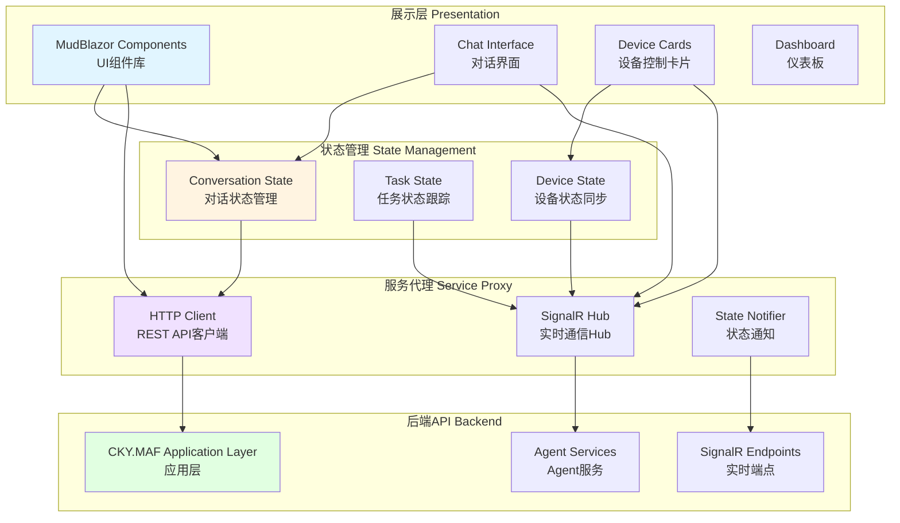
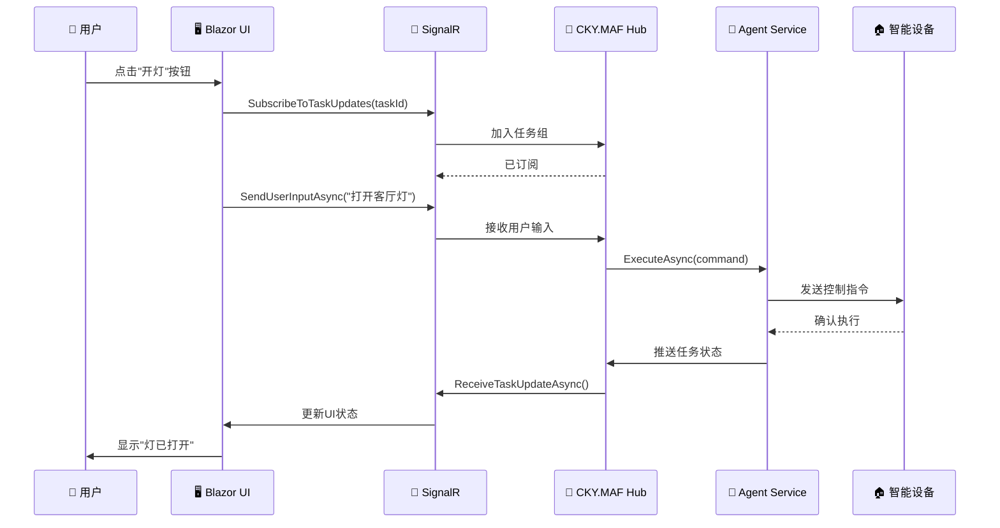

# CKY.MAF框架UI设计规范

> **文档版本**: v1.2
> **创建日期**: 2026-03-12
> **用途**: 前端架构与UI设计规范

---

## 📋 目录

1. [前端架构设计](#一前端架构设计)
2. [技术栈选择](#二技术栈选择)
3. [实时通信设计](#三实时通信设计)
4. [对话式UI设计](#四对话式ui设计)
5. [设备控制UI设计](#五设备控制ui设计)
6. [多场景UI设计](#六多场景ui设计)
7. [响应式设计](#七响应式设计)

---

## 一、前端架构设计

### 1.1 整体架构图



### 1.2 架构层次

| 层级 | 职责 | 技术 |
|------|------|------|
| **展示层** | UI组件、用户交互 | MudBlazor、Blazor Server |
| **状态层** | 状态管理、数据流 | Blazor状态、Flux模式 |
| **服务层** | API调用、实时通信 | HttpClient、SignalR |
| **后端层** | 业务逻辑、数据处理 | CKY.MAF框架 |

---

## 二、技术栈选择

### 2.1 前端框架对比

| 框架 | 优势 | 劣势 | 推荐度 |
|------|------|------|--------|
| **Blazor Server** | • C#全栈<br>• 实时通信内置<br>• SEO友好 | • 服务器开销<br>• 延迟敏感 | ⭐⭐⭐⭐⭐ |
| **Blazor WebAssembly** | • 客户端运行<br>• 离线可用 | • 首次加载慢 | ⭐⭐⭐⭐ |
| **React + ASP.NET Core** | • 生态成熟<br>• 性能优秀 | • 技术栈分离 | ⭐⭐⭐ |

**最终选择**: **Blazor Server** (首选项) + **Blazor WebAssembly** (移动端)

**理由**:
1. C#全栈，代码复用率高
2. 与ASP.NET Core无缝集成
3. SignalR实时通信开箱即用
4. 团队学习成本低

### 2.2 UI组件库

| 组件库 | 特点 | 推荐度 |
|--------|------|--------|
| **MudBlazor** | • Material Design<br>• 组件丰富<br>• 文档完善 | ⭐⭐⭐⭐⭐ |
| **Blazorise** | • 多框架支持<br>• 主题灵活 | ⭐⭐⭐⭐ |
| **Radzen** | • 商业组件<br>• 数据网格强大 | ⭐⭐⭐ |

**最终选择**: **MudBlazor**

---

## 三、实时通信设计

### 3.1 SignalR架构



### 3.2 SignalR Hub定义

```csharp
/// <summary>
/// CKY.MAF SignalR Hub接口
/// </summary>
public interface ICKY.MAFHub
{
    /// <summary>
    /// 接收用户消息
    /// </summary>
    Task ReceiveMessageAsync(ChatMessage message);

    /// <summary>
    /// 接收任务更新
    /// </summary>
    Task ReceiveTaskUpdateAsync(TaskUpdate update);

    /// <summary>
    /// 接收Agent状态
    /// </summary>
    Task ReceiveAgentStatusAsync(AgentStatus status);

    /// <summary>
    /// 接收设备状态
    /// </summary>
    Task ReceiveDeviceStateAsync(DeviceState state);
}

/// <summary>
/// CKY.MAF SignalR Hub实现
/// </summary>
public class CKY.MAFHub : Hub<ICKY.MAFHub>
{
    private readonly IAgentOrchestrator _orchestrator;
    private readonly ILogger<CKY.MAFHub> _logger;

    public CKY.MAFHub(
        IAgentOrchestrator orchestrator,
        ILogger<CKY.MAFHub> logger)
    {
        _orchestrator = orchestrator;
        _logger = logger;
    }

    /// <summary>
    /// 发送用户输入
    /// </summary>
    public async Task SendUserInputAsync(string userInput)
    {
        var userId = Context.UserIdentifier;
        var connectionId = Context.ConnectionId;

        _logger.LogInformation("收到用户输入：{Input}, ConnectionId: {ConnectionId}",
            userInput, connectionId);

        // 委托给MainAgent处理
        await _orchestrator.ProcessUserInputAsync(userId, userInput, connectionId);
    }

    /// <summary>
    /// 订阅任务更新
    /// </summary>
    public async Task SubscribeToTaskUpdatesAsync(string taskId)
    {
        await Groups.AddToGroupAsync(Context.ConnectionId, $"task_{taskId}");
        _logger.LogInformation("ConnectionId {ConnectionId} 订阅任务 {TaskId}",
            Context.ConnectionId, taskId);
    }

    /// <summary>
    /// 取消订阅任务更新
    /// </summary>
    public async Task UnsubscribeFromTaskUpdatesAsync(string taskId)
    {
        await Groups.RemoveFromGroupAsync(Context.ConnectionId, $"task_{taskId}");
    }
}
```

### 3.3 实时事件类型

| 事件类型 | SignalR方法 | 更新频率 | UI影响 |
|---------|------------|----------|--------|
| **消息发送** | ReceiveMessageAsync | 实时 | 对话气泡添加 |
| **任务状态** | ReceiveTaskUpdateAsync | 状态变化时 | 进度条、状态标签 |
| **Agent状态** | ReceiveAgentStatusAsync | 2-5秒 | 在线指示器 |
| **设备状态** | ReceiveDeviceStateAsync | 变化时 | 设备图标、开关 |

---

## 四、对话式UI设计

### 4.1 主界面布局

```
┌─────────────────────────────────────────────────────────────┐
│  CKY.MAF 智能家居控制界面                                      │
├─────────────────────────────────────────────────────────────┤
│  Header: [Logo] [当前场景: 晨间例程] [设置] [用户头像]     │
├──────────────────┬──────────────────────────────────────────┤
│                  │                                          │
│  左侧栏          │  主对话区                                │
│  ┌────────────┐ │  ┌────────────────────────────────────┐ │
│  │ 场景列表   │ │  │ 对话历史                           │ │
│  │ • 晨间例程 │ │  │                                    │ │
│  │ • 离家模式 │ │  │  👤 用户: 我起床了                    │ │
│  │ • 影院模式 │ │  │                                    │ │
│  │ • ...      │ │  │  🤖 系统: 正在为您执行晨间例程...     │ │
│  │            │ │  │                                    │ │
│  │ 设备列表   │ │  │  ⏳ [Loading动画]                    │ │
│  │ • 客厅灯   │ │  │                                    │ │
│  │ • 空调     │ │  │  ✅ 系统: 已完成以下操作：            │ │
│  │ • 音箱     │ │  │  ✓ 打开客厅灯                     │ │
│  │ • ...      │ │  │  ✓ 温度设置为26度                 │ │
│  │            │ │  │  ✓ 播放轻音乐                     │ │
│  │ Agent状态  │ │  │  ✓ 打开窗帘                       │ │
│  │ 🟢 Lighting│ │  │                                    │ │
│  │ 🟢 Climate │ │  └────────────────────────────────────┘ │
│  │ 🟢 Music   │ │  ┌────────────────────────────────────┐ │
│  │ 🔴 Security│ │  │ [输入框]          [发送📤]       │ │
│  └────────────┘ │  └────────────────────────────────────┘ │
│                  │                                          │
├──────────────────┴──────────────────────────────────────────┤
│  Footer: [任务执行进度] ════════════════════════░░░ 60%    │
└─────────────────────────────────────────────────────────────┘
```

### 4.2 消息类型设计

```csharp
/// <summary>
/// 聊天消息类型
/// </summary>
public enum ChatMessageType
{
    User,           // 用户消息
    Assistant,      // 助手回复
    System,         // 系统通知
    TaskCreated,    // 任务创建
    TaskProgress,   // 任务进度
    TaskCompleted,  // 任务完成
    Error           // 错误消息
}

/// <summary>
/// 聊天消息
/// </summary>
public class ChatMessage
{
    public string MessageId { get; set; }
    public ChatMessageType Type { get; set; }
    public string Content { get; set; }
    public DateTime Timestamp { get; set; }
    public MessageMetadata Metadata { get; set; }
}

/// <summary>
/// 消息元数据
/// </summary>
public class MessageMetadata
{
    // 任务相关
    public string TaskId { get; set; }
    public List<string> SubTaskIds { get; set; }

    // Agent相关
    public string AgentId { get; set; }
    public string AgentName { get; set; }

    // 设备相关
    public string DeviceId { get; set; }
    public string DeviceName { get; set; }
}
```

### 4.3 消息组件实现

```razor
<!-- ChatMessage.razor -->
<MudPaper Class="pa-4 mb-2" Elevation="0">
    <div class="d-flex align-center">
        @if (Message.Type == ChatMessageType.User)
        {
            <MudIcon Icon="@Icons.Material.Filled.Person" Class="mr-2" Size="Size.Small"/>
            <span class="text-subtitle2">@Message.Timestamp.ToString("HH:mm")</span>
        }
        else if (Message.Type == ChatMessageType.Assistant)
        {
            <MudIcon Icon="@Icons.Material.Filled.SmartToy" Class="mr-2" Size="Size.Small"/>
            <span class="text-subtitle2">@Message.Timestamp.ToString("HH:mm")</span>
        }
        else if (Message.Type == ChatMessageType.TaskProgress)
        {
            <MudIcon Icon="@Icons.Material.Filled.HourglassEmpty" Class="mr-2 anim-spin" Size="Size.Small"/>
            <MudText Typo="Typo.body2">正在处理...</MudText>
        }
        else if (Message.Type == ChatMessageType.TaskCompleted)
        {
            <MudIcon Icon="@Icons.Material.Filled.CheckCircle" Class="mr-2" Color="Color.Success" Size="Size.Small"/>
            <MudText Typo="Typo.body2" Color="Color.Success">任务完成</MudText>
        }
    </div>

    <MudText Typo="Typo.body1" Class="mt-2">@Message.Content</MudText>

    @if (Message.Metadata?.TaskId != null)
    {
        <MudText Typo="Typo.caption" Class="mt-1 text--disabled">
            任务ID: @Message.Metadata.TaskId
        </MudText>
    }
</MudPaper>
```

---

## 五、设备控制UI设计

### 5.1 设备控制卡片

```razor
<!-- DeviceCard.razor -->
<MudCard Elevation="2">
    <MudCardHeader>
        <CardMedia>
            <MudIcon Icon="@GetDeviceIcon(Device.Type)"
                     Size="Size.Large"
                     Color="@GetDeviceColor(Device.State)"/>
        </CardMedia>
        <CardActions>
            <MudSwitch T="bool"
                       @bind-Checked="@Device.IsOn"
                       Color="Color.Primary"
                       Label="@Device.Name"
                       LabelPosition="LabelPosition.End"
                       Disabled="@Device.IsReadOnly"
                       CheckedChanged="@ToggleDeviceAsync"/>
        </CardActions>
    </MudCardHeader>

    <MudCardContent>
        @if (Device.Capabilities.Contains("Brightness"))
        {
            <MudSlider T="int"
                       Min="0" Max="100"
                       @bind-Value="@Device.Brightness"
                       Label="亮度"
                       Disabled="@!Device.IsOn"
                       ValueChanged="@UpdateBrightnessAsync"/>
        }

        @if (Device.Capabilities.Contains("ColorTemperature"))
        {
            <MudSlider T="int"
                       Min="2700" Max="6500"
                       @bind-Value="@Device.ColorTemperature"
                       Label="色温(K)"
                       Disabled="@!Device.IsOn"
                       ValueChanged="@UpdateColorTemperatureAsync"/>
        }

        @if (Device.Capabilities.Contains("Color"))
        {
            <div class="mt-4">
                <MudText Typo="Typo.body2">颜色</MudText>
                <MudPicker T="string" Value="@Device.Color" PickerVariant="PickerVariant.Text" />
            </div>
        }
    </MudCardContent>

    <MudCardActions>
        <MudButton Variant="Variant.Filled"
                   Color="Color.Primary"
                   Size="Size.Small"
                   Disabled="@!Device.IsOn"
                   OnClick="@ShowAdvancedSettingsAsync">
            高级设置
        </MudButton>
    </MudCardActions>
</MudCard>
```

### 5.2 设备状态实时更新

```razor
@code {
    private List<Device> _devices = new();

    protected override async Task OnInitializedAsync()
    {
        // 加载初始设备列表
        _devices = await DeviceService.GetDevicesAsync();

        // 订阅SignalR设备状态更新
        var hub = await HubConnection.TryAsync();
        hub.On<DeviceState>("ReceiveDeviceState", async (state) =>
        {
            // 更新设备状态
            var device = _devices.FirstOrDefault(d => d.Id == state.DeviceId);
            if (device != null)
            {
                device.UpdateFrom(state);

                // 通知UI刷新
                await InvokeAsync(StateHasChanged);
            }
        });
    }

    private async Task ToggleDeviceAsync(bool newValue)
    {
        // 调用API控制设备
        await DeviceService.ToggleDeviceAsync(Device.Id, newValue);
    }

    private async Task UpdateBrightnessAsync(int brightness)
    {
        await DeviceService.SetBrightnessAsync(Device.Id, brightness);
    }
}
```

---

## 六、多场景UI设计

### 6.1 智能家居UI

**关键组件**:
1. **对话式主界面** - 聊天气泡、输入框
2. **设备控制面板** - 设备卡片、开关控制
3. **场景模式选择器** - 一键执行场景
4. **房间布局视图** - 可视化房间设备
5. **历史记录面板** - 操作日志

**特色功能**:
- 🎤 语音输入按钮
- ⚡ 场景一键执行
- 📱 设备分组控制
- ⏰ 定时任务设置

### 6.2 设备控制UI

**关键组件**:
1. **产线拓扑图** - 可视化设备连接
2. **设备状态大屏** - 实时状态监控
3. **任务队列监控** - 任务执行进度
4. **报警列表** - 故障通知
5. **日志查询** - 操作历史

**特色功能**:
- 📊 实时状态刷新
- 🚨 故障高亮显示
- 🔄 批量操作支持
- 📈 历史曲线图表

### 6.3 智能客服UI

**关键组件**:
1. **对话式客服界面** - 聊天气泡
2. **知识库搜索** - 快捷回复推荐
3. **工单系统** - 工单创建、跟踪
4. **客户信息卡片** - 客户详情
5. **情绪分析展示** - 情绪指标

**特色功能**:
- 💬 快捷回复模板
- 🔄 多轮对话管理
- 📚 知识库推荐
- 🎫 工单自动创建

---

## 七、响应式设计

### 7.1 断点策略

```css
/* MudBlazor断点 */
xs: 0px      /* 手机竖屏 */
sm: 600px    /* 手机横屏/小平板 */
md: 960px    /* 平板 */
lg: 1280px   /* 笔记本 */
xl: 1920px   /* 台式机 */
```

### 7.2 布局适配

| 屏幕尺寸 | 布局模式 | 关键调整 |
|---------|---------|----------|
| **xs** | 单列 | • 左侧栏折叠为抽屉<br>• 卡片单列显示<br>• 全屏对话 |
| **sm** | 单列+抽屉 | • 侧边栏可滑出<br>• 对话区最大化<br>• 优化触摸操作 |
| **md+** | 双列完整 | • 左侧栏常驻<br>• 右侧详情面板<br>• 鼠标悬停交互 |

### 7.3 响应式布局实现

```razor
<!-- ResponsiveLayout.razor -->
<MudLayout>
    <!-- 顶部导航栏 -->
    <MudAppBar>
        <MudIconButton Icon="@Icons.CustomIcons.Menu" Color="Color.Inherit"
                        Edge="Edge.Start" OnClick="@ToggleDrawer"/>
        <MudAppBarSpacer/>
        <MudText Typo="Typo.h6">CKY.MAF智能家居</MudText>
        <MudIconButton Icon="@Icons.Material.Filled.Settings" Color="Color.Inherit"
                        Edge="Edge.End"/>
    </MudAppBar>

    <!-- 左侧抽屉（移动端）/ 侧边栏（桌面端） -->
    <MudDrawer @bind-Open="@DrawerOpen"
               Anchor="Anchor.Start"
               Elevation="1"
               Variant="@DrawerVariant"
               Class="@GetDrawerClass()">
        <MudList Clickable="@CloseDrawer">
            <MudListItem Text="晨间例程" Icon="@Icons.Material.WbSunny" OnClick="@ActivateMorningRoutine"/>
            <MudListItem Text="离家模式" Icon="@Icons.Material.FlightTakeoff" OnClick="@ActivateAwayMode"/>
            <MudListItem Text="影院模式" Icon="@Icons.Material.Theaters" OnClick="@ActivateCinemaMode"/>
        </MudList>
    </MudDrawer>

    <!-- 主内容区 -->
    <MudMainContent Class="pa-4">
        @ChildContent
    </MudMainContent>
</MudLayout>

@code {
    bool DrawerOpen = false;
    DrawerVariant DrawerVariant = DrawerVariant.Responsive;
    Breakpoint Breakpoint = Breakpoint.MdAndUp;

    private void ToggleDrawer()
    {
        DrawerOpen = !DrawerOpen;
    }

    private string GetDrawerClass()
    {
        // 桌面端：永久侧边栏
        // 移动端：抽屉
        return Breakpoint == Breakpoint.MdAndUp
            ? "maf-desktop-sidebar"
            : "maf-mobile-drawer";
    }
}
```

---

## 🔗 相关文档

- [架构概览](./01-architecture-overview.md)
- [实现指南](./09-implementation-guide.md)
- [架构图表集](./02-architecture-diagrams.md)

---

**文档版本**: v1.2
**最后更新**: 2026-03-13
