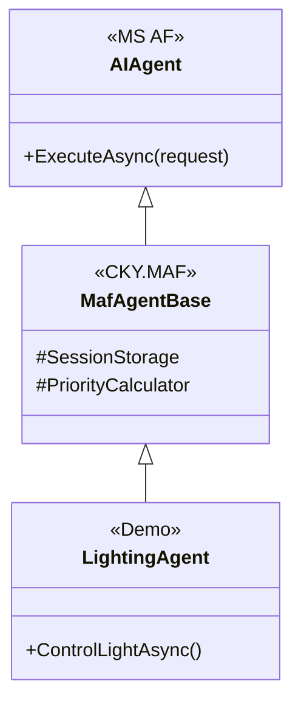
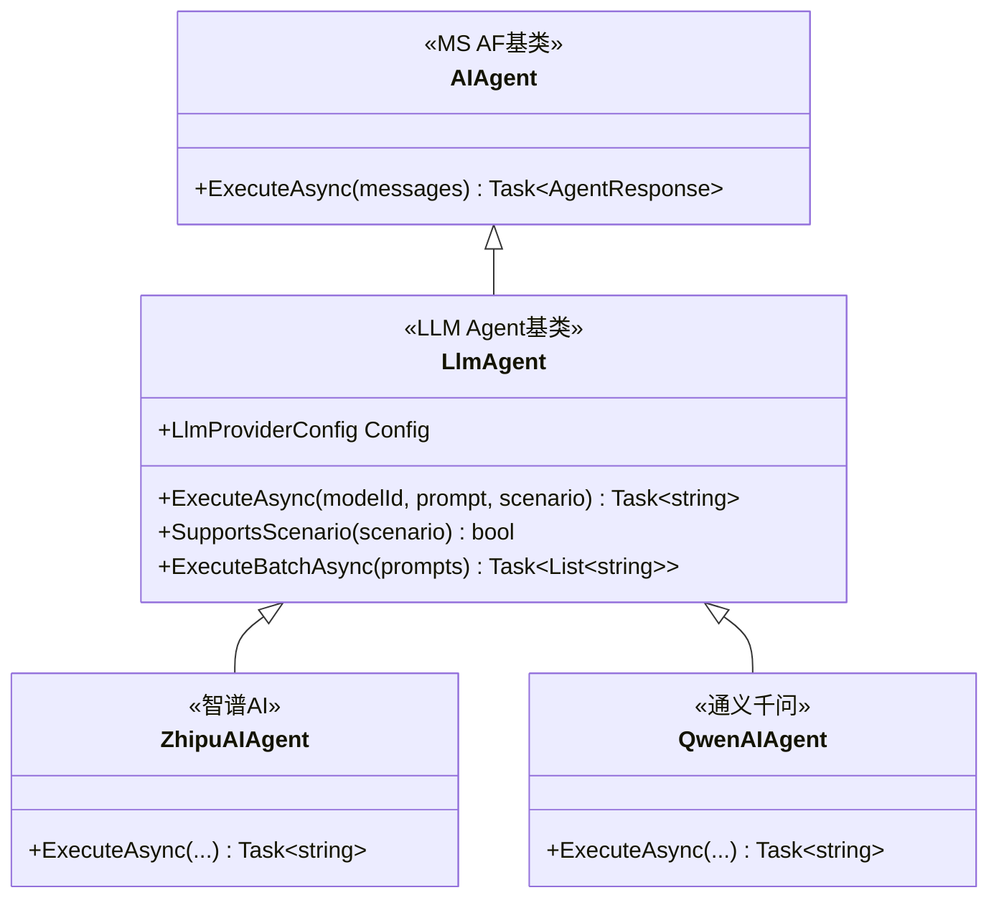

# CKY.MAF实现指南

> **文档版本**: v1.3
> **创建日期**: 2026-03-12
> **最后更新**: 2026-03-13
> **用途**: 基于Microsoft Agent Framework的代码实现细节
> **最新更新**: 新增 LLM Agent 实现章节（2026-03-13）

---

## ⚠️ 重要说明

**CKY.MAF不是独立框架**，而是**Microsoft Agent Framework的企业级增强层**。

**所有实现必须**：
- ✅ 继承MS AF的`AIAgent`基类
- ✅ 使用MS AF的A2A通信机制
- ✅ 使用MS AF的`IChatClient`进行LLM调用
- ✅ CKY.MAF仅提供增强功能（存储、调度、监控）

---

## 📋 目录

1. [MS Agent Framework集成](#一ms-agent-framework集成)
2. [项目结构](#二项目结构)
3. [Agent实现模式](#三agent实现模式)
4. [依赖注入配置](#四依赖注入配置)
5. [Demo场景实现](#五demo场景实现)
6. [最佳实践](#六最佳实践)

---

## 一、MS Agent Framework集成

### 1.1 核心依赖

```xml
<!-- 项目文件 -->
<ItemGroup>
  <!-- MS Agent Framework (必须) -->
  <PackageReference Include="Microsoft.Agents.AI" Version="1.0.0-preview.251001.1" />

  <!-- CKY.MAF增强功能 -->
  <ProjectReference Include="..\Core\MafCore.csproj" />
</ItemGroup>
```

### 1.2 Agent继承层次



**关键原则**：
- ❌ **不定义** `IMafAgent` 接口，使用 MS AF 的 `AIAgent`
- ❌ **不定义** `ILLMService` 接口，使用 MS AF 的 `IChatClient`
- ✅ **只定义** CKY.MAF 特有的增强功能

---

## 二、项目结构

### 2.1 完整目录结构

```
src/
├── Core/                                    # CKY.MAF核心层
│   ├── Agents/                             # 增强基类
│   │   ├── MafAgentBase.cs                # 继承AIAgent
│   │   └── MafMainAgentBase.cs            # 继承AIAgent
│   │
│   ├── Models/                             # 领域模型
│   │   ├── Task/
│   │   │   ├── MafTaskRequest.cs
│   │   │   ├── MafTaskResponse.cs
│   │   │   ├── DecomposedTask.cs
│   │   │   └── ExecutionPlan.cs
│   │   ├── Agent/
│   │   │   ├── AgentSession.cs
│   │   │   └── AgentStatistics.cs
│   │   └── Message/
│   │       └── MessageContext.cs
│   │
│   ├── Enums/                              # 枚举定义
│   │   ├── MafAgentStatus.cs
│   │   ├── TaskPriority.cs
│   │   ├── TaskStatus.cs
│   │   └── ExecutionStrategy.cs
│   │
│   ├── Scheduling/                         # 任务调度（CKY.MAF新增）
│   │   ├── ITaskScheduler.cs
│   │   ├── IPriorityCalculator.cs
│   │   └── TaskDependencyGraph.cs
│   │
│   ├── Storage/                            # 存储系统（CKY.MAF新增）
│   │   ├── IMafSessionStorage.cs
│   │   ├── ThreeTierStorage.cs
│   │   └── AgentSession.cs
│   │
│   └── Monitoring/                         # 监控系统（CKY.MAF新增）
│       └── IMetricsCollector.cs
│
├── Services/                               # 服务实现层
│   ├── Agents/                             # Agent实现
│   │   ├── Base/
│   │   │   └── MafAgentBase.cs             # Agent基类
│   │   └── Main/
│   │       └── MafMainAgent.cs             # MainAgent实现
│   │
│   ├── NLP/                                # NLP服务
│   │   ├── MafIntentRecognizer.cs
│   │   ├── RuleBasedIntentRecognizer.cs
│   │   ├── VectorBasedIntentRecognizer.cs
│   │   ├── MafEntityExtractor.cs
│   │   └── MafCoreferenceResolver.cs
│   │
│   ├── Orchestration/                      # 编排服务
│   │   ├── MafTaskDecomposer.cs
│   │   ├── MafAgentMatcher.cs
│   │   ├── MafTaskOrchestrator.cs
│   │   ├── MafResultAggregator.cs
│   │   └── Schedulers/
│   │       ├── ITaskScheduler.cs
│   │       ├── MafTaskScheduler.cs
│   │       └── TaskPriorityCalculator.cs
│   │
│   └── Storage/                            # 存储服务
│       ├── MafTieredSessionStorage.cs
│       ├── MafMemoryManager.cs
│       └── MafAgentRegistry.cs
│
├── Demos/                                  # Demo应用层（独立于核心层）
│   └── SmartHome/                          # 智能家居Demo
│       ├── SmartHomeMainAgent.cs
│       ├── Agents/
│       │   ├── LightingAgent.cs
│       │   ├── ClimateAgent.cs
│       │   ├── MusicAgent.cs
│       │   └── SecurityAgent.cs
│       ├── Services/
│       │   ├── ILightingService.cs        # 领域服务接口
│       │   ├── IClimateService.cs
│       │   └── implementations/
│       │       ├── XiaomiLightingService.cs
│       │       └── TuyaClimateService.cs
│       └── Scenarios/
│           └── morning-routine.json
│
└── Infrastructure/                         # 基础设施层
    ├── LLM/                                # LLM服务
    │   ├── ILLMService.cs
    │   ├── ZhipuAIClient.cs
    │   ├── QwenClient.cs
    │   └── PromptManager/
    │       └── IPromptManager.cs
    │
    ├── VectorDB/                           # 向量数据库
    │   └── QdrantClient.cs
    │
    ├── Messaging/                          # 消息队列
    │   ├── IMessageQueue.cs                # 消息队列接口
    │   ├── RedisMessageQueue.cs            # Redis实现（默认）
    │   └── RabbitMQMessageQueue.cs         # RabbitMQ实现（可选）
    │
    └── Caching/                            # 缓存服务
        ├── IMafCache.cs                    # 缓存接口
        ├── RedisMafCache.cs                # Redis分布式缓存实现（默认）
        └── MafTieredCache.cs               # 三层缓存组合实现
```

### 2.2 命名规范
```csharp
// 接口命名：I + 功能 + 类型
IMafAgent, ITaskDecomposer, IAgentMatcher

// 实现命名：Maf + 功能 + 类型
MafAgentBase, MafTaskDecomposer, MafAgentMatcher

// Demo命名：场景 + 功能 + Agent
SmartHomeMainAgent, LightingAgent, ClimateAgent

// 领域服务命名：平台 + 功能 + Service
XiaomiLightingService, TuyaClimateService
```

---

## 四、服务层实现

### 4.1 Agent基类实现

```csharp
namespace CKY.MultiAgentFramework.Services.Agents
{
    /// <summary>
    /// CKY.MAF Agent 基类
    /// 提供通用功能，减少重复代码
    /// </summary>
    public abstract class MafAgentBase : IMafAgent, IMafAgentLifecycle, IMafAgentHealthCheck
    {
        // 子类实现基本属性
        public abstract string AgentId { get; }
        public abstract string Name { get; }
        public abstract string Description { get; }
        public abstract string Version { get; }
        public abstract IReadOnlyList<string> Capabilities { get; }

        // 基类提供实现
        public MafAgentStatus Status { get; private set; } = MafAgentStatus.Initializing;
        public DateTime? LastHealthCheck { get; private set; }
        public AgentStatistics Statistics { get; private set; } = new();

        // 模板方法：定义执行流程
        public async Task<MafTaskResponse> ExecuteAsync(
            MafTaskRequest request,
            CancellationToken ct = default)
        {
            Status = MafAgentStatus.Busy;

            try
            {
                // 1. 前置处理（子类可重写）
                await OnBeforeExecuteAsync(request, ct);

                // 2. 执行业务逻辑（子类必须实现）
                var result = await ExecuteBusinessLogicAsync(request, ct);

                // 3. 后置处理（子类可重写）
                await OnAfterExecuteAsync(request, result, ct);

                // 4. 更新统计
                Statistics.TotalExecutions++;
                Statistics.SuccessfulExecutions++;

                return new MafTaskResponse
                {
                    TaskId = request.TaskId,
                    Success = result.Success,
                    Result = result.Message,
                    Data = result.Data
                };
            }
            catch (Exception ex)
            {
                // 5. 异常处理
                Statistics.FailedExecutions++;
                return await HandleExceptionAsync(request, ex, ct);
            }
            finally
            {
                Status = MafAgentStatus.Idle;
            }
        }

        // 抽象方法：子类必须实现
        protected abstract Task<ExecutionResult> ExecuteBusinessLogicAsync(
            MafTaskRequest request,
            CancellationToken ct = default);

        // 可选重写方法
        protected virtual Task OnBeforeExecuteAsync(
            MafTaskRequest request,
            CancellationToken ct = default)
            => Task.CompletedTask;

        protected virtual Task OnAfterExecuteAsync(
            MafTaskRequest request,
            ExecutionResult result,
            CancellationToken ct = default)
            => Task.CompletedTask;

        protected virtual Task<MafTaskResponse> HandleExceptionAsync(
            MafTaskRequest request,
            Exception exception,
            CancellationToken ct = default)
        {
            return new MafTaskResponse
            {
                TaskId = request.TaskId,
                Success = false,
                Error = exception.Message,
                Result = $"处理您的请求时遇到问题：{exception.Message}"
            };
        }

        // 生命周期管理
        public virtual async Task InitializeAsync(CancellationToken ct = default)
        {
            Status = MafAgentStatus.Idle;
            await Task.CompletedTask;
        }

        public virtual async Task ShutdownAsync(CancellationToken ct = default)
        {
            Status = MafAgentStatus.Offline;
            await Task.CompletedTask;
        }

        public virtual async Task SuspendAsync(CancellationToken ct = default)
        {
            Status = MafAgentStatus.Suspended;
            await Task.CompletedTask;
        }

        public virtual async Task ResumeAsync(CancellationToken ct = default)
        {
            Status = MafAgentStatus.Idle;
            await Task.CompletedTask;
        }

        // 健康检查
        public async Task<MafHealthStatus> CheckHealthAsync(CancellationToken ct = default)
        {
            LastHealthCheck = DateTime.UtcNow;

            if (Status == MafAgentStatus.Error)
            {
                return MafHealthStatus.Unhealthy;
            }

            if (Statistics.FailedExecutions > Statistics.TotalExecutions * 0.5)
            {
                return MafHealthStatus.Degraded;
            }

            return MafHealthStatus.Healthy;
        }

        public async Task<AgentStatistics> GetStatisticsAsync(CancellationToken ct = default)
        {
            return await Task.FromResult(Statistics);
        }
    }

    /// <summary>
    /// Agent统计信息
    /// </summary>
    public class AgentStatistics
    {
        public int TotalExecutions { get; set; }
        public int SuccessfulExecutions { get; set; }
        public int FailedExecutions { get; set; }
        public double SuccessRate => TotalExecutions > 0
            ? (double)SuccessfulExecutions / TotalExecutions
            : 0;
    }
}
```

### 2.2 MainAgent实现框架

```csharp
namespace CKY.MultiAgentFramework.Services.Agents.Main
{
    /// <summary>
    /// MainAgent 基类实现
    /// </summary>
    public abstract class MafMainAgentBase : MafAgentBase, IMafMainAgent
    {
        protected readonly IIntentRecognizer IntentRecognizer;
        protected readonly ITaskDecomposer TaskDecomposer;
        protected readonly IAgentMatcher AgentMatcher;
        protected readonly ITaskOrchestrator TaskOrchestrator;
        protected readonly IResultAggregator ResultAggregator;

        protected MafMainAgentBase(
            IIntentRecognizer intentRecognizer,
            ITaskDecomposer taskDecomposer,
            IAgentMatcher agentMatcher,
            ITaskOrchestrator taskOrchestrator,
            IResultAggregator resultAggregator)
        {
            IntentRecognizer = intentRecognizer;
            TaskDecomposer = taskDecomposer;
            AgentMatcher = agentMatcher;
            TaskOrchestrator = taskOrchestrator;
            ResultAggregator = resultAggregator;
        }

        public override async Task<MafTaskResponse> ExecuteAsync(
            MafTaskRequest request,
            CancellationToken ct = default)
        {
            try
            {
                // 1. 意图识别
                var intent = await IntentRecognizer.RecognizeAsync(
                    request.UserInput,
                    ct);

                // 2. 任务分解
                var decomposition = await TaskDecomposer.DecomposeAsync(
                    request.UserInput,
                    intent,
                    ct);

                // 3. Agent编排
                var result = await OrchestrateAgentsAsync(
                    decomposition.SubTasks,
                    ct);

                // 4. 结果聚合
                var aggregated = await ResultAggregator.AggregateAsync(
                    result.SubTaskResults,
                    request.UserInput,
                    ct);

                // 5. 生成响应
                var response = await ResultAggregator.GenerateResponseAsync(
                    aggregated,
                    ct);

                return new MafTaskResponse
                {
                    TaskId = request.TaskId,
                    Success = aggregated.Success,
                    Result = response,
                    Data = aggregated.AggregatedData
                };
            }
            catch (Exception ex)
            {
                return new MafTaskResponse
                {
                    TaskId = request.TaskId,
                    Success = false,
                    Error = ex.Message
                };
            }
        }

        public abstract Task<TaskDecomposition> DecomposeTaskAsync(
            string userInput,
            CancellationToken ct = default);

        public abstract Task<ExecutionResult> OrchestrateAgentsAsync(
            List<DecomposedTask> tasks,
            CancellationToken ct = default);
    }
}
```

---

## 五、LLM Agent 实现

> **新增功能（2026-03-13）**：CKY.MAF 提供完整的 LLM Agent 架构，支持智谱AI、通义千问等多个提供商，内置弹性保护。

### 5.1 LLM Agent 架构概览



### 5.2 创建 LlmAgent 实例

```csharp
// ===== 1. 配置 LLM 提供商 =====
var config = new LlmProviderConfig
{
    ProviderName = "zhipuai",
    ProviderDisplayName = "智谱AI",
    ModelId = "glm-4",
    ApiKey = "your-api-key",  // 从环境变量读取
    ApiBaseUrl = "https://open.bigmodel.cn/api/paas/v4",
    SupportedScenarios = new List<LlmScenario>
    {
        LlmScenario.Chat,
        LlmScenario.Intent
    },
    Temperature = 0.7,
    MaxTokens = 2000,
    Priority = 0,  // 优先级（数字越小优先级越高）
    IsEnabled = true
};

// 验证配置（启动时检查）
config.Validate();

// ===== 2. 配置依赖注入 =====
services.AddHttpClient<ZhipuAIAgent>(client =>
{
    client.BaseAddress = new Uri("https://open.bigmodel.cn/api/paas/v4/chat/completions");
    client.DefaultRequestHeaders.Add("Authorization", $"Bearer {apiKey}");
    client.DefaultRequestHeaders.Add("Content-Type", "application/json");
    client.Timeout = TimeSpan.FromSeconds(30);
});

services.AddSingleton<LlmResiliencePipeline>();

// ===== 3. 创建 Agent 实例 =====
var agent = new ZhipuAIAgent(
    config,
    logger,
    httpClient,
    resiliencePipeline
);
```

### 5.3 基本 LLM 调用

```csharp
// ===== 1. 简单对话 =====
var response = await agent.ExecuteAsync(
    modelId: "glm-4",
    prompt: "你好，请介绍一下你自己",
    scenario: LlmScenario.Chat,
    systemPrompt: "你是一个友好的AI助手",
    ct: CancellationToken.None
);

Console.WriteLine(response);
// => "你好！我是智谱AI开发的大型语言模型..."

// ===== 2. 意图识别 =====
var intentResponse = await agent.ExecuteAsync(
    modelId: "glm-4",
    prompt: "打开客厅的灯",
    scenario: LlmScenario.Intent,
    systemPrompt: "你是意图识别专家，请识别用户意图",
    ct: CancellationToken.None
);

Console.WriteLine(intentResponse);
// => "{\"intent\": \"lighting.control\", \"confidence\": 0.95}"

// ===== 3. 批量调用（并行执行） =====
var prompts = new List<string>
{
    "介绍Python",
    "介绍C#",
    "介绍JavaScript"
};

var responses = await agent.ExecuteBatchAsync(
    modelId: "glm-4",
    prompts: prompts,
    scenario: LlmScenario.Chat,
    ct: CancellationToken.None
);

// 批量调用自动并行执行，提高效率
foreach (var (prompt, response) in prompts.Zip(responses))
{
    Console.WriteLine($"Prompt: {prompt}");
    Console.WriteLine($"Response: {response}\n");
}
```

### 5.4 使用 LlmAgentRegistry（故障转移）

```csharp
// ===== 1. 注册多个 LLM Agent =====
var registry = new LlmAgentRegistry(logger);

// 注册智谱AI
var zhipuConfig = new LlmProviderConfig
{
    ProviderName = "zhipuai",
    ModelId = "glm-4",
    ApiKey = "zhipu-api-key",
    Priority = 0,  // 主力模型
    IsEnabled = true
};

// 注册通义千问（备选）
var qwenConfig = new LlmProviderConfig
{
    ProviderName = "qwen",
    ModelId = "qwen-plus",
    ApiKey = "qwen-api-key",
    Priority = 1,  // 备选模型
    IsEnabled = true
};

registry.RegisterAgents(new[] { zhipuAgent, qwenAgent });

// ===== 2. 使用注册表（自动故障转移） =====
try
{
    // 自动选择最佳 Agent（按优先级）
    var bestAgent = await registry.GetBestAgentAsync(
        scenario: LlmScenario.Chat,
        ct: CancellationToken.None
    );

    var response = await bestAgent.ExecuteAsync(
        modelId: bestAgent.Config.ModelId,
        prompt: "你好",
        scenario: LlmScenario.Chat
    );

    Console.WriteLine($"使用 {bestAgent.Config.ProviderName}: {response}");
}
catch (InvalidOperationException ex)
{
    // 所有 Agent 都不可用
    Console.WriteLine($"错误: {ex.Message}");
}

// ===== 3. 动态禁用 Agent =====
await registry.SetAgentEnabledAsync(
    providerName: "zhipuai",
    enabled: false,
    ct: CancellationToken.None
);

// 下次调用会自动使用 qwen（优先级第2）
```

### 5.5 弹性保护（自动生效）

所有 LLM 调用自动通过 `LlmResiliencePipeline`，提供三层保护：

```csharp
// 在 ZhipuAIAgent.ExecuteAsync() 中自动应用
public override async Task<string> ExecuteAsync(...)
{
    return await _resiliencePipeline.ExecuteAsync(
        AgentId,
        async (innerCt) => await ExecuteInternalAsync(...),
        timeout: TimeSpan.FromSeconds(30),
        ct
    );
}

// 三层防护：
// 1. 熔断器检查 → 连续失败 3 次后打开
// 2. 超时保护 → 30 秒后自动取消
// 3. 指数退避重试 → 最多 3 次，延迟：1s, 2s, 4s
```

**熔断器状态监控**：

```csharp
// 获取熔断器状态
var circuitBreaker = pipeline.GetCircuitBreaker("zhipuai");
var status = circuitBreaker.GetStatus();

Console.WriteLine($"状态: {status.State}");
Console.WriteLine($"失败次数: {status.FailureCount}/{status.FailureThreshold}");
Console.WriteLine($"最后状态变更: {status.LastStateChangeTime}");

// 手动重置熔断器（例如在管理员确认后）
circuitBreaker.Reset("zhipuai");
```

### 5.6 异常处理

```csharp
try
{
    var response = await agent.ExecuteAsync(...);
}
catch (LlmCircuitBreakerOpenException ex)
{
    // 熔断器已打开，请求被拒绝
    logger.LogWarning(ex, "熔断器已打开，请稍后重试");

    // 建议：使用备选模型或降级服务
    var fallbackResponse = await UseFallbackModel();
}
catch (LlmResilienceException ex)
{
    // 所有重试都失败
    logger.LogError(ex, "LLM 调用失败，已重试 3 次");

    // 建议：使用规则引擎或返回友好错误
    return "抱歉，服务暂时不可用，请稍后重试";
}
catch (LlmServiceException ex) when (ex.IsRateLimited)
{
    // 速率限制（429 Too Many Requests）
    logger.LogWarning(ex, "LLM API 速率限制");

    // 建议：延迟后重试或切换提供商
    await Task.Delay(5000);
}
catch (LlmServiceException ex) when (ex.StatusCode == 401)
{
    // 认证失败（401 Unauthorized）
    logger.LogError(ex, "LLM API 认证失败");

    // 建议：检查 API Key 配置
    return "服务配置错误，请联系管理员";
}
```

### 5.7 最佳实践

#### ✅ 推荐做法

```csharp
// 1. 使用依赖注入
services.AddHttpClient<ZhipuAIAgent>(...);
services.AddSingleton<LlmResiliencePipeline>();

// 2. 从环境变量读取 API Key
var apiKey = Environment.GetEnvironmentVariable("ZHIPU_API_KEY");
var config = new LlmProviderConfig { ApiKey = apiKey };

// 3. 启动时验证配置
config.Validate();

// 4. 使用场景指定 system prompt
var response = await agent.ExecuteAsync(
    modelId: "glm-4",
    prompt: userInput,
    scenario: LlmScenario.Intent,  // 自动添加意图识别的 system prompt
    systemPrompt: customSystemPrompt  // 可选自定义
);

// 5. 监控熔断器状态
var status = circuitBreaker.GetStatus();
logger.LogInformation("熔断器状态: {State}, 失败: {Failures}/{Threshold}",
    status.State, status.FailureCount, status.FailureThreshold);
```

#### ❌ 避免的做法

```csharp
// 1. ❌ 不要硬编码 API Key
var config = new LlmProviderConfig
{
    ApiKey = "sk-xxxx"  // 危险！
};

// 2. ❌ 不要创建自己的 HttpClient
public class MyAgent : LlmAgent
{
    private readonly HttpClient _httpClient = new();  // 错误！会导致 socket 耗尽
}

// 3. ❌ 不要忽略配置验证
var config = new LlmProviderConfig { ... };
// config.Validate();  // 不要跳过验证！

// 4. ❌ 不要捕获所有异常
try
{
    await agent.ExecuteAsync(...);
}
catch (Exception ex)  // 太宽泛
{
    // 应该区分处理不同类型的异常
}
```

---

## 六、传统 Agent 实现模式

### 6.1 智能家居Agent示例

```csharp
namespace CKY.MultiAgentFramework.Services.NLP
{
    /// <summary>
    /// CKY.MAF 意图识别器
    /// 支持规则和向量混合识别
    /// </summary>
    public class MafIntentRecognizer : IIntentRecognizer
    {
        private readonly RuleBasedIntentRecognizer _ruleBased;
        private readonly VectorBasedIntentRecognizer _vectorBased;

        public MafIntentRecognizer(
            RuleBasedIntentRecognizer ruleBased,
            VectorBasedIntentRecognizer vectorBased)
        {
            _ruleBased = ruleBased;
            _vectorBased = vectorBased;
        }

        public async Task<IntentRecognitionResult> RecognizeAsync(
            string userInput,
            CancellationToken ct = default)
        {
            // 1. 尝试规则匹配（快速、准确）
            var ruleResult = await _ruleBased.RecognizeAsync(userInput, ct);

            if (ruleResult.Confidence > 0.9)
            {
                return ruleResult;  // 高置信度，直接返回
            }

            // 2. 规则匹配不确定，尝试向量匹配
            var vectorResult = await _vectorBased.RecognizeAsync(userInput, ct);

            // 3. 融合两种结果
            return CombineResults(ruleResult, vectorResult);
        }

        private IntentRecognitionResult CombineResults(
            IntentRecognitionResult ruleResult,
            IntentRecognitionResult vectorResult)
        {
            // 简单策略：选择置信度更高的
            return ruleResult.Confidence >= vectorResult.Confidence
                ? ruleResult
                : vectorResult;
        }
    }

    /// <summary>
    /// 基于规则的意图识别
    /// </summary>
    public class RuleBasedIntentRecognizer : IIntentRecognizer
    {
        private readonly Dictionary<string, List<string>> _intentPatterns;

        public RuleBasedIntentRecognizer()
        {
            _intentPatterns = new Dictionary<string, List<string>>
            {
                ["lighting.control.turn_on"] = new List<string>
                {
                    @"打开.*灯", @"开.*灯", @"点亮.*灯",
                    @"turn on.*light", @"switch on.*light"
                },
                ["climate.control.set_temperature"] = new List<string>
                {
                    @"设置.*温度.*\d+", @"调.*温度.*\d+",
                    @"set.*temperature", @"adjust.*temperature"
                },
                ["music.play"] = new List<string>
                {
                    @"播放.*音乐", @"放.*歌", @"play.*music"
                },
                ["morning_routine.activate"] = new List<string>
                {
                    @"我起床了", @"起床了", @"good morning",
                    @"wake up", @"start morning routine"
                }
            };
        }

        public async Task<IntentRecognitionResult> RecognizeAsync(
            string userInput,
            CancellationToken ct = default)
        {
            var input = userInput.ToLower().Trim();

            foreach (var (intent, patterns) in _intentPatterns)
            {
                foreach (var pattern in patterns)
                {
                    if (Regex.IsMatch(input, pattern, RegexOptions.IgnoreCase))
                    {
                        return new IntentRecognitionResult
                        {
                            PrimaryIntent = intent,
                            Confidence = 0.95,
                            OriginalInput = userInput
                        };
                    }
                }
            }

            return new IntentRecognitionResult
            {
                PrimaryIntent = "unknown",
                Confidence = 0.0,
                OriginalInput = userInput
            };
        }
    }
}
```

### 3.2 任务分解服务

```csharp
namespace CKY.MultiAgentFramework.Services.Orchestration
{
    /// <summary>
    /// CKY.MAF 任务分解器
    /// </summary>
    public class MafTaskDecomposer : ITaskDecomposer
    {
        public async Task<TaskDecomposition> DecomposeAsync(
            string userInput,
            IntentRecognitionResult intent,
            CancellationToken ct = default)
        {
            var decompositionId = Guid.NewGuid().ToString("N");
            var subTasks = new List<DecomposedTask>();

            // 根据意图分解任务
            switch (intent.PrimaryIntent)
            {
                case "morning_routine.activate":
                    subTasks = await DecomposeMorningRoutine(userInput, ct);
                    break;

                case "lighting.control.turn_on":
                    subTasks = await DecomposeLightControl(userInput, intent, ct);
                    break;

                case "climate.control.set_temperature":
                    subTasks = await DecomposeClimateControl(userInput, intent, ct);
                    break;

                default:
                    // 未知意图，返回单个任务
                    subTasks.Add(new DecomposedTask
                    {
                        TaskId = Guid.NewGuid().ToString("N"),
                        Intent = intent.PrimaryIntent,
                        Priority = TaskPriority.Normal,
                        ExecutionStrategy = ExecutionStrategy.Serial
                    });
                    break;
            }

            return new TaskDecomposition
            {
                DecompositionId = decompositionId,
                OriginalUserInput = userInput,
                Intent = intent,
                SubTasks = subTasks
            };
        }

        private async Task<List<DecomposedTask>> DecomposeMorningRoutine(
            string userInput,
            CancellationToken ct)
        {
            return await Task.FromResult(new List<DecomposedTask>
            {
                new DecomposedTask
                {
                    TaskId = Guid.NewGuid().ToString("N"),
                    TaskName = "打开客厅灯",
                    Intent = "lighting.control.turn_on",
                    Description = "打开客厅的灯",
                    Priority = TaskPriority.High,
                    PriorityScore = 45,
                    ExecutionStrategy = ExecutionStrategy.Immediate,
                    Parameters = new Dictionary<string, object>
                    {
                        ["room"] = "living_room",
                        ["device"] = "ceiling_light"
                    }
                },
                new DecomposedTask
                {
                    TaskId = Guid.NewGuid().ToString("N"),
                    TaskName = "设置空调温度",
                    Intent = "climate.control.set_temperature",
                    Description = "设置空调温度为26度",
                    Priority = TaskPriority.Normal,
                    PriorityScore = 25,
                    ExecutionStrategy = ExecutionStrategy.Parallel,
                    Parameters = new Dictionary<string, object>
                    {
                        ["room"] = "living_room",
                        ["temperature"] = 26
                    }
                },
                new DecomposedTask
                {
                    TaskId = Guid.NewGuid().ToString("N"),
                    TaskName = "播放音乐",
                    Intent = "music.play",
                    Description = "播放轻音乐",
                    Priority = TaskPriority.Normal,
                    PriorityScore = 20,
                    ExecutionStrategy = ExecutionStrategy.Parallel,
                    Dependencies = new List<TaskDependency>
                    {
                        new TaskDependency
                        {
                            DependsOnTaskId = null,  // 将在调度时填充
                            Type = DependencyType.MustComplete
                        }
                    },
                    Parameters = new Dictionary<string, object>
                    {
                        ["playlist"] = "轻音乐"
                    }
                },
                new DecomposedTask
                {
                    TaskId = Guid.NewGuid().ToString("N"),
                    TaskName = "打开窗帘",
                    Intent = "curtain.open",
                    Description = "打开卧室窗帘",
                    Priority = TaskPriority.Low,
                    PriorityScore = 10,
                    ExecutionStrategy = ExecutionStrategy.Delayed,
                    Parameters = new Dictionary<string, object>
                    {
                        ["room"] = "bedroom"
                    }
                }
            });
        }
    }
}
```

---

## 六、依赖注入配置

### 6.1 服务注册

```csharp
namespace CKY.MultiAgentFramework.Demos.SmartHome.Agents
{
    /// <summary>
    /// 灯光控制Agent
    /// </summary>
    public class LightingAgent : MafAgentBase
    {
        private readonly ILightingService _lightingService;

        public LightingAgent(ILightingService lightingService)
        {
            _lightingService = lightingService;
        }

        public override string AgentId => "smarthome:lighting:agent:default";
        public override string Name => "智能家居灯光控制Agent";
        public override string Description => "负责智能灯光的控制和管理";
        public override string Version => "1.0.0";

        public override IReadOnlyList<string> Capabilities =>
            new List<string>
            {
                "SmartHome:Lighting:Switch",
                "SmartHome:Lighting:Dimmer",
                "SmartHome:Lighting:Color",
                "SmartHome:Lighting:Scene"
            }.AsReadOnly();

        protected override async Task<ExecutionResult> ExecuteBusinessLogicAsync(
            MafTaskRequest request,
            CancellationToken ct = default)
        {
            try
            {
                // 1. 提取参数
                var room = request.Parameters.GetValueOrDefault("room", "living_room").ToString();
                var action = request.Parameters.GetValueOrDefault("action", "turn_on").ToString();

                // 2. 执行控制
                switch (action)
                {
                    case "turn_on":
                        await _lightingService.TurnOnAsync(room, ct);
                        break;

                    case "turn_off":
                        await _lightingService.TurnOffAsync(room, ct);
                        break;

                    case "set_brightness":
                        var brightness = (int)request.Parameters["brightness"];
                        await _lightingService.SetBrightnessAsync(room, brightness, ct);
                        break;

                    case "set_color":
                        var color = request.Parameters["color"].ToString();
                        await _lightingService.SetColorAsync(room, color, ct);
                        break;

                    default:
                        return new ExecutionResult
                        {
                            Success = false,
                            Message = $"未知的灯光操作：{action}"
                        };
                }

                return new ExecutionResult
                {
                    Success = true,
                    Message = $"成功执行灯光操作：{action}",
                    Data = new { Room = room, Action = action }
                };
            }
            catch (Exception ex)
            {
                return new ExecutionResult
                {
                    Success = false,
                    Message = $"灯光控制失败：{ex.Message}"
                };
            }
        }
    }

    /// <summary>
    /// 温度控制Agent
    /// </summary>
    public class ClimateAgent : MafAgentBase
    {
        private readonly IClimateService _climateService;

        public ClimateAgent(IClimateService climateService)
        {
            _climateService = climateService;
        }

        public override string AgentId => "smarthome:climate:agent:default";
        public override string Name => "智能家居温控Agent";
        public override string Description => "负责空调等温控设备的控制";
        public override string Version => "1.0.0";

        public override IReadOnlyList<string> Capabilities =>
            new List<string>
            {
                "SmartHome:Climate:Switch",
                "SmartHome:Climate:Temperature",
                "SmartHome:Climate:Mode",
                "SmartHome:Climate:Humidity"
            }.AsReadOnly();

        protected override async Task<ExecutionResult> ExecuteBusinessLogicAsync(
            MafTaskRequest request,
            CancellationToken ct = default)
        {
            var room = request.Parameters.GetValueOrDefault("room", "living_room").ToString();
            var action = request.Parameters.GetValueOrDefault("action", "set_temperature").ToString();

            switch (action)
            {
                case "set_temperature":
                    var temperature = (int)request.Parameters["temperature"];
                    await _climateService.SetTemperatureAsync(room, temperature, ct);
                    return new ExecutionResult
                    {
                        Success = true,
                        Message = $"已将{room}的温度设置为{temperature}度"
                    };

                default:
                    return new ExecutionResult
                    {
                        Success = false,
                        Message = $"未知的温控操作：{action}"
                    };
            }
        }
    }
}
```

### 4.2 领域服务接口

```csharp
namespace CKY.MultiAgentFramework.Demos.SmartHome.Services
{
    /// <summary>
    /// 灯光服务接口 - 领域抽象
    /// 具体实现可以对接不同的智能家居平台（小米、涂鸦、天猫精灵等）
    /// </summary>
    public interface ILightingService
    {
        Task TurnOnAsync(string deviceName, CancellationToken ct = default);
        Task TurnOffAsync(string deviceName, CancellationToken ct = default);
        Task SetBrightnessAsync(string deviceName, int brightness, CancellationToken ct = default);
        Task SetColorAsync(string deviceName, string hexColor, CancellationToken ct = default);
        Task<DeviceState> GetStateAsync(string deviceName, CancellationToken ct = default);
    }

    /// <summary>
    /// 温度控制服务接口
    /// </summary>
    public interface IClimateService
    {
        Task TurnOnAsync(string deviceName, CancellationToken ct = default);
        Task TurnOffAsync(string deviceName, CancellationToken ct = default);
        Task SetTemperatureAsync(string deviceName, int temperature, CancellationToken ct = default);
        Task SetModeAsync(string deviceName, string mode, CancellationToken ct = default);
    }

    /// <summary>
    /// 音乐服务接口
    /// </summary>
    public interface IMusicService
    {
        Task PlayAsync(string deviceName, string playlist, CancellationToken ct = default);
        Task StopAsync(string deviceName, CancellationToken ct = default);
        Task SetVolumeAsync(string deviceName, int volume, CancellationToken ct = default);
    }
}
```

### 4.3 领域服务实现

```csharp
namespace CKY.MultiAgentFramework.Demos.SmartHome.Services.Implementations
{
    /// <summary>
    /// 小米平台灯光服务实现
    /// </summary>
    public class XiaomiLightingService : ILightingService
    {
        private readonly IXiaomiCloudApi _xiaomiApi;
        private readonly ILogger<XiaomiLightingService> _logger;

        public XiaomiLightingService(
            IXiaomiCloudApi xiaomiApi,
            ILogger<XiaomiLightingService> logger)
        {
            _xiaomiApi = xiaomiApi;
            _logger = logger;
        }

        public async Task TurnOnAsync(string deviceName, CancellationToken ct = default)
        {
            _logger.LogInformation("打开设备：{DeviceName}", deviceName);
            await _xiaomiApi.CallDeviceApiAsync(
                deviceName,
                "set_power",
                new { power = "on" },
                ct);
        }

        public async Task TurnOffAsync(string deviceName, CancellationToken ct = default)
        {
            _logger.LogInformation("关闭设备：{DeviceName}", deviceName);
            await _xiaomiApi.CallDeviceApiAsync(
                deviceName,
                "set_power",
                new { power = "off" },
                ct);
        }

        public async Task SetBrightnessAsync(
            string deviceName,
            int brightness,
            CancellationToken ct = default)
        {
            _logger.LogInformation("设置{DeviceName}亮度为{Brightness}", deviceName, brightness);
            await _xiaomiApi.CallDeviceApiAsync(
                deviceName,
                "set_bright",
                new { brightness = brightness },
                ct);
        }

        public async Task SetColorAsync(
            string deviceName,
            string hexColor,
            CancellationToken ct = default)
        {
            _logger.LogInformation("设置{DeviceName}颜色为{Color}", deviceName, hexColor);
            await _xiaomiApi.CallDeviceApiAsync(
                deviceName,
                "set_rgb",
                new { rgb = hexColor },
                ct);
        }

        public async Task<DeviceState> GetStateAsync(
            string deviceName,
            CancellationToken ct = default)
        {
            var state = await _xiaomiApi.GetDeviceStateAsync(deviceName, ct);
            return new DeviceState
            {
                DeviceName = deviceName,
                IsOn = state.Power == "on",
                Brightness = state.Brightness,
                Color = state.RGB
            };
        }
    }

    /// <summary>
    /// 涂鸦平台灯光服务实现
    /// </summary>
    public class TuyaLightingService : ILightingService
    {
        private readonly ITuyaCloudApi _tuyaApi;

        public TuyaLightingService(ITuyaCloudApi tuyaApi)
        {
            _tuyaApi = tuyaApi;
        }

        public async Task TurnOnAsync(string deviceName, CancellationToken ct = default)
        {
            await _tuyaApi.ControlDeviceAsync(
                deviceName,
                "switch",
                true,
                ct);
        }

        // ... 其他实现
    }
}
```

---

## 七、Demo场景实现

### 5.1 智能家居Demo完整配置

```csharp
namespace CKY.MultiAgentFramework.Demos.SmartHome
{
    public class Startup
    {
        public void ConfigureServices(IServiceCollection services)
        {
            // ===== 注册核心服务 =====
            services.AddSingleton<IIntentRecognizer, MafIntentRecognizer>();
            services.AddSingleton<IEntityExtractor, MafEntityExtractor>();
            services.AddSingleton<ICoreferenceResolver, MafCoreferenceResolver>();

            services.AddSingleton<ITaskDecomposer, MafTaskDecomposer>();
            services.AddSingleton<IAgentMatcher, MafAgentMatcher>();
            services.AddSingleton<ITaskOrchestrator, MafTaskOrchestrator>();
            services.AddSingleton<IResultAggregator, MafResultAggregator>();
            services.AddSingleton<ITaskScheduler, MafTaskScheduler>();

            services.AddSingleton<IMafSessionStorage, MafTieredSessionStorage>();
            services.AddSingleton<IMafMemoryManager, MafMemoryManager>();
            services.AddSingleton<IAgentRegistry, MafAgentRegistry>();

            // ===== 注册LLM服务 =====
            services.AddSingleton<ILLMService, ZhipuAIClient>();
            services.AddSingleton<IPromptManager, MafPromptManager>();

            // ===== 注册领域服务（可替换实现）=====
            var lightingProvider = _config["SmartHome:LightingServiceProvider"];

            services.AddSingleton<ILightingService>(sp =>
            {
                return lightingProvider switch
                {
                    "Xiaomi" => new XiaomiLightingService(
                        sp.GetRequiredService<IXiaomiCloudApi>()),
                    "Tuya" => new TuyaLightingService(
                        sp.GetRequiredService<ITuyaCloudApi>()),
                    _ => throw new NotSupportedException(
                        $"Unknown provider: {lightingProvider}")
                };
            });

            services.AddSingleton<IClimateService, TuyaClimateService>();
            services.AddSingleton<IMusicService, SpotifyMusicService>();
            services.AddSingleton<ISecurityService, HikvisionSecurityService>();

            // ===== 注册Sub-Agents =====
            services.AddSingleton<IMafAgent, SmartHomeLightingAgent>();
            services.AddSingleton<IMafAgent, SmartHomeClimateAgent>();
            services.AddSingleton<IMafAgent, SmartHomeMusicAgent>();
            services.AddSingleton<IMafAgent, SmartHomeSecurityAgent>();

            // ===== 注册Main Agent（最后注册，依赖所有Sub-Agents）=====
            services.AddSingleton<IMafMainAgent, SmartHomeMainAgent>();
        }
    }
}
```

### 5.2 配置文件示例

```json
{
  "SmartHome": {
    "DefaultPlatform": "Xiaomi",
    "LightingServiceProvider": "Xiaomi",
    "ClimateServiceProvider": "Tuya",
    "MusicServiceProvider": "Spotify"
  },
  "LLM": {
    "Provider": "ZhipuAI",
    "ApiKey": "",
    "Model": "glm-4-plus",
    "Endpoint": "https://open.bigmodel.cn/api/paas/v4/chat/completions",
    "Fallback": {
      "EnableFallback": true,
      "FallbackProvider": "Qwen",
      "MaxRetries": 3
    }
  },
  "Storage": {
    "Session": {
      "L1Enabled": true,
      "L2ConnectionString": "localhost:6379",
      "L2TTL": "01:00:00",
      "L3ConnectionString": "Host=localhost;Database=maf;Username=maf;Password=maf",
      "L3ArchiveDays": 30
    },
    "Vector": {
      "Provider": "Qdrant",
      "ConnectionString": "http://localhost:6333",
      "Dimension": 768,
      "IndexType": "HNSW"
    }
  }
}
```

---

## 八、最佳实践

### 6.1 场景配置文件

```json
{
  "scenario_id": "smarthome_morning_routine_001",
  "scenario_name": "晨间例程",
  "scenario_description": "用户起床后的一系列智能家居操作",
  "prerequisites": {
    "devices": [
      {
        "name": "客厅顶灯",
        "type": "Light",
        "room": "living_room",
        "initial_state": "off"
      },
      {
        "name": "客厅空调",
        "type": "AirConditioner",
        "room": "living_room",
        "initial_state": "off"
      }
    ]
  },
  "user_inputs": [
    {
      "turn": 1,
      "input": "我起床了",
      "expected_intent": "morning_routine.activate",
      "expected_tasks": [
        {
          "task_id": "task_001",
          "intent": "lighting.control.turn_on",
          "agent": "LightingAgent",
          "room": "living_room"
        },
        {
          "task_id": "task_002",
          "intent": "climate.control.set_temperature",
          "agent": "ClimateAgent",
          "room": "living_room",
          "temperature": 26
        }
      ],
      "execution_strategy": "parallel",
      "expected_response": "好的，已为您完成晨间准备：已打开客厅灯、温度设置为26度、正在播放轻音乐、窗帘已打开"
    }
  ]
}
```

### 6.2 场景测试

```csharp
namespace CKY.MultiAgentFramework.Demos.SmartHome.Tests
{
    public class MorningRoutineScenarioTests
    {
        private readonly ITestOutputHelper _output;
        private readonly IMafMainAgent _mainAgent;

        public MorningRoutineScenarioTests(ITestOutputHelper output)
        {
            _output = output;

            // 设置测试环境
            var services = new ServiceCollection();
            ConfigureServices(services);
            var provider = services.BuildServiceProvider();
            _mainAgent = provider.GetRequiredService<IMafMainAgent>();
        }

        [Fact]
        public async Task MorningRoutine_ShouldExecuteAllTasks()
        {
            // Arrange
            var request = new MafTaskRequest
            {
                TaskId = Guid.NewGuid().ToString(),
                UserInput = "我起床了",
                ConversationId = "test_conv_001"
            };

            // Act
            var response = await _mainAgent.ExecuteAsync(request);

            // Assert
            response.Success.Should().BeTrue();
            response.SubTaskResults.Should().HaveCount(4);
            response.SubTaskResults.Should().OnlyContain(r => r.Success);
        }

        [Fact]
        public async Task MorningRoutine_ShouldExecuteInParallel()
        {
            // 验证任务并行执行
            var stopwatch = Stopwatch.StartNew();

            var response = await _mainAgent.ExecuteAsync(new MafTaskRequest
            {
                TaskId = Guid.NewGuid().ToString(),
                UserInput = "我起床了"
            });

            stopwatch.Stop();

            // 4个任务如果并行执行，应该在合理时间内完成
            stopwatch.Elapsed.Should().BeLessThan(TimeSpan.FromSeconds(10));
        }
    }
}
```

---

## 九、附录：常见问题

### 7.1 错误处理

```csharp
// ✅ 推荐：使用具体的异常类型
public async Task<MafTaskResponse> ExecuteAsync(MafTaskRequest request)
{
    try
    {
        // ...
    }
    catch (MafBusinessException ex)
    {
        // 业务异常：记录日志，返回友好提示
        _logger.LogWarning(ex, "业务处理失败");
        return CreateErrorResponse(ex.Message, ErrorType.Business);
    }
    catch (MafIntegrationException ex)
    {
        // 集成异常：重试或降级
        _logger.LogError(ex, "外部服务调用失败");
        return await HandleIntegrationErrorAsync(ex, request);
    }
}

// ❌ 不推荐：捕获所有异常
public async Task<MafTaskResponse> ExecuteAsync(MafTaskRequest request)
{
    try
    {
        // ...
    }
    catch (Exception ex)  // 太宽泛
    {
        return CreateErrorResponse("发生错误");
    }
}
```

### 7.2 日志记录

```csharp
// ✅ 推荐：使用结构化日志
_logger.LogInformation(
    "开始执行任务：{TaskId}, 意图：{Intent}, 优先级：{Priority}",
    request.TaskId,
    intent.PrimaryIntent,
    request.Priority);

// ❌ 不推荐：字符串拼接
_logger.LogInformation(
    $"开始执行任务：{request.TaskId}, 意图：{intent.PrimaryIntent}");
```

### 7.3 异步编程

```csharp
// ✅ 推荐：使用ConfigureAwait(false)
public async Task<MafTaskResponse> ExecuteAsync(MafTaskRequest request)
{
    var result = await _service.ExecuteAsync(request)
        .ConfigureAwait(false);  // 避免捕获上下文
    return result;
}

// ✅ 推荐：使用CancellationToken
public async Task<MafTaskResponse> ExecuteAsync(
    MafTaskRequest request,
    CancellationToken ct = default)
{
    // 传递ct到所有异步方法
    var result = await _service.ExecuteAsync(request, ct);
    return result;
}
```

### 7.4 性能优化

```csharp
// ✅ 推荐：使用对象池
private readonly ObjectPool<StringBuilder> _stringBuilderPool;

public string GenerateResponse(List<string> items)
{
    var sb = _stringBuilderPool.Get();
    try
    {
        foreach (var item in items)
        {
            sb.AppendLine(item);
        }
        return sb.ToString();
    }
    finally
    {
        _stringBuilderPool.Return(sb);
    }
}

// ✅ 推荐：使用ArrayPool
public byte[] ProcessData(byte[] input)
{
    var buffer = ArrayPool<byte>.Shared.Rent(input.Length);
    try
    {
        // 处理数据
        return buffer.ToArray();
    }
    finally
    {
        ArrayPool<byte>.Shared.Return(buffer);
    }
}
```

---

## 🔗 相关文档

- [接口设计规范](./interface-design-spec.md)
- [架构概览](../01-architecture-overview.md)
- [任务调度系统](../03-task-scheduling-design.md)

---

**文档版本**: v2.0
**最后更新**: 2026-03-13
