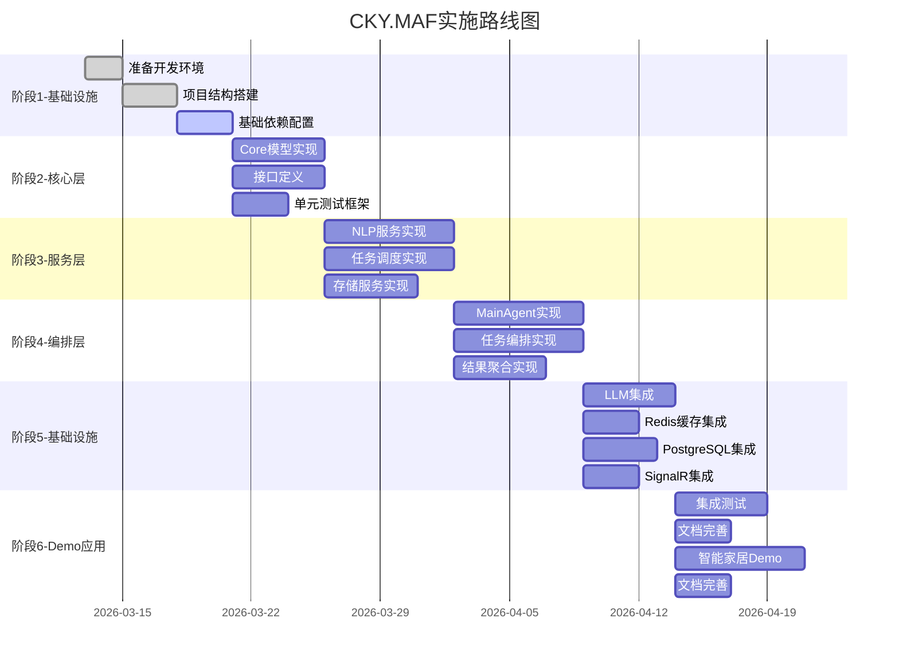
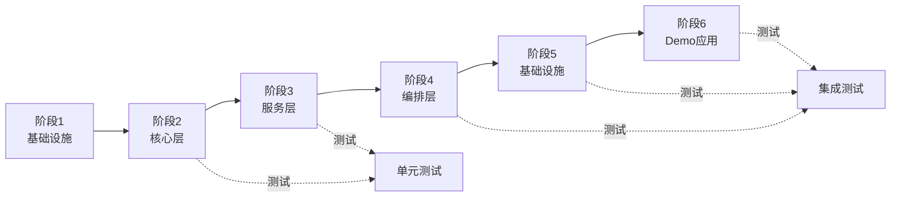

# CKY.MAF框架系统实现计划

> **文档版本**: v1.0
> **创建日期**: 2026-03-13
> **用途**: CKY.MAF框架分阶段实施路线图

---

## 📋 目录

1. [实施总览](#一实施总览)
2. [阶段划分](#二阶段划分)
3. [详细实施步骤](#三详细实施步骤)
4. [依赖关系](#四依赖关系)
5. [风险管理](#五风险管理)
6. [验收标准](#六验收标准)

---

## 一、实施总览

### 1.1 实施原则

| 原则 | 说明 | 应用 |
|------|------|------|
| **分层实施** | 从底层到上层逐层构建 | Core → Services → Infrastructure → Demo |
| **增量交付** | 每个阶段可独立运行验证 | 每个里程碑都有可演示的功能 |
| **测试先行** | 核心功能必须有单元测试 | TDD开发模式 |
| **持续集成** | 每日构建、自动化测试 | GitHub Actions |
| **文档同步** | 代码与文档保持一致 | 代码即文档 |

### 1.2 实施范围

**包含**：
- ✅ CKY.MAF核心框架（Core + Services）
- ✅ 基础设施层（Infrastructure）
- ✅ 单元测试和集成测试
- ✅ 智能家居Demo（Demo）

**不包含**：
- ❌ 生产环境部署
- ❌ 性能优化（放在后期）
- ❌ 企业级功能（多租户、权限管理等）

---

## 二、阶段划分

### 2.1 六阶段实施路线图



---

## 三、详细实施步骤

### 阶段1：基础设施搭建（5天，2026-03-13 ~ 2026-03-17）

#### 目标
- ✅ 搭建开发环境
- ✅ 创建项目结构
- ✅ 配置基础依赖

#### 任务清单

**1.1 开发环境准备**
- [ ] 安装.NET 10 SDK
- [ ] 安装开发工具（Visual Studio 2022 / Rider）
- [ ] 配置Git仓库
- [ ] 配置Docker Desktop（用于测试环境）

**1.2 项目结构创建**
```bash
# 创建解决方案
dotnet new sln -n CKY.MAF

# 创建项目
dotnet new classlib -n CKY.MAF.Core -o src/Core
dotnet new classlib -n CKY.MAF.Services -o src/Services
dotnet new classlib -n CKY.MAF.Infrastructure -o src/Infrastructure
dotnet new xunit -n CKY.MAF.Tests -o tests/UnitTests
dotnet new xunit -n CKY.MAF.IntegrationTests -o tests/IntegrationTests
dotnet new blazorserver -n CKY.MAF.Demos.SmartHome -o demos/SmartHome

# 添加项目到解决方案
dotnet sln add src/Core/CKY.MAF.Core.csproj
dotnet sln add src/Services/CKY.MAF.Services.csproj
dotnet sln add src/Infrastructure/CKY.MAF.Infrastructure.csproj
dotnet sln add tests/UnitTests/CKY.MAF.Tests.csproj
dotnet sln add tests/IntegrationTests/CKY.MAF.IntegrationTests.csproj
dotnet sln add demos/SmartHome/CKY.MAF.Demos.SmartHome.csproj
```

**1.3 配置基础依赖（遵循依赖倒置原则DIP）**

> **架构说明**：框架核心（Core）只定义抽象接口，具体实现下沉到 Infrastructure 层。

```xml
<!-- Core项目 - 只包含抽象接口和模型 -->
<ItemGroup>
  <!-- MS Agent Framework（唯一硬性依赖）-->
  <PackageReference Include="Microsoft.AgentFramework" Version="1.0.0-preview" />

  <!-- .NET 基础依赖 -->
  <PackageReference Include="Microsoft.Extensions.Logging.Abstractions" Version="10.0.0" />
  <PackageReference Include="Microsoft.Extensions.DependencyInjection.Abstractions" Version="10.0.0" />
  <PackageReference Include="System.Text.Json" Version="10.0.0" />
</ItemGroup>

<!-- Services项目 - 业务逻辑层 -->
<ItemGroup>
  <!-- 依赖 Core 项目 -->
  <ProjectReference Include="../Core/CKY.MAF.Core.csproj" />

  <!-- LLM 和 AI 服务 -->
  <PackageReference Include="Microsoft.Extensions.AI" Version="1.0.0-preview" />
  <PackageReference Include="Microsoft.ML" Version="3.0.0" />
</ItemGroup>

<!-- Infrastructure项目 - 具体实现层 -->
<ItemGroup>
  <!-- 依赖 Core 项目（实现抽象接口） -->
  <ProjectReference Include="../Core/CKY.MAF.Core.csproj" />

  <!-- 缓存实现 -->
  <PackageReference Include="StackExchange.Redis" Version="2.8.16" />

  <!-- 关系数据库实现 -->
  <PackageReference Include="Npgsql" Version="8.0.3" />
  <PackageReference Include="Dapper" Version="2.1.35" />

  <!-- 向量数据库实现 -->
  <PackageReference Include="Qdrant.Client" Version="1.9.0" />

  <!-- 实时通信 -->
  <PackageReference Include="Microsoft.AspNetCore.SignalR" Version="8.0.0" />
</ItemGroup>

<!-- Infrastructure.Caching - Redis缓存实现（可选的独立项目）-->
<ItemGroup>
  <ProjectReference Include="../Core/CKY.MAF.Core.csproj" />
  <PackageReference Include="StackExchange.Redis" Version="2.8.16" />
</ItemGroup>

<!-- Infrastructure.Relational - PostgreSQL实现（可选的独立项目）-->
<ItemGroup>
  <ProjectReference Include="../Core/CKY.MAF.Core.csproj" />
  <PackageReference Include="Npgsql" Version="8.0.3" />
  <PackageReference Include="Dapper" Version="2.1.35" />
</ItemGroup>

<!-- Infrastructure.Vectorization - Qdrant向量存储实现（可选的独立项目）-->
<ItemGroup>
  <ProjectReference Include="../Core/CKY.MAF.Core.csproj" />
  <PackageReference Include="Qdrant.Client" Version="1.9.0" />
</ItemGroup>

<!-- 测试项目 -->
<ItemGroup>
  <PackageReference Include="xunit" Version="2.6.2" />
  <PackageReference Include="FluentAssertions" Version="6.12.0" />
  <PackageReference Include="Moq" Version="4.20.70" />
  <PackageReference Include="Microsoft.NET.Test.Sdk" Version="17.10.0" />

  <!-- 测试容器（集成测试） -->
  <PackageReference Include="Testcontainers.Redis" Version="3.9.0" />
  <PackageReference Include="Testcontainers.PostgreSql" Version="3.9.0" />
</ItemGroup>
```

**分层依赖架构**：
```
┌─────────────────────────────────────────────┐
│  Demo应用层（Blazor Server）                │
│  ↓ 依赖                                     │
├─────────────────────────────────────────────┤
│  Services层（任务调度、意图识别）           │
│  ↓ 依赖 Core.Abstractions                  │
├─────────────────────────────────────────────┤
│  Infrastructure层（具体实现）               │
│  - RedisCacheStore : ICacheStore           │
│  - PostgreSqlDatabase : IRelationalDatabase│
│  - QdrantVectorStore : IVectorStore        │
│  ↓ 实现 Core.Abstractions                  │
├─────────────────────────────────────────────┤
│  Core层（抽象接口和模型）                   │
│  - ICacheStore, IVectorStore,              │
│    IRelationalDatabase                     │
│  - IMafSessionStorage, IMafMemoryManager   │
│  ↓ 无依赖                                   │
└─────────────────────────────────────────────┘
```

**关键设计决策**：
- ✅ **Core 项目零外部依赖**（除 MS AF 和 .NET 基础库）
- ✅ **所有具体实现可替换**（通过接口抽象）
- ✅ **单元测试无需外部服务**（使用 Moq 模拟接口）
- ✅ **集成测试使用 Testcontainers**（真实的 Redis/PostgreSQL 容器）

**1.4 配置CI/CD**
- [ ] 创建GitHub Actions工作流
- [ ] 配置自动化测试
- [ ] 配置代码覆盖率报告

#### 验收标准
- ✅ 解决方案可以成功构建
- ✅ 所有依赖包正确安装
- ✅ CI/CD工作流正常运行

---

### 阶段2：核心层实现（5天，2026-03-18 ~ 2026-03-22）

#### 目标
- ✅ 实现所有核心接口定义
- ✅ 实现核心领域模型
- ✅ 建立单元测试框架

#### 任务清单

**2.1 接口定义** (`src/Core/Interfaces/`)
```csharp
// 核心接口
IIntentRecognizer.cs
IEntityExtractor.cs
ICoreferenceResolver.cs
ITaskDecomposer.cs
IAgentMatcher.cs
ITaskOrchestrator.cs
IResultAggregator.cs
IMafSessionStorage.cs
IAgentRegistry.cs
```

**2.2 领域模型** (`src/Core/Models/`)
```csharp
// 任务模型
MafTaskRequest.cs
MafTaskResponse.cs
DecomposedTask.cs
ExecutionPlan.cs
TaskDependency.cs

// Agent模型
AgentSession.cs
AgentStatistics.cs

// 消息模型
MessageContext.cs
Conversation.cs
```

**2.3 枚举定义** (`src/Core/Enums/`)
```csharp
MafAgentStatus.cs
TaskPriority.cs
TaskStatus.cs
ExecutionStrategy.cs
DependencyType.cs
```

**2.4 单元测试框架搭建**
```csharp
// 测试基类
tests/UnitTests/Core/Models/MessageContextTests.cs
tests/UnitTests/Core/Enums/TaskPriorityTests.cs
```

#### 验收标准
- ✅ 所有接口编译通过
- ✅ 单元测试覆盖率 > 80%
- ✅ 所有模型可正确序列化/反序列化

---

### 阶段3：服务层实现（7天，2026-03-23 ~ 2026-03-29）

#### 目标
- ✅ 实现NLP服务
- ✅ 实现任务调度服务
- ✅ 实现存储服务

#### 任务清单

**3.1 NLP服务实现** (`src/Services/NLP/`)
```csharp
// 优先级顺序
MafIntentRecognizer.cs           // P0 - 规则+向量混合识别
MafEntityExtractor.cs            // P0 - 实体提取
MafCoreferenceResolver.cs        // P1 - 指代消解
RuleBasedIntentRecognizer.cs    // P1 - 基于规则
VectorBasedIntentRecognizer.cs  // P2 - 基于向量
```

**3.2 任务调度服务实现** (`src/Services/Scheduling/`)
```csharp
// 优先级顺序
MafTaskScheduler.cs              // P0 - 任务调度器
MafTaskPriorityCalculator.cs     // P0 - 优先级计算
TaskDependencyGraph.cs           // P0 - 依赖图构建
```

**3.3 存储服务实现** (`src/Services/Storage/`)
```csharp
// 优先级顺序
MafTieredSessionStorage.cs       // P0 - 三层存储
MafMemoryManager.cs              // P1 - 记忆管理
MafAgentRegistry.cs              // P1 - Agent注册表
```

#### 验收标准
- ✅ 所有NLP服务单元测试通过
- ✅ 任务调度器可正确处理并行/串行任务
- ✅ 三层存储L1/L2/L3可正常工作

---

### 阶段4：编排层实现（7天，2026-03-30 ~ 2026-04-05）

#### 目标
- ✅ 实现MainAgent基类
- ✅ 实现任务编排器
- ✅ 实现结果聚合器

#### 任务清单

**4.1 Agent基类** (`src/Services/Agents/`)
```csharp
MafAgentBase.cs                   // P0 - Agent基类（继承AIAgent）
MafMainAgentBase.cs               // P0 - MainAgent基类
```

**4.2 编排服务** (`src/Services/Orchestration/`)
```csharp
// 优先级顺序
MafTaskDecomposer.cs              // P0 - 任务分解器
MafAgentMatcher.cs                // P0 - Agent匹配器
MafTaskOrchestrator.cs            // P0 - 任务编排器
MafResultAggregator.cs            // P1 - 结果聚合器
```

#### 验收标准
- ✅ MainAgent可完成完整对话流程
- ✅ 任务编排器可正确处理依赖关系
- ✅ 单元测试覆盖率 > 85%

---

### 阶段5：基础设施集成（5天，2026-04-06 ~ 2026-04-10）

#### 目标
- ✅ 集成LLM服务
- ✅ 集成Redis缓存
- ✅ 集成PostgreSQL
- ✅ 集成SignalR

#### 任务清单

**5.1 LLM服务集成** (`src/Infrastructure/LLM/`)
```csharp
// 优先级
ILLMService.cs                    // P0 - LLM服务接口
ZhipuAIClient.cs                  // P0 - 智谱AI客户端
QwenClient.cs                     // P1 - 通义千问客户端（备选）
PromptManager.cs                  // P1 - Prompt管理器
```

**5.2 缓存集成** (`src/Infrastructure/Caching/`)
```csharp
IMafCache.cs                      // P0 - 缓存接口
RedisMafCache.cs                  // P0 - Redis实现
MafTieredCache.cs                 // P1 - 三层缓存组合
```

**5.3 数据库集成** (`src/Infrastructure/Database/`)
```csharp
// PostgreSQL集成
DbContext.cs                       // P0 - EF Core DbContext
Migrations/                       // P1 - 数据库迁移
Repositories/                     // P1 - 仓储模式
```

**5.4 实时通信** (`src/Infrastructure/Messaging/`)
```csharp
IMessageQueue.cs                  // P0 - 消息队列接口
RedisMessageQueue.cs              // P0 - Redis实现
CKY.MAFHub.cs                     // P0 - SignalR Hub
```

#### 验收标准
- ✅ LLM服务可正常调用
- ✅ Redis缓存读写正常
- ✅ 数据库可正常读写
- ✅ SignalR可实时推送消息

---

### 阶段6：Demo应用与测试（7天，2026-04-11 ~ 2026-04-17）

#### 目标
- ✅ 完成智能家居Demo
- ✅ 完成集成测试
- ✅ 完善文档

#### 任务清单

**6.1 智能家居Demo** (`demos/SmartHome/`)
```csharp
// 优先级
SmartHomeMainAgent.cs             // P0 - MainAgent
Agents/LightingAgent.cs           // P0 - 灯光Agent
Agents/ClimateAgent.cs            // P0 - 温控Agent
Agents/MusicAgent.cs              // P1 - 音乐Agent
Services/ILightingService.cs       // P0 - 领域服务接口
Services/implementations/         // P1 - 具体平台实现
Scenarios/morning-routine.json    // P0 - 场景配置
```

**6.2 集成测试** (`tests/IntegrationTests/`)
```csharp
MainAgentIntegrationTests.cs       // P0 - MainAgent完整流程
TaskOrchestrationIntegrationTests.cs // P0 - 任务编排测试
StorageIntegrationTests.cs        // P1 - 存储层集成
```

**6.3 文档完善**
- [ ] API文档生成
- [ ] 部署文档完善
- [ ] 开发者指南完善
- [ ] 示例代码完善

#### 验收标准
- ✅ Demo可正常运行"晨间例程"场景
- ✅ 集成测试全部通过
- ✅ 文档完整准确

---

## 四、依赖关系

### 4.1 阶段依赖图



### 4.2 关键路径

**必须按顺序执行**：
1. 阶段1（基础设施）→ 所有后续阶段
2. 阶段2（核心层）→ 阶段3、4（服务层、编排层）
3. 阶段4（编排层）→ 阶段6（Demo应用）

**可并行执行**：
- 阶段5的部分工作（如LLM集成）可与阶段3并行
- 文档编写与代码开发可并行

---

## 五、风险管理

### 5.1 技术风险

| 风险 | 影响 | 概率 | 缓解措施 |
|------|------|------|---------|
| **MS AF API不稳定** | 高 | 高 | 使用适配器模式，便于切换 |
| **LLM API限制** | 中 | 中 | 实现降级机制，支持多提供商 |
| **Redis性能问题** | 中 | 低 | 提前压力测试，优化缓存策略 |
| **PostgreSQL版本兼容** | 低 | 低 | 统一开发环境版本 |

### 5.2 进度风险

| 风险 | 影响 | 概率 | 缓解措施 |
|------|------|------|---------|
| **需求变更** | 高 | 中 | 锁定核心需求，其他放在迭代 |
| **人员变动** | 中 | 低 | 知识共享，代码review |
| **技术难点** | 中 | 中 | 预留缓冲时间，及时求助 |

### 5.3 质量风险

| 风险 | 影响 | 概率 | 缓解措施 |
|------|------|------|---------|
| **测试覆盖不足** | 高 | 中 | TDD开发，设定覆盖率目标 |
| **架构设计缺陷** | 高 | 低 | 架构评审，原型验证 |
| **代码质量差** | 中 | 低 | Code Review，代码规范 |

---

## 六、验收标准

### 6.1 功能验收

| 阶段 | 验收标准 | 优先级 |
|------|---------|--------|
| **阶段1** | 项目可构建，依赖正确安装 | P0 |
| **阶段2** | 所有接口定义完成，单元测试通过 | P0 |
| **阶段3** | NLP服务可识别意图，调度器可调度任务 | P0 |
| **阶段4** | MainAgent可完成完整对话流程 | P0 |
| **阶段5** | LLM可调用，缓存可读写，SignalR可推送 | P0 |
| **阶段6** | Demo可运行"晨间例程"，集成测试通过 | P0 |

### 6.2 质量验收

| 指标 | 目标 | 优先级 |
|------|------|--------|
| **代码覆盖率** | 单元测试>80%，集成测试>60% | P0 |
| **代码规范** | 符合编码规范，通过StyleCop检查 | P1 |
| **性能指标** | 简单任务响应<2s，复杂任务<10s | P1 |
| **文档完整性** | 所有公开API有文档，README完整 | P1 |

### 6.3 交付物

| 交付物 | 说明 | 优先级 |
|--------|------|--------|
| **源代码** | 完整的CKY.MAF框架代码 | P0 |
| **单元测试** | 所有单元测试代码 | P0 |
| **集成测试** | 集成测试代码和测试配置 | P0 |
| **技术文档** | 所有设计文档（9个） | P0 |
| **示例代码** | 智能家居Demo完整代码 | P0 |
| **部署脚本** | Docker Compose配置，部署文档 | P1 |

---

## 七、时间节点

### 7.1 关键里程碑

| 里程碑 | 日期 | 交付内容 |
|--------|------|---------|
| **M1: 基础设施完成** | 2026-03-17 | 项目结构、依赖配置、CI/CD |
| **M2: 核心层完成** | 2026-03-22 | 所有接口定义、核心模型 |
| **M3: 服务层完成** | 2026-03-29 | NLP、调度、存储服务 |
| **M4: 编排层完成** | 2026-04-05 | MainAgent、任务编排 |
| **M5: 基础设施集成** | 2026-04-10 | LLM、缓存、数据库、SignalR |
| **M6: Demo完成** | 2026-04-17 | 智能家居Demo、测试、文档 |

### 7.2 时间估算

| 阶段 | 工作日 | 开始日期 | 结束日期 |
|------|--------|---------|---------|
| 阶段1：基础设施 | 5天 | 2026-03-13 | 2026-03-17 |
| 阶段2：核心层 | 5天 | 2026-03-18 | 2026-03-22 |
| 阶段3：服务层 | 7天 | 2026-03-23 | 2026-03-29 |
| 阶段4：编排层 | 7天 | 2026-03-30 | 2026-04-05 |
| 阶段5：基础设施 | 5天 | 2026-04-06 | 2026-04-10 |
| 阶段6：Demo应用 | 7天 | 2026-04-11 | 2026-04-17 |
| **总计** | **36天** | **2026-03-13** | **2026-04-17** |

---

## 八、资源分配

### 8.1 人员配置

| 角色 | 人数 | 主要职责 |
|------|------|---------|
| **架构师** | 1 | 架构设计、技术决策、Code Review |
| **后端开发** | 2 | Core层、Services层实现 |
| **基础设施** | 1 | Infrastructure层、DevOps |
| **前端开发** | 1 | Demo UI（后期） |
| **测试工程师** | 1 | 单元测试、集成测试 |

### 8.2 开发工具

| 工具类型 | 工具选择 | 用途 |
|---------|---------|------|
| **IDE** | Visual Studio 2022 / Rider | 开发 |
| **版本控制** | Git | 代码管理 |
| **CI/CD** | GitHub Actions | 持续集成 |
| **项目管理** | GitHub Projects | 任务跟踪 |
| **测试** | xUnit, Moq, FluentAssertions | 单元测试 |
| **容器化** | Docker Desktop | 测试环境 |

---

## 九、后续迭代计划

### 9.1 v1.1 功能（预计2026年5月）

- [ ] 支持更多LLM提供商
- [ ] 增加更多Demo场景
- [ ] 性能优化
- [ ] 监控告警完善

### 9.2 v1.2 功能（预计2026年6月）

- [ ] 多租户支持
- [ ] 权限管理
- [ ] 审计日志
- [ ] API限流

---

## 🔗 相关文档

- [实现指南](./09-implementation-guide.md)
- [测试指南](./10-testing-guide.md)
- [架构概览](./01-architecture-overview.md)

---

**文档版本**: v1.0
**最后更新**: 2026-03-13
**预计完成**: 2026-04-17
